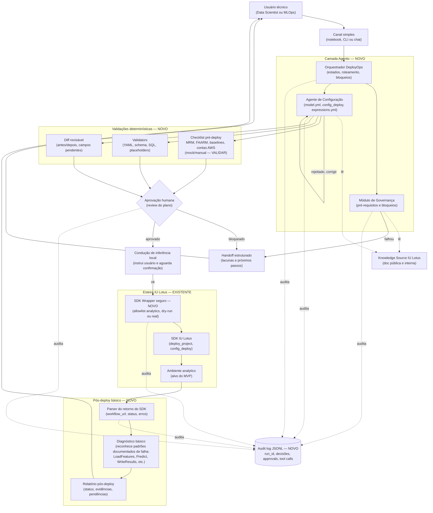
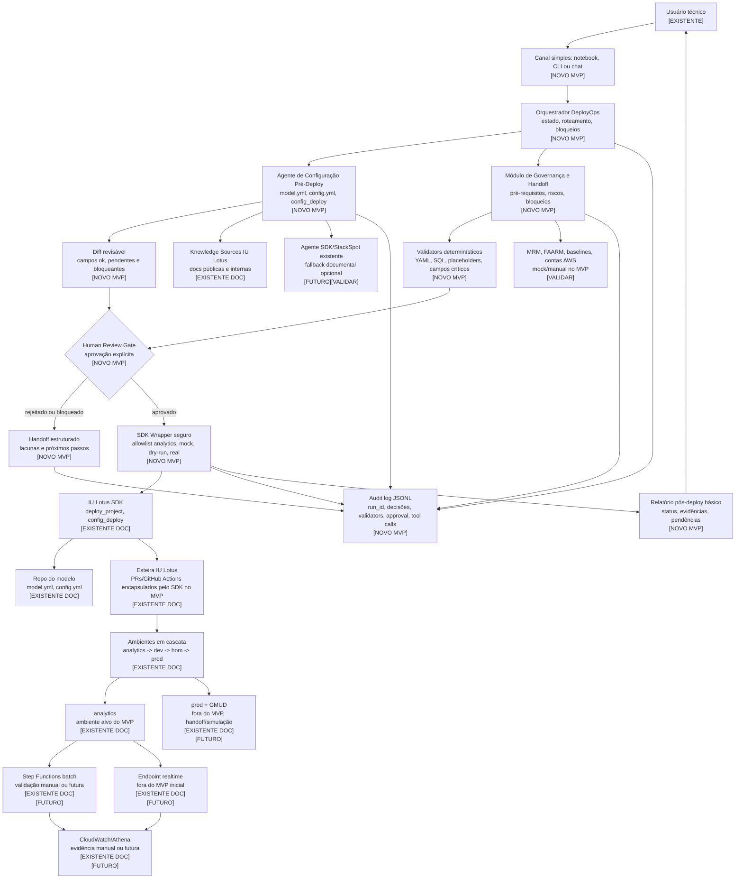
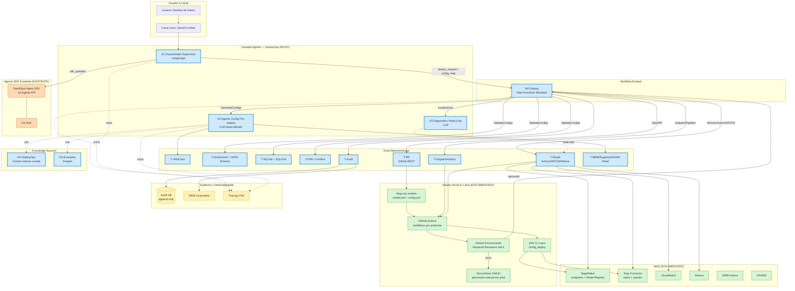
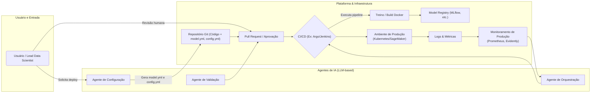

# PROMPT ÚNICO — cria a pasta e TODOS os 9 arquivos de uma vez

Alternativa ao passo-a-passo (00 a 08). Execute no repositório `itau-rs7-dep-iu-lotus-sdk`. Rode o bloco inteiro; cada `cat` usa heredoc com aspas simples e preserva o conteúdo literalmente. NÃO edite o conteúdo.

```bash
mkdir -p docs/planejamento_inicial
cat > docs/planejamento_inicial/00_LEIA-ME.md << 'PLANEJAMENTO_EOF'
# Planejamento inicial — DeployOps Agentic

> [!WARNING]
> **Esta pasta é o planejamento ORIGINAL do projeto, anterior à implementação. NÃO é especificação vigente.**
>
> Os arquivos aqui foram produzidos na fase de discovery e desenho (comparando saídas de Claude e GPT, consolidando arquitetura e cronograma). Desde então, escolhas de arquitetura e de implementação **evoluíram**, e essas mudanças vivem **no próprio repositório** (`itau-rs7-dep-iu-lotus-sdk`) — não estão refletidas aqui.

## Regra de precedência (a única que importa)

1. **Estado atual do repositório é a fonte de verdade.** Código, testes, ADRs e docs de milestone (`docs/M*`) descrevem o que o sistema **é**. Se qualquer arquivo desta pasta conflitar com o que está implementado, **o repositório vence, sem exceção**.
2. **Este material é contexto histórico e direcional.** Serve para entender *por que* o desenho é o que é, quais alternativas foram descartadas e com que raciocínio. Não é checklist a executar nem spec a obedecer literalmente.
3. **A documentação da IU Lotus é autoritativa nos repositórios irmãos**, não aqui (ver "O que NÃO está aqui").

Para "o que mudou do plano para a implementação", ver **`01_STATUS_VS_PLANO.md`** (gerado a partir da análise do repositório real — ver seção final).

## Nota de formato

Todo o conteúdo aqui é `.md` para ser lido por agente. Dois arquivos foram convertidos do formato original: `mvp_minimo.md` é a versão textual/Mermaid do diagrama original em imagem (`.png`); `decomposicao_mvp_deployops.md` é a versão Markdown do documento original em Word (`.docx`). O conteúdo é o mesmo; formatação pode diferir.

---

## O que é cada arquivo

### A. Arquitetura do MVP (o desenho que foi aprovado)

- **`arquitetura_mvp_minimo.md`** — Documento de referência da arquitetura aprovada para o MVP. Descreve as três camadas (agentic, determinística, esteira IU Lotus existente), o audit log transversal e cada componente (orquestrador, agente de configuração, módulo de governança, validators, SDK Wrapper, etc.).
- **`mvp_minimo.md`** — Diagrama do fluxo do MVP mínimo (Mermaid + descrição em texto): canal de entrada → camada agentic → validações determinísticas → aprovação humana → esteira IU Lotus (SDK Wrapper → SDK → `analytics`) → pós-deploy + audit log.

### B. Decomposição e cronograma

- **`decomposicao_mvp_deployops.md`** — Decomposição do MVP em tarefas executáveis para 1 pessoa em 8 meses: escopo dentro/fora explícito, premissas, restrições, marcos mensais e mecanismos de corte de escopo. Planejamento operacional original; tarefas/estimativas reais já divergem — usar `01_STATUS_VS_PLANO.md` e o repo como referência corrente.

### C. Discovery / pesquisa arquitetural (rodadas comparando Claude e GPT)

Trilha de pesquisa que levou à arquitetura. Explicitamente **não** é a arquitetura final — é insumo.

- **`claude-new-round1.md`** — Rodada 1 (Claude): discovery. Referências externas (SageMaker, Vertex, Argo, Temporal, GitHub Actions Environments, OPA), padrões, riscos, modos seguros de execução por agente.
- **`gpt-new-round1.md`** — Rodada 1 (GPT): mesmo objetivo, com tabela de pontuação e classificação de referências.
- **`claude-new-round2.md`** — Rodada 2 (Claude): consolidação. DeployOps multiagente separado do agente SDK/StackSpot; discute levers (Step Functions, OPA/Conftest, PR/GitOps, dual-LLM).
- **`gpt-new-round2.md`** — Rodada 2 (GPT): arquitetura multiagente com tabelas comparativas de ferramentas e diagramas.
- **`relatorio-final.md`** — Relatório final consolidado da Rodada 2: a tese (copiloto que **prepara + aciona, nunca executa livre**) e a arquitetura de três camadas. Meta-consolidação das rodadas acima.

> Decisões posteriores já superam parte do que está na pesquisa (checar contra o repo, não assumir):
> - OPA/Conftest, Step Functions, Argo, Temporal, KServe aparecem como referência; foram **cortados como overengineering** para o MVP.
> - StackSpot foi identificado como **descontinuado** — não deve ser dependência.
> - MLflow stages estão **deprecados** (usar aliases tipo `@champion`).
> - Feature Store foi **rejeitada** do escopo do MVP.

---

## O que NÃO está aqui (de propósito)

- **Consolidado OCR da documentação IU Lotus** — a versão OCR usada na fase pessoal do projeto **não foi trazida** para cá. A documentação **oficial e completa** vive nos repositórios irmãos: `../itau-rs7-doc-iulotus/docs/` (pública) e `../itau-mr7-doc-documentacao-interna/docs/` (interna). **Essas são as fontes autoritativas** — use-as, não uma cópia OCR.

---

## `01_STATUS_VS_PLANO.md`

Este índice descreve o **plano**. Ele não sabe o que está de fato implementado — quem sabe é o repositório. O arquivo `01_STATUS_VS_PLANO.md` (gerado a partir da análise do código, ADRs e docs de milestone reais) faz a ponte: mapeia, ponto a ponto, onde a implementação seguiu o plano e onde divergiu, para que ninguém — humano ou agente — trate esta pasta como autoritativa sobre o código.
PLANEJAMENTO_EOF

mkdir -p docs/planejamento_inicial
cat > docs/planejamento_inicial/arquitetura_mvp_minimo.md << 'PLANEJAMENTO_EOF'
> [!WARNING]
> **PLANEJAMENTO INICIAL — NÃO É A ESPECIFICAÇÃO VIGENTE.**
> Este arquivo faz parte do planejamento *original* do DeployOps Agentic, anterior à implementação. Desde então houve mudanças de arquitetura e de implementação que vivem **apenas no repositório de trabalho** (`itau-rs7-dep-iu-lotus-sdk`), não aqui.
> **Fonte de verdade = estado atual do repositório** (código, ADRs, `docs/M*`, e `docs/planejamento_inicial/01_STATUS_VS_PLANO.md`). Em qualquer conflito entre este documento e o que está implementado, **o repositório vence**.
> Trate este arquivo como contexto histórico e direcional, **não como instrução a ser seguida literalmente**. Índice e regras de uso: `docs/planejamento_inicial/00_LEIA-ME.md`.

---

# Arquitetura do MVP mínimo — DeployOps Agentic IU Lotus

> Documento de referência da arquitetura aprovada para o MVP do projeto.  
> Acompanha o diagrama `mvp_minimo.svg`.

---

## Visão geral

O MVP do DeployOps Agentic é um copiloto operacional especializado em conduzir a jornada de deploy de modelos no IU Lotus para o ambiente `analytics` (sandbox), em modo batch. O sistema não substitui o SDK IU Lotus nem reimplementa a esteira oficial — em vez disso, ele apoia o usuário técnico (Data Scientist ou MLOps) na preparação correta dos artefatos pré-deploy, valida cada peça determinística e funcionalmente, exige aprovação humana antes de qualquer ação sensível e, com essa autorização, aciona o SDK existente.

A premissa central é simples: o gargalo real da jornada de deploy não está no acionamento do `lotus.deploy_project()` em si — que é um one-liner Python — mas na preparação correta dos artefatos que precisam estar prontos antes desse acionamento (`model.yml`, payload de `config_deploy()`, `expressions.yml`, queries com placeholder correto, pré-requisitos MRM/FAARM, etc.). É nesse trecho da jornada que o agente concentra seu valor.

O sistema é construído sobre **LangGraph 1.0**, com estado tipado, edges condicionais e loops de retorno como primitivas nativas, e human-in-the-loop via `interrupt()`.

---

## Camadas funcionais

A arquitetura tem três camadas funcionais e um sistema transversal de auditoria.

A **camada agentic** é onde mora o raciocínio do sistema. Três componentes feitos com LLM e tools: um orquestrador, um agente de configuração e um módulo de governança. Eles consomem conhecimento da Knowledge Source e produzem artefatos para a camada determinística avaliar.

A **camada determinística** é onde o sistema bloqueia o que não deve passar. Validators, checklist de pré-requisitos, diff revisável, parser, diagnóstico — tudo isso é código regular, sem LLM, com regras testáveis. É essa camada que protege contra alucinação e contra concessões na governança.

A **camada da esteira IU Lotus existente** é o que já vive no IU Lotus hoje e não será reimplementado: o SDK, o repositório do modelo, o ambiente `analytics`. O ponto de interface entre o agente e essa camada é o SDK Wrapper, único componente novo construído nessa fronteira.

O **audit log** atravessa todas as camadas. Toda decisão do orquestrador, toda tool call, todo gate humano, todo retorno do SDK é registrado em formato JSONL append-only, com sanitização de dados sensíveis. Esse log existe a serviço da rastreabilidade, da depuração e da governança.

---

## Componentes

### Usuário técnico e canal de entrada

O **usuário técnico** é um Data Scientist ou engenheiro de MLOps que quer fazer o deploy de um modelo. Ele interage com o sistema por um **canal simples** — notebook Jupyter, CLI ou chat — sem necessidade de interface gráfica elaborada. A escolha pela interface mínima é deliberada: o público-alvo opera em terminal e notebook diariamente, e construir UI rica desviaria esforço da lógica do agente.

A entrada típica é em linguagem natural, do tipo "faça o deploy do modelo X em analytics". O sistema não pede formulário estruturado nem comandos com sintaxe rígida.

### Orquestrador DeployOps

O **Orquestrador DeployOps** é a máquina de estados que controla a jornada inteira. Ele recebe o pedido do usuário, identifica o que precisa ser feito, roteia para os componentes corretos, aplica bloqueios quando necessário e decide quando a jornada pode prosseguir, quando precisa esperar humano e quando deve ser encerrada com handoff.

Implementação: `StateGraph` do LangGraph com estado tipado em TypedDict. Cada estado da jornada é um node; transições são edges (algumas condicionais, baseadas no resultado do estado anterior). O orquestrador é também quem invoca o Agente de Configuração, o Módulo de Governança e o SDK Wrapper quando chega a hora.

Limites importantes: o orquestrador não executa shell, não chama comandos arbitrários, não toca em produção e não pode pular o gate de aprovação humana. Sua autonomia é planejar e rotear, não agir sobre o mundo externo.

### Agente de Configuração

O **Agente de Configuração** é o componente que mais agrega valor ao usuário. Ele usa LLM com prompts especializados e tools para gerar ou revisar três artefatos: `model.yml`, payload de `config_deploy()` e `expressions.yml`.

Para o `model.yml`, ele lê o esqueleto criado pelo `create_model()` do SDK e propõe preenchimento dos campos que dependem de decisão — flavor (batch ou realtime), instância, schedule, lifecycle, tags. Cada campo gerado recebe um status de confiança: `ok_fonte_estruturada`, `ok_usuario_confirmou`, `inferido_revisar`, `pendente_usuario`, `pendente_squad` ou `bloqueante`. Campos críticos como `experiment_id`, `mrm_id`, `story_id` e contas AWS nunca são inferidos pelo agente — são sempre `pendente_usuario` até confirmação explícita.

Para o `config_deploy()`, o agente prepara o payload com `inference_query`, `target_query`, primary keys e demais parâmetros. As queries são construídas com placeholder `{{IULOTUS_DATREF}}` obrigatório em qualquer filtro temporal; datas hardcoded são bloqueadas pelo validator que vem a seguir. Tabelas e colunas concretas vêm sempre do usuário, nunca inventadas pelo agente.

Para o `expressions.yml`, o agente gera o CASE-WHEN do cálculo pós-inferência (tipicamente o GH — Grupo Homogêneo) a partir da regra de segmentação informada pelo usuário, com cobertura de faixas verificada (sem sobreposição, com `ELSE` explícito).

O Agente de Configuração consulta a Knowledge Source para conhecer convenções, exemplos e restrições documentadas, mas não inventa informação operacional crítica.

### Módulo de Governança

O **Módulo de Governança** aplica regras de pré-requisito antes que o deploy possa prosseguir. Ele opera o checklist pré-deploy (MRM, FAARM, baselines, contas AWS) e dispara os validators sobre os artefatos gerados pelo Agente de Configuração.

Como as APIs internas de MRM, FAARM e baselines não estão confirmadas como acessíveis para o agente, no MVP esses pré-requisitos são tratados como entrada do usuário (com mocks configuráveis para simular ausência, presença ou parcialidade durante desenvolvimento e testes). Quando essas APIs forem confirmadas e liberadas no roadmap (fase intermediária ou futura), o Módulo de Governança consulta diretamente — sem mudança no resto da arquitetura.

O Módulo de Governança também lê a Knowledge Source: as regras de pré-requisito e os campos críticos são extraídos da documentação oficial via RAG, não codificados rigidamente. Isso faz com que a evolução das regras (novos campos obrigatórios, novas políticas) seja absorvida atualizando a documentação, sem mudança no agente.

### Knowledge Source IU Lotus

A **Knowledge Source** é a documentação oficial do IU Lotus — pública (jornada, SDK, deploy, validação) e interna (DeployOps, Discovery, Componentes) — indexada em retriever local. Sua função é alimentar o Agente de Configuração e o Módulo de Governança com contexto operacional confiável.

A KS é populada uma vez no setup e atualizada periodicamente conforme a documentação evolui. O retriever entrega chunks por busca semântica, com marcação de origem (qual arquivo, qual seção), permitindo rastreabilidade do que foi consultado em cada decisão.

### Validators determinísticos

Os **Validators** são funções regulares (sem LLM) que avaliam objetivamente cada artefato gerado. São três famílias principais:

- **YAML e schema**: parsing do YAML (sintaxe), validação contra schemas pydantic/jsonschema (campos obrigatórios, tipos, formatos). Bloqueia YAML quebrado ou com campos obrigatórios ausentes.
- **SQL**: parsing AST via SQLGlot. Detecta comandos perigosos (`DROP`, `DELETE`, `TRUNCATE`, `UPDATE`), garante presença de `SELECT`, identifica tabelas referenciadas. Não tenta entender semântica, apenas estrutura.
- **Placeholders**: garante presença de `{{IULOTUS_DATREF}}` em filtros temporais e ausência de datas hardcoded em campos sensíveis.

Os validators retornam três estados: `ok`, `warning` (segue mas registra) ou `blocking` (impede prosseguimento). Um único `blocking_issue` impede que o fluxo chegue ao gate humano.

### Checklist pré-deploy

O **Checklist pré-deploy** verifica a presença e validade dos pré-requisitos não derivados de arquivos: identificador MRM do modelo, status FAARM, baselines comparativos, conta AWS de destino, experimento campeão. No MVP, esses itens são entrada do usuário ou vêm de mocks configuráveis durante desenvolvimento; futuramente podem vir de APIs internas, sem mudança no contrato do checklist.

Itens críticos ausentes (sem MRM, sem experimento, sem conta AWS) são bloqueantes — o fluxo não chega ao gate humano até serem fornecidos.

### Diff revisável

O **Diff revisável** consolida o estado dos artefatos para o usuário aprovar. Para cada arquivo (`model.yml`, payload de `config_deploy`, `expressions.yml`), apresenta o antes e o depois, com cada campo marcado por status de confiança e origem. Mostra também resultado dos validators, itens do checklist e bloqueios encontrados.

O formato é markdown estruturado, legível em CLI ou notebook. Não é UI gráfica rica — é texto bem organizado que cabe na tela e responde objetivamente: "isso vai ser enviado, você concorda?".

### Aprovação humana

A **Aprovação humana** é o primeiro dos dois gates humanos do MVP. Implementada via `interrupt()` do LangGraph: o grafo pausa, persiste o estado completo no checkpointer, e aguarda indefinidamente até que o usuário responda via `Command(resume=...)`.

O usuário tem três respostas possíveis: aprovar (segue para o próximo gate), rejeitar com motivo (volta ao Agente de Configuração para iteração) ou bloquear (vai para handoff estruturado). A rejeição admite até três iterações antes de virar handoff automático — para evitar loops indefinidos.

Nenhum deploy, nenhuma chamada ao SDK, nenhuma ação sensível acontece antes desse gate. Sem aprovação explícita, o sistema não age.

### Condução de inferência local

A **Condução de inferência local** é o segundo gate humano. Depois da aprovação do plano e antes de chamar o SDK, o agente instrui o usuário a executar localmente a inferência com a `inference_query` aprovada e o pickle do modelo. A documentação oficial é categórica sobre essa prática: validar localmente economiza 10–15 minutos por iteração no GitHub Actions e detecta a maior parte dos bugs em ~30 segundos.

O agente fornece o snippet pronto para o usuário copiar e colar no Jupyter, parametrizado com a query aprovada e o caminho do pickle. O usuário roda, valida o resultado e confirma uma de três opções: `ok` (segue para o SDK Wrapper), `falhou` (volta ao Agente de Configuração para revisão) ou `pular` (retreino — a doc permite pular nesse caso, e o agente registra a escolha no audit log).

### SDK Wrapper seguro

O **SDK Wrapper** é a única peça do MVP que efetivamente toca o mundo externo do IU Lotus. É uma tool com schema fixo que invoca `lotus.deploy_project()` sob condições estritas:

- **Allowlist de ambiente**: aceita apenas `analytics` no MVP. Qualquer tentativa com `dev`, `hom` ou `prod` levanta erro com mensagem clara antes de chegar ao SDK.
- **Idempotência**: o wrapper é desenhado para tolerar re-execução pelo LangGraph (que pode reexecutar nodes ao retomar de `interrupt`). Estado de "já chamei o SDK neste run_id" é registrado antes da chamada e checado a cada entrada no node.
- **Modos de operação**: pode rodar em modo `mock` (durante desenvolvimento, sem qualquer chamada real), `dry-run fiel` (com SDK acessível mas sem efeito) ou `real` (chamada efetiva ao deploy_project em analytics).
- **Captura completa do retorno**: o JSON retornado pelo SDK (incluindo `workflow_url`, `status` e, em produção, `gmud_id`/`gmud_url`) é capturado integralmente para o audit log e passado ao parser.

O SDK Wrapper não aceita shell livre, não permite parâmetros não validados, e não tem caminho para chamar APIs sensíveis adjacentes (ServiceNow, IAM, criação de roles, etc.) — essas estão fora do MVP por design.

### SDK IU Lotus e ambiente analytics

O **SDK IU Lotus** é o componente existente que de fato faz o deploy. Por baixo, ele orquestra criação de branch, abertura de PR, execução de GitHub Actions, aprovações intermediárias e — em produção — geração de GMUD. O agente do MVP não interage diretamente com nenhum desses subsistemas; apenas com o SDK como interface única.

O **ambiente analytics** é o alvo exclusivo do MVP. Sandbox consumer com dados reais, sem impacto produtivo. Após o deploy, a Step Function do batch lê features via Athena, prediz e escreve resultado no Data Mesh consumer — mas esses passos pós-deploy são operados pela esteira IU Lotus, não pelo agente.

### Parser do retorno do SDK

O **Parser** lê o JSON retornado pelo SDK Wrapper e extrai campos estruturados de interesse: `status`, `workflow_url`, mensagens de erro quando houver. É um adaptador tolerante a campos opcionais — se o schema do retorno mudar entre versões do SDK, o parser segue funcionando com aviso, não com crash.

A taxonomia interna de status mapeia retornos do SDK para uma representação consistente: `queued`, `in_progress`, `succeeded`, `failed`, `partial`. Essa abstração é importante porque outras fases (intermediária e futura) vão consumir status do GitHub Actions e da Step Function — e todos passam pelo mesmo parser conceitual.

### Diagnóstico básico

O **Diagnóstico básico** entra em ação quando o parser indica falha. Ele tenta reconhecer cinco padrões nomeados pela documentação oficial:

- `LoadFeatures` com `Table not found` → tabela do `inference_query` não democratizada na consumer
- `LoadFeatures` com query vazia → `IULOTUS_DATREF` sem dados na janela escolhida
- `LoadModel` com `experiment not found` → `experiment_id` incorreto ou experimento apagado
- `Predict` com `KeyError` → schema das features no runtime difere do schema usado no treino
- `WriteResults` com permissão → role da Step Function sem permissão na tabela de destino

Para cada padrão reconhecido, o diagnóstico injeta um "hint estruturado" no relatório com confiança alta e ação sugerida. Casos não cobertos pelos cinco padrões fixos podem ser enriquecidos via consulta à seção de troubleshooting da KS, com confiança marcada como baixa para diferenciar de match exato.

### Relatório pós-deploy

O **Relatório pós-deploy** consolida tudo. Recebe status do parser, hints do diagnóstico, evidências disponíveis e gera um documento markdown legível ao final de cada run. Inclui o que rodou, o resultado, eventuais pendências (validações manuais que o usuário precisa fazer fora do MVP), links úteis (workflow_url) e próximas ações sugeridas.

### Handoff estruturado

O **Handoff estruturado** é a saída para casos onde o sistema não consegue ou não deve prosseguir: bloqueio crítico, três rejeições consecutivas na aprovação, erro do SDK fora dos cinco padrões conhecidos. Produz um pacote JSON com motivos do bloqueio, lacunas identificadas, próximos passos sugeridos e responsáveis. É o que o usuário leva à squad quando o agente sozinho não consegue resolver.

### Audit log

O **Audit log** é JSONL append-only, escrito sobre o checkpointer SQLite do LangGraph (que já registra estado por super-step) com enrichment adicional: tool calls, resultados de validators, conteúdo do diff aprovado, motivo de rejeição, comandos do gate humano, retorno bruto do SDK. Antes de persistir, dados sensíveis (tokens, queries com PII detectada, credenciais) passam por sanitização.

Cada run tem `run_id` único; cada evento tem timestamp e referência ao estado do workflow. O log serve a três propósitos: rastreabilidade (entender por que o agente decidiu o que decidiu), depuração (reconstruir o que aconteceu em um run problemático) e governança (provar para a squad e auditoria que controles foram aplicados).

---

## Fluxo completo da jornada (caminho feliz)

O usuário envia um pedido em linguagem natural pelo canal simples — por exemplo, "faça o deploy do modelo `churn_v2` em analytics". O orquestrador recebe, identifica intenção (modelo, ambiente, tipo de inferência), resolve o modelo no repositório local e segue.

O Módulo de Governança roda o checklist pré-deploy: confirma com o usuário os IDs críticos (MRM, experimento, contas AWS) que não pode inferir e checa pré-requisitos contra mocks ou inputs do usuário. Se algo crítico falta, o orquestrador interrompe aqui e gera handoff.

Em paralelo, o Agente de Configuração lê o esqueleto do `model.yml`, consulta a Knowledge Source, propõe preenchimento dos campos pendentes com marcação de status; prepara o payload de `config_deploy()` com queries e placeholders corretos; gera o `expressions.yml` para o cálculo pós-inferência conforme a regra informada.

Os validators determinísticos rodam: YAML válido, schema correto, SQL bem-formado, placeholders obrigatórios presentes, campos críticos não inventados. Bloqueios fatais interrompem aqui; warnings seguem para revisão humana.

O orquestrador consolida tudo no diff revisável: cada arquivo antes/depois, cada campo com status e origem, resultados de validação, riscos. Apresenta ao usuário e o grafo pausa via `interrupt()`.

O usuário revisa e aprova. O grafo retoma e segue para o gate de inferência local: agente apresenta o snippet pronto, usuário executa no Jupyter, valida o resultado e confirma `ok`. O grafo retoma de novo.

O SDK Wrapper é invocado com payload validado e allowlist de ambiente checada. Chama `lotus.deploy_project(env="analytics")` (real ou em dry-run, conforme modo). O retorno é capturado bruto no audit log e passado ao parser, que extrai status estruturado.

Se o status indica sucesso, o diagnóstico não precisa atuar e o relatório consolida resultado, workflow_url e próximos passos sugeridos (verificar Step Function no console, conferir Athena depois da janela de execução). Se status indica falha, o diagnóstico tenta reconhecer um dos cinco padrões e injeta o hint no relatório.

O relatório vai ao usuário pelo canal, encerrando a jornada. Todo o run fica registrado no audit log.

---

## Caminhos não-felizes e como são tratados

Há três bifurcações principais que o sistema precisa lidar bem.

**Rejeição na aprovação humana.** O usuário olha o diff e identifica algo errado — uma query mal escrita, um campo inferido incorretamente, um placeholder no lugar errado. Ele rejeita com motivo. O orquestrador incrementa o contador de iterações do run, alimenta o feedback de volta ao Agente de Configuração ("o usuário rejeitou porque X") e refaz o trecho relevante. Volta ao validators, volta ao diff, volta ao gate. Até três iterações. Na quarta rejeição, o sistema gera handoff automaticamente — entende que há algo que ele sozinho não consegue resolver.

**Falha na inferência local.** O usuário executa o snippet e o resultado não bate (KeyError, distribuição estranha, exceção). Ele responde `falhou` ao gate. O fluxo volta ao Agente de Configuração para revisão dos artefatos — provavelmente a `inference_query` precisa ser ajustada, ou o pickle do modelo aponta para o experimento errado. Mesmo limite de iterações.

**Bloqueio insolúvel.** Algum pré-requisito crítico está ausente e o usuário não consegue fornecer (não tem o MRM ID, não tem a conta AWS, não tem o experimento campeão registrado). O Módulo de Governança classifica como bloqueante; o sistema gera handoff estruturado com lacunas e responsáveis. O usuário leva isso à squad e volta depois com as pendências resolvidas — abrindo um novo run.

Em qualquer dos três casos, o audit log preserva a trilha completa: por que entrou na bifurcação, qual feedback foi dado, quantas iterações ocorreram, como terminou.

---

## Princípios de design invioláveis

Quatro princípios atravessam toda a arquitetura e não são negociáveis em nenhum cenário de corte de escopo:

A **aprovação humana antes de ações sensíveis** é obrigatória. Sem aprovação explícita, o sistema não chama o SDK, não escreve no repositório nem aciona qualquer comportamento que tenha efeito fora do agente.

O **bloqueio de produção** é codificado no SDK Wrapper, não é configuração. Tentativas de chamar `prod` (ou `dev`/`hom` no MVP) levantam erro antes mesmo de o SDK ser consultado.

A **separação entre raciocínio e execução** é estrutural. O LLM raciocina, propõe e explica; ferramentas determinísticas executam, validam e bloqueiam. Não há ação sensível disparada diretamente por um prompt — sempre passa por validator, gate ou ambos.

O **audit log mínimo** com sanitização de dados sensíveis é o piso de rastreabilidade. Tokens, credenciais e queries com dados detectáveis como sensíveis são mascarados antes de qualquer persistência.

Esses princípios são o que diferencia o DeployOps Agentic de um chatbot ou de um executor automatizado. Cortes futuros podem reduzir UX, simplificar diagnóstico, reduzir gold set — mas nunca podem comprometer esses quatro pontos.
PLANEJAMENTO_EOF

mkdir -p docs/planejamento_inicial
cat > docs/planejamento_inicial/mvp_minimo.md << 'PLANEJAMENTO_EOF'
> [!WARNING]
> **PLANEJAMENTO INICIAL — NÃO É A ESPECIFICAÇÃO VIGENTE.**
> Este arquivo faz parte do planejamento *original* do DeployOps Agentic, anterior à implementação. Desde então houve mudanças de arquitetura e de implementação que vivem **apenas neste repositório** (`itau-rs7-dep-iu-lotus-sdk`), não aqui.
> **Fonte de verdade = estado atual do repositório** (código, ADRs, `docs/M*`, e `docs/planejamento_inicial/01_STATUS_VS_PLANO.md`). Em qualquer conflito entre este documento e o que está implementado, **o repositório vence**.
> Trate este arquivo como contexto histórico e direcional, **não como instrução a ser seguida literalmente**. Índice e regras: `docs/planejamento_inicial/00_LEIA-ME.md`.

---

# Diagrama do MVP mínimo — DeployOps Agentic

> *Nota: versão textual (Mermaid + descrição) do diagrama original em imagem (`mvp_minimo.png`), para leitura e interpretação por agente. Reproduz o fluxo e os rótulos do diagrama aprovado; não é um render pixel-a-pixel.*

Legenda de anotações do diagrama original: **NOVO** = componente construído pelo projeto; **EXISTENTE** = já vive no IU Lotus e não é reimplementado; **VALIDAR** = mock/manual no MVP, a confirmar com fonte oficial.

## Fluxo (Mermaid)



## Descrição do fluxo

O **usuário técnico** entra por um **canal simples** (notebook, CLI ou chat) em linguagem natural. O **Orquestrador DeployOps** conduz a máquina de estados, roteia entre componentes e aplica bloqueios. Ele aciona o **Módulo de Governança** (checa pré-requisitos) e o **Agente de Configuração** (gera `model.yml`, payload de `config_deploy()`, `expressions.yml`). Governança e Configuração **leem** a Knowledge Source (documentação pública e interna).

Os artefatos gerados passam pela **camada determinística**: checklist pré-deploy (MRM, FAARM, baselines, contas AWS — mock/manual no MVP, a validar), validators (YAML, schema, SQL, placeholders) e diff revisável (antes/depois, campos pendentes). Tudo converge para a **aprovação humana** (review do plano).

Se Governança falha ou a aprovação bloqueia, o fluxo vai para **handoff estruturado** (lacunas + próximos passos) e volta ao usuário. Se aprovado, o sistema conduz a **inferência local** (instrui o usuário e aguarda confirmação). Com o `ok`, o **SDK Wrapper seguro** (allowlist só para `analytics`, dry-run ou real) aciona o **SDK IU Lotus** (`deploy_project`, `config_deploy`) no **ambiente analytics**.

No **pós-deploy**, o parser lê o retorno do SDK (workflow_url, status, erros), o diagnóstico básico reconhece padrões documentados de falha (LoadFeatures, Predict, WriteResults, etc.) e o relatório pós-deploy (status, evidências, pendências) volta ao usuário.

O **audit log JSONL** (append-only) registra decisões do orquestrador, tool calls, gates humanos e retornos do SDK, atravessando todas as camadas.
PLANEJAMENTO_EOF

mkdir -p docs/planejamento_inicial
cat > docs/planejamento_inicial/decomposicao_mvp_deployops.md << 'PLANEJAMENTO_EOF'
> [!WARNING]
> **PLANEJAMENTO INICIAL — NÃO É A ESPECIFICAÇÃO VIGENTE.**
> Este arquivo faz parte do planejamento *original* do DeployOps Agentic, anterior à implementação. Desde então houve mudanças de arquitetura e de implementação que vivem **apenas neste repositório** (`itau-rs7-dep-iu-lotus-sdk`), não aqui.
> **Fonte de verdade = estado atual do repositório** (código, ADRs, `docs/M*`, e `docs/planejamento_inicial/01_STATUS_VS_PLANO.md`). Em qualquer conflito entre este documento e o que está implementado, **o repositório vence**.
> Trate este arquivo como contexto histórico e direcional, **não como instrução a ser seguida literalmente**. Índice e regras: `docs/planejamento_inicial/00_LEIA-ME.md`.

---

> *Nota: versão em Markdown do documento original `.docx` (`decomposicao_mvp_deployops.docx`), convertida para leitura por agente. O conteúdo é o mesmo; a formatação de tabelas/estilos pode diferir do original.*

---

**Decomposição e Cronograma do MVP**

**DeployOps Agentic --- IU Lotus**

*Planejamento operacional para 1 pessoa em 8 meses*

Versão 1.0 --- para revisão da squad

*Documento de planejamento, sujeito a ajustes conforme validação com a
squad*

**1. Resumo executivo**

Este documento decompõe a construção do MVP do DeployOps Agentic --- um
copiloto de configuração e acionamento controlado de deploys de modelos
no IU Lotus --- em tarefas executáveis distribuídas ao longo de 8 meses,
considerando 1 pessoa como executor e LangGraph 1.0 como framework de
orquestração.

O escopo do MVP é restrito a deploys em ambiente analytics (sandbox),
modo batch, com aprovação humana obrigatória, validators
determinísticos, SDK Wrapper com allowlist de ambiente, audit log
estruturado e relatório pós-deploy com diagnóstico básico. Produção,
dev, hom, GMUD, CloudWatch e Athena estão explicitamente fora do MVP ---
ficam para fases intermediária e futura.

A estimativa total é de aproximadamente 26 a 32 semanas úteis de
trabalho focado, deliberadamente conservadora --- estimativas
individuais sempre admitem variação para mais. Os 8 meses calendário
(\~32 semanas) acomodam o cronograma com folga marginal para
imprevistos; mecanismos explícitos de corte de escopo estão documentados
na seção 9.

**Ponto crítico de atenção:** o mês 6 do MVP concentra a dependência
mais arriscada --- acesso real ao SDK IU Lotus e ao ambiente analytics.
Se este acesso não estiver liberado no início do M6, o cronograma mantém
o SDK Wrapper em modo mock e o piloto interno do M7 acontece em modo
simulado fiel, com a passagem para SDK real movida para a fase
intermediária pós-MVP.

**2. Premissas, restrições e escopo**

**2.1. Premissas operacionais**

-   Executor único: 1 pessoa, em dedicação razoavelmente integral ao MVP
    durante os 8 meses.

-   Squad: disponível para validação, revisão de schemas, autorização de
    acessos e participação em piloto. Não desenvolve em paralelo.

-   Framework: LangGraph 1.0 estável (lançado em outubro/2025).
    Confirmado via spike no mês 1 antes de comprometer todo o trabalho.
    Plano B documentado em caso de travamento.

-   Provider LLM: assumido como acessível via API (Anthropic ou OpenAI).
    Custos absorvidos pelo projeto.

-   Repositório: monorepo Python; CI básico via GitHub Actions com
    testes automatizados; ADRs versionados no próprio repo.

**2.2. Restrições**

-   8 meses calendário corridos é o teto, sem extensão prevista.

-   Cronograma é conservador (estimativas erram para mais), mas não há
    buffer ilimitado --- atrasos consecutivos em 3 ou mais meses exigem
    corte de escopo.

-   Estimativas individuais admitem variação de até 30% para mais;
    variações maiores são tratadas como gatilho de revisão.

-   Produção, GMUD, rollback, rerun, dev, hom não fazem parte do MVP.
    Tentar abrir esse escopo durante a construção viola o ADR-002.

**2.3. Escopo do MVP**

Está dentro:

-   Orquestração via LangGraph com estado tipado, edges condicionais e
    loops de retorno.

-   Agente de Configuração para model.yml, payload de config_deploy() e
    expressions.yml.

-   Validators determinísticos: YAML, schema pydantic/jsonschema, SQL
    via SQLGlot, placeholder {{IULOTUS_DATREF}}.

-   Módulo de Governança com checklist pré-deploy (MRM, FAARM,
    baselines, contas AWS) --- mocks no MVP.

-   Diff revisável + Aprovação humana via interrupt() + Loop de retorno
    após rejeição.

-   Condução de inferência local pré-deploy via interrupt() com snippet
    pronto.

-   SDK Wrapper seguro com allowlist apenas para analytics; modo dry-run
    fiel + modo real.

-   Parser do retorno do SDK + diagnóstico básico por reconhecimento de
    padrões documentados.

-   Audit log JSONL append-only enriquecido sobre o checkpointer do
    LangGraph.

-   Handoff estruturado quando há bloqueio insolúvel.

-   Knowledge Source com indexação da documentação pública e interna do
    IU Lotus.

-   Gold set automatizado de 10-15 casos + 3-5 adversariais.

Está fora (explicitamente):

-   Deploy em prod (e GMUD).

-   Deploy em dev e hom (ficam para fase intermediária).

-   Integração com GitHub Actions API (fica para fase intermediária).

-   Leitura de Step Functions, CloudWatch ou Athena.

-   Integração com APIs MRM, FAARM, ServiceNow.

-   Policy engine formal (OPA/Conftest) --- validators simples no MVP.

-   Runbooks de rollback e rerun automatizados.

-   Reuso do agente SDK/StackSpot existente (depende de validação de
    existência e escopo dele).

-   Geração assistida de config.yml (rebaixado: arquivo é configurado
    uma vez por repo no setup inicial, fora do hot path do agente).

**3. Visão geral da arquitetura do MVP**

O MVP segue o diagrama mvp_minimo.svg validado anteriormente. A
arquitetura tem três camadas funcionais e um sistema de audit log
transversal:

**Camada Agentic (LangGraph)**

-   Orquestrador DeployOps: máquina de estados que controla roteamento e
    bloqueios.

-   Agente de Configuração: nó com LLM e tools, gera artefatos
    pré-deploy.

-   Módulo de Governança: nó determinístico que aplica regras de
    pré-requisito.

**Camada determinística**

-   Validators: YAML, schema, SQL, placeholders, campos críticos.

-   Checklist pré-deploy: MRM, FAARM, baselines, contas AWS (mocks no
    MVP).

-   Diff revisável: comparação antes/depois com origem de cada campo.

-   Parser do retorno do SDK e diagnóstico básico por padrões
    documentados.

-   Handoff estruturado para lacunas insolúveis.

-   Audit log JSONL transversal.

**Esteira IU Lotus (existente)**

-   SDK Wrapper seguro (componente novo) que aciona o SDK IU Lotus
    existente.

-   SDK IU Lotus: função deploy_project() e
    LotusInference().config_deploy().

-   Ambiente analytics como alvo único do MVP.

**Gates humanos**

-   Aprovação do plano de deploy: review do diff antes de qualquer ação.

-   Confirmação de inferência local: instrui o usuário e aguarda
    confirmação antes de chamar o SDK.

Esta arquitetura tem 16 componentes principais que serão construídos ao
longo dos 8 meses. A decomposição abaixo distribui esses componentes em
tarefas executáveis, com estimativas conservadoras.

**4. Cronograma macro**

A tabela abaixo resume mês a mês o foco, entregáveis-chave, esforço
estimado em semanas (faixa conservadora), principais dependências
externas e riscos. Estimativas em semanas convertem dias úteis em base
de 5 dias/semana, considerando que parte do tempo é gasta em reuniões,
debugging e validações.

  --------- ------------------ ----------------------- ----------- ------------------------------- -----------------
  **Mês**   **Foco**           **Entregáveis-chave**   **Esforço   **Dependências externas**       **Riscos
                                                       (sem.)**                                    principais**

  M1        Fundação,          Spike LangGraph;        5-8         Agenda da squad (alta           Squad atrasa;
            validação com      ADR-001 e ADR-002; KS               dependência)                    LangGraph trava
            squad, KS pública  pública indexada;                                                   no spike
                               perguntas squad                                                     
                               respondidas                                                         

  M2        Esqueleto          Workflow LangGraph      5-7         Nenhuma forte                   RAG não converge;
            LangGraph          compilável com mocks;                                               estado tipado
            end-to-end + RAG   RAG funcional; loop de                                              mais complexo que
                               retorno validado                                                    estimado

  M3        Agente de          Geração de model.yml    5-6         Exemplos de model.yml reais (se Prompt não
            Configuração para  com status; validators              squad fornecer)                 converge; schema
            model.yml          YAML/schema; suite de                                               oficial
                               testes sintéticos                                                   indisponível

  M4        config_deploy,     Geração de queries com  6-8         Schemas e exemplos de           SQL com casos
            expressions.yml,   placeholder; SQL                    config_deploy/expressions.yml   complexos;
            governança         validator; checklist                                                expressions.yml
                               pré-deploy; mocks                                                   sem schema
                               MRM/FAARM                                                           

  M5        Gates humanos,     Diff revisável; HITL    5-7         ---                             UX do diff
            inferência local,  aprovação; loop até 3                                               confusa; loop
            SDK mock           iter; inferência local;                                             infinito sem
                               SDK Wrapper mock                                                    guard

  M6        SDK real, parser,  SDK Wrapper real em     6-7         Acesso ao SDK e ambiente        ACESSO AO SDK não
            diagnóstico, audit analytics; parser                   analytics (CRÍTICO)             liberado; erros
                               estruturado;                                                        não documentados
                               diagnóstico básico;                                                 
                               audit JSONL                                                         

  M7        Gold set,          Gold set rodando; casos 5-7         Disponibilidade da squad para   Falhas
            adversariais,      adversariais; métricas              piloto                          adversariais
            piloto interno     básicas; demo gravada;                                              graves; feedback
                               feedback                                                            aponta retrabalho

  M8        Ajustes, doc,      ADRs finais; runbook;   5-6         Agenda da squad para            Lista P0 grande
            ADRs, runbook,     backlog futuro;                     treinamento                     demais; agenda
            treinamento        treinamento; relatório                                              apertada
                               final                                                               
  --------- ------------------ ----------------------- ----------- ------------------------------- -----------------

Soma das faixas inferiores: aproximadamente 26 semanas úteis. Soma das
faixas superiores: aproximadamente 32-34 semanas úteis. Com 32 semanas
calendário disponíveis (\~8 meses descontando feriados), há aderência
marginal --- qualquer slip relevante exige acionamento da estratégia de
cortes (seção 9).

**5. Decomposição detalhada por mês**

Cada seção abaixo apresenta o foco do mês, a descrição resumida e a
tabela de tarefas. Cada tarefa tem ID único, nome, estimativa em faixa
de dias úteis (conservadora --- sempre admite variação para mais),
entregável esperado e dependências internas ou externas.

**5.1. Mês 1 do MVP --- Fundação e validação de hipóteses**

*(mês 4 do projeto macro)*

Confirmar viabilidade técnica do LangGraph para esse uso, validar com a
squad as premissas críticas, montar ferramental e Knowledge Source
inicial. É o mês em que mais coisa pode dar errado por dependência
externa (squad). Tarefas internas seguem mesmo se validações da squad
atrasarem.

  -------- --------------------- ----------- ------------------------ ------------------
  **ID**   **Tarefa**            **Esforço   **Entregável**           **Dependências**
                                 (dias)**                             

  M1-T01   Spike LangGraph 1.0   5-7         Protótipo rodável:       ---
           com 3 nodes e 1                   Intake → Gen (mock) →    
           interrupt                         HumanReview (interrupt). 
                                             Resume via Command.      
                                             Checkpointer SQLite      
                                             funcional.               

  M1-T02   Estudo aprofundado de 3-4         Notas operacionais e     Em paralelo com
           LangGraph (docs,                  armadilhas conhecidas    T01
           exemplos,                         documentadas.            
           idempotência)                                              

  M1-T03   Lista priorizada de   2-3         15-20 perguntas críticas ---
           perguntas para a                  (acessos, schemas,       
           squad                             dry-run, agente          
                                             existente, repo de PoC)  
                                             com motivo e impacto.    

  M1-T04   Validação com a squad 5-8         Ata com decisões e       T03; bloqueador
           (reuniões + retorno               premissas                externo
           assíncrono)                       confirmadas/refutadas.   
                                             Parte gera ADRs.         

  M1-T05   Setup do repositório, 3-4         Repo configurado,        ---
           lint, CI básico,                  pre-commit, formatação,  
           ferramental                       pyproject, README        
                                             inicial.                 

  M1-T06   Setup do ambiente de  2-3         Python virtualenv        Em paralelo com
           desenvolvimento                   reproduzível, deps       T05
                                             congeladas, acesso a     
                                             provider LLM             
                                             configurado.             

  M1-T07   Ingestão inicial da   3-4         Docs públicos limpos,    T06
           KS (doc pública IU                chunkados e indexados em 
           Lotus, etapa 09)                  retriever local          
                                             (SQLite/FAISS).          

  M1-T08   ADR-001 stack         2-3         Dois ADRs versionados no T01, T04
           tecnológico + ADR-002             repo. Inclui critérios   
           escopo do MVP                     para reavaliar LangGraph 
                                             caso travar.             
  -------- --------------------- ----------- ------------------------ ------------------

**Total estimado do mês:** 25 a 36 dias úteis (\~5 a 8 semanas)

**5.2. Mês 2 do MVP --- Esqueleto do workflow e RAG**

*(mês 5 do projeto macro)*

Construir o esqueleto completo do workflow em LangGraph rodando
end-to-end com mocks em todos os nodes que dependem de LLM ou integração
externa. Foco em ter os caminhos felizes e os loops de retorno
funcionando antes de qualquer lógica de negócio. Implementar RAG
operacional sobre toda a documentação.

  -------- -------------------------------- ----------- ----------------------- ------------------
  **ID**   **Tarefa**                       **Esforço   **Entregável**          **Dependências**
                                            (dias)**                            

  M2-T01   Estado tipado (TypedDict) com    2-3         Módulo state.py com     M1 fechado
           todos os campos do MVP                       schema completo,        
                                                        run_id, contador de     
                                                        iterações, slots por    
                                                        etapa.                  

  M2-T02   Implementação dos 10-12 nodes    3-4         Cada node retorna       T01
           esqueleto (com print/log)                    estado simulado,        
                                                        decisões hardcoded para 
                                                        validar o grafo.        

  M2-T03   Edges + conditional routing      2-3         Grafo compilável;       T02
           (rejeitado/aprovado/bloqueado)               testes de roteamento    
                                                        cobrindo as 3 saídas do 
                                                        gate.                   

  M2-T04   Checkpointer SQLite e gestão de  2-3         Persistência            T03
           thread_id                                    funcionando; resume     
                                                        após restart preserva   
                                                        estado.                 

  M2-T05   Teste end-to-end happy path (com 2           Run completo da Intake  T04
           todos mocks)                                 até Done com dados      
                                                        sintéticos.             

  M2-T06   Teste end-to-end com loop de     2-3         Loop rejeitado → CFG    T05
           retorno e handoff                            iterando até 3x;        
                                                        handoff acionado no     
                                                        limite.                 

  M2-T07   Implementação do RAG (escolha de 5-7         Retriever local         T06 (parcial)
           retriever)                                   funcional, com chunking 
                                                        por seção, embeddings,  
                                                        top-k configurável.     

  M2-T08   Indexação da documentação        3-4         Doc interna chunkada,   T07
           interna IU Lotus                             indexada, marcação de   
                                                        origem por arquivo.     

  M2-T09   Testes de retrieval (consultas   2-3         Suite de queries        T08
           de validação)                                esperadas vs            
                                                        retornadas, métricas de 
                                                        retrieval mínimas.      
  -------- -------------------------------- ----------- ----------------------- ------------------

**Total estimado do mês:** 23 a 32 dias úteis (\~5 a 7 semanas)

**5.3. Mês 3 do MVP --- Agente de Configuração para model.yml +
Validators básicos**

*(mês 6 do projeto macro)*

Implementação do primeiro componente que produz valor real: o Agente de
Configuração para model.yml. Inclui validators determinísticos para YAML
e schema. Marcação de campos por status de confiança. Sem isso, o
restante do agente é só plumbing.

  -------- --------------------- ----------- ---------------------------------------- ------------------
  **ID**   **Tarefa**            **Esforço   **Entregável**                           **Dependências**
                                 (dias)**                                             

  M3-T01   Prompt template para  3-4         Template parametrizado por flavor        M2 fechado
           geração de model.yml              (batch/realtime); instruções de          
                                             não-inventar para campos críticos.       

  M3-T02   Tool de geração       3-4         LLM retorna objeto tipado; conversão     T01
           estruturada de YAML               para YAML com formatação padrão.         
           (Pydantic output)                                                          

  M3-T03   Sistema de marcação   3           Cada campo tem status                    T02
           de status por campo               ok_fonte/inferido/pendente/bloqueante;   
                                             campos críticos não inferíveis           
                                             configurados.                            

  M3-T04   Validators de YAML    3-4         YAML inválido bloqueia; mensagem clara   T02
           (sintaxe + pydantic +             de erro; campos obrigatórios checados.   
           jsonschema)                                                                

  M3-T05   Schemas por flavor    3-4         Dois schemas pydantic separados;         T04
           (batch vs realtime)               validação por flavor antes de aprovar.   

  M3-T06   Testes com modelos    3-4         5-8 casos sintéticos cobrindo happy      T05
           sintéticos (suite                 path, campos faltando, flavor errado.    
           inicial)                                                                   

  M3-T07   Refinamento de        2-3         Prompts ajustados; taxa de geração       T06
           prompts baseado em                correta no happy path \>85%.             
           testes                                                                     

  M3-T08   Documentação          2           README do módulo cfg_agent com inputs,   T07
           operacional do Agente             outputs, modos de falha conhecidos.      
           de Configuração                                                            
  -------- --------------------- ----------- ---------------------------------------- ------------------

**Total estimado do mês:** 22 a 28 dias úteis (\~5 a 6 semanas)

**5.4. Mês 4 do MVP --- config_deploy, expressions.yml e Módulo de
Governança**

*(mês 7 do projeto macro)*

Estender o Agente de Configuração para o payload de config_deploy()
(queries + placeholders) e para expressions.yml (CASE-WHEN do GH).
Implementar Módulo de Governança com checklist pré-deploy
(MRM/FAARM/baselines/contas AWS) usando mocks até confirmação da squad.
Esta é a parte mais densa em prompt engineering e regras de validação.

  -------- ---------------------------- ----------- ------------------------------ ------------------
  **ID**   **Tarefa**                   **Esforço   **Entregável**                 **Dependências**
                                        (dias)**                                   

  M4-T01   Prompt template para payload 3-4         Template para inference_query, M3 fechado
           de config_deploy                         target_query, primary keys,    
                                                    conta AWS.                     

  M4-T02   Tool de geração de queries   3-4         Geração de SQL com             T01
           (com placeholder                         {{IULOTUS_DATREF}} obrigatório 
           obrigatório)                             em filtros temporais.          

  M4-T03   Validator de SQL via SQLGlot 4-5         Detecta                        T02
           (parsing AST)                            DROP/DELETE/TRUNCATE/UPDATE;   
                                                    verifica SELECT; identifica    
                                                    tabelas referenciadas.         

  M4-T04   Validator de placeholder e   2-3         Bloqueia query com data        T03
           datas hardcoded                          literal em filtro de partição; 
                                                    exige placeholder.             

  M4-T05   Prompt template para         3-4         Template para CASE-WHEN de GH  T01 (paralelo)
           expressions.yml                          a partir de regra de           
                                                    segmentação informada.         

  M4-T06   Validator de expressions.yml 2-3         Sintaxe SQL válida; cobertura  T05
           (CASE-WHEN bem formado)                  de faixas sem sobreposição;    
                                                    ELSE explícito.                

  M4-T07   Módulo de Governança:        3-4         Checklist pré-deploy com 6-8   T03
           estrutura e checklist                    itens (MRM, FAARM, baselines,  
                                                    contas AWS, repo,              
                                                    experimento).                  

  M4-T08   Integração do checklist com  2-3         Regras de pré-requisito vêm de T07
           KS (regras lidas da doc)                 busca semântica na doc, não    
                                                    hardcoded.                     

  M4-T09   Mocks de                     2-3         Mocks configuráveis; permite   T07
           MRM/FAARM/baselines/contas               simular pré-requisito ausente, 
           AWS                                      presente, parcial.             

  M4-T10   Sistema de bloqueios e       2-3         Campos críticos sem fonte      T09
           classificação de campos                  viram bloqueante; outros viram 
           críticos                                 warning. Lista versionada.     
  -------- ---------------------------- ----------- ------------------------------ ------------------

**Total estimado do mês:** 26 a 36 dias úteis (\~6 a 8 semanas)

**5.5. Mês 5 do MVP --- Diff revisável, Aprovação humana e Inferência
local**

*(mês 8 do projeto macro)*

Implementar os dois gates humanos do MVP: aprovação do plano (com loop
de retorno) e confirmação de inferência local pré-deploy. Construir o
diff revisável que o humano vai aprovar. Implementar SDK Wrapper em modo
mock (dry-run fiel) para validar todo o fluxo antes do real.

  -------- --------------------- ----------- --------------------------- ------------------
  **ID**   **Tarefa**            **Esforço   **Entregável**              **Dependências**
                                 (dias)**                                

  M5-T01   Geração de diff       3-4         Diff por arquivo com        M4 fechado
           revisável (markdown               antes/depois, campos        
           estruturado)                      alterados, origem (status), 
                                             riscos.                     

  M5-T02   Implementação do      3-4         Pausa no node; payload com  T01
           interrupt() para                  diff + validação +          
           HumanReview                       checklist; resume via       
                                             Command.                    

  M5-T03   Loop de retorno após  2-3         Até 3 iterações; depois     T02
           rejeição com guard de             disso, vira handoff         
           iteração                          automático.                 

  M5-T04   Interface de revisão  3-4         Usuário vê diff, valida,    T02
           (CLI simples com rich             aprova/rejeita/comenta. Não 
           ou texto plano)                   precisa ser bonito, precisa 
                                             ser usável.                 

  M5-T05   Handoff estruturado   2-3         Output legível, com motivos T03
           (pacote JSON com                  de bloqueio, próximos       
           lacunas e                         passos, links para          
           responsáveis)                     evidências.                 

  M5-T06   Gerador do snippet de 3-4         Snippet Python              T01
           inferência local                  parametrizado com           
           pré-deploy                        inference_query aprovado,   
                                             pickle path, datref.        

  M5-T07   interrupt() para      2-3         Pausa antes do SDK; aceita  T06
           confirmação de                    ok/falhou/pular(retreino)   
           inferência local                  como input.                 

  M5-T08   SDK Wrapper em modo   4-5         Mock que simula chamada     T07
           mock (dry-run fiel)               deploy_project, retorna     
                                             JSON realista, ativa        
                                             idempotência.               

  M5-T09   Allowlist de          2-3         Tentativa de prod/dev/hom   T08
           ambientes (apenas                 levanta erro com mensagem   
           analytics) + denylist             clara; shell/cli            
           de comandos                       bloqueados.                 
  -------- --------------------- ----------- --------------------------- ------------------

**Total estimado do mês:** 24 a 33 dias úteis (\~5 a 7 semanas)

**5.6. Mês 6 do MVP --- Execução real, Pós-deploy e Audit log
enriquecido**

*(mês 9 do projeto macro)*

Substituir o mock pelo SDK real em analytics (se acesso liberado pela
squad). Implementar parser do retorno, diagnóstico básico por padrões
documentados, relatório pós-deploy e audit log enriquecido em cima do
checkpointer do LangGraph. Este é o mês com maior risco de bloqueio
externo: se SDK não estiver acessível, mantemos mock e movemos
diferencial para piloto.

  -------- --------------------- ----------- --------------------------------------------------- ------------------
  **ID**   **Tarefa**            **Esforço   **Entregável**                                      **Dependências**
                                 (dias)**                                                        

  M6-T01   SDK Wrapper real      5-7         Chamada real funcional; tratamento de timeouts;     M5 fechado; ACESSO
           (chamada                          logging de payload submetido.                       À SQUAD/SDK
           deploy_project em                                                                     
           analytics)                                                                            

  M6-T02   Tratamento de erros,  3-4         Retry exponencial para erros transitórios; erros    T01
           retry policy e                    permanentes vão direto a handoff.                   
           idempotência                                                                          

  M6-T03   Parser do retorno do  3-4         Parsing tolerante a campos opcionais; taxonomia     T01
           SDK (status,                      interna de status.                                  
           workflow_url,                                                                         
           gmud_id)                                                                              

  M6-T04   Diagnóstico básico    4-5         Reconhece                                           T03
           por padrões                       LoadFeatures/LoadModel/Predict/WriteResults/query   
           documentados (5                   vazia; injeta hint estruturado.                     
           padrões fixos)                                                                        

  M6-T05   Relatório pós-deploy  3-4         Markdown/JSON com status, links, evidências         T04
           (template + dados                 disponíveis, pendências, ações sugeridas.           
           estruturados)                                                                         

  M6-T06   Audit log enriquecido 3-4         JSONL append-only com run_id, decisões, tool calls, T05
           sobre o checkpointer              approvals, diff sumário.                            

  M6-T07   Sanitização de dados  2-3         Tokens, queries com PII detectada e segredos são    T06
           sensíveis no audit                mascarados antes de persistir.                      
           log                                                                                   

  M6-T08   Testes integrados de  3-4         Caminho feliz validado em analytics; modos de falha T07; ACESSO À
           ponta-a-ponta com SDK             conhecidos validados.                               SQUAD
           real                                                                                  
  -------- --------------------- ----------- --------------------------------------------------- ------------------

**Total estimado do mês:** 26 a 35 dias úteis (\~6 a 7 semanas)

**5.7. Mês 7 do MVP --- Avaliação, segurança e piloto interno inicial**

*(mês 10 do projeto macro)*

Construir gold set automatizado, casos adversariais, métricas mínimas.
Fechar controles de segurança (kill switch, denylist). Demonstrar para
squad e coletar feedback estruturado. Ainda há tempo para ajustes neste
mês caso surjam problemas.

  -------- --------------------- ----------- ----------------------- ------------------
  **ID**   **Tarefa**            **Esforço   **Entregável**          **Dependências**
                                 (dias)**                            

  M7-T01   Definição do gold set 3-4         Lista com casos de      M6 fechado
           (10-15 casos                      happy path, campo       
           categorizados)                    crítico ausente, query  
                                             inválida, prod          
                                             bloqueado, etc.         

  M7-T02   Runner de avaliação   3-4         Script que roda cada    T01
           automatizado                      caso, captura           
                                             resultado, compara com  
                                             esperado, gera          
                                             relatório.              

  M7-T03   Implementação dos     5-6         Cada caso codificado    T02
           casos do gold set                 com input, expectativa, 
                                             validação.              

  M7-T04   Casos adversariais    3-4         3-5 casos onde KS       T03
           (prompt injection,                contém instrução        
           SQL malicioso)                    maliciosa; agente não   
                                             obedece.                

  M7-T05   Métricas mínimas      3-4         Dashboard simples (CLI  T03
           (groundedness,                    ou notebook) com taxa   
           bloqueio correto,                 por métrica.            
           ação insegura                                             
           evitada)                                                  

  M7-T06   Kill switch global e  2-3         Variável de ambiente    T05
           denylist permanente               desabilita execuções;   
           de tools                          lista de ações          
                                             proibidas versionada.   

  M7-T07   Demo end-to-end       2-3         Vídeo curto + script    T06
           gravada para squad                reproduzível mostrando  
                                             jornada completa em     
                                             analytics.              

  M7-T08   Coleta estruturada de 2-3         Lista priorizada de     T07
           feedback                          ajustes; classificação  
           (formulário +                     em P0/P1/P2.            
           reunião)                                                  
  -------- --------------------- ----------- ----------------------- ------------------

**Total estimado do mês:** 23 a 31 dias úteis (\~5 a 7 semanas)

**5.8. Mês 8 do MVP --- Ajustes finais, documentação e passagem de
conhecimento**

*(mês 11 do projeto macro)*

Aplicar ajustes do feedback de piloto, fechar toda documentação técnica
e operacional, registrar todas ADRs, escrever runbook e fazer passagem
de conhecimento para squad. É o mês onde menos pode ter incertezas ---
se chegar aqui com lista grande de pendências, há que cortar escopo.

  -------- --------------------- ----------- ----------------------- ------------------
  **ID**   **Tarefa**            **Esforço   **Entregável**          **Dependências**
                                 (dias)**                            

  M8-T01   Implementação dos     5-7         Itens P0 fechados; P1   M7 fechado
           ajustes P0 do                     movidos para backlog    
           feedback de piloto                futuro se não couberem. 

  M8-T02   Documentação técnica  3-4         Documento com mermaids  T01
           de arquitetura                    atualizados, decisões,  
           (diagramas finais)                módulos, interfaces.    

  M8-T03   ADRs finais           3-4         Todas decisões críticas T02
           consolidados                      registradas (LangGraph, 
                                             escopo, separação de    
                                             agentes, etc.).         

  M8-T04   Runbook operacional   3-4         Como rodar, como        T02
                                             configurar, como        
                                             debugar, como ler audit 
                                             log, como abrir ticket. 

  M8-T05   Backlog priorizado    2-3         Lista de itens M9+ com  T03
           para próximas fases               priorização e           
           (intermediária e                  dependências, herdada   
           futura)                           do roadmap.             

  M8-T06   Sessões de            3-5         Sessões agendadas,      T04
           treinamento e                     gravadas se possível,   
           passagem com a squad              material de apoio.      

  M8-T07   Relatório final do    2-3         O que foi entregue, o   T06
           projeto                           que ficou de fora,      
                                             métricas, lições        
                                             aprendidas.             
  -------- --------------------- ----------- ----------------------- ------------------

**Total estimado do mês:** 21 a 30 dias úteis (\~5 a 6 semanas)

**6. Marcos e entregáveis-chave**

Os marcos abaixo são os pontos de controle do MVP. Cada um corresponde a
um conjunto de entregáveis verificáveis e um critério de aceite que deve
ser declarado atendido antes de seguir para o mês seguinte. Atrasos em
marcos consecutivos disparam a estratégia de cortes.

  -------------- ------------ --------------------------- -------------------
  **Marco**      **Quando**   **Entregável**              **Critério de
                                                          aceite**

  M1 fechado     Fim do mês 1 Spike de LangGraph valida   Tenho confiança
                              ou refuta o framework;      técnica para
                              squad respondeu às 15-20    começar a construir
                              perguntas críticas; KS      o esqueleto.
                              pública indexada; ADRs 001  
                              e 002 escritos.             

  Esqueleto      Fim do mês 2 Workflow LangGraph roda do  Todo o fluxo do
  end-to-end                  Intake ao Done com mocks;   mermaid existe como
                              loop de retorno funciona;   nodes vazios, mas
                              checkpointer persiste       funcionais e
                              estado; KS interna          conectados.
                              indexada.                   

  Agente de      Fim do mês 3 Geração de model.yml com    Primeira parte real
  Configuração                marcação de status;         do agente, com
  para model.yml              validators de schema        valor demonstrável
                              rodando; testes sintéticos  isoladamente.
                              passando \>85%.             

  Pipeline de    Fim do mês 4 config_deploy +             Toda a parte
  configuração                expressions.yml +           pré-aprovação está
  completo                    governança + checklist +    pronta; só falta
                              validators SQL/placeholder  gates e execução.
                              funcionando.                

  Jornada        Fim do mês 5 Usuário consegue rodar do   MVP demonstrável
  completa com                início ao fim, aprovação    internamente, sem
  mock                        humana funcionando,         depender ainda de
                              inferência local conduzida, acesso ao SDK real.
                              SDK chamado em modo mock.   

  Execução real  Fim do mês 6 SDK Wrapper real            Deploy real em
  em analytics                funcionando (ou             analytics observado
                              justificativa documentada   pelo menos uma vez
                              para manter mock); parser,  (ou plano de
                              diagnóstico, audit log      contingência
                              enriquecido completos.      aprovado).

  Sistema        Fim do mês 7 Gold set rodando em CI;     Sei
  avaliado                    casos adversariais          quantitativamente
                              cobertos; demo gravada;     se o MVP está bom,
                              feedback estruturado        e tenho feedback
                              coletado.                   qualitativo da
                                                          squad.

  MVP entregue   Fim do mês 8 Doc, ADRs, runbook,         Squad tem autonomia
                              treinamento, relatório      para evoluir o
                              final e backlog futuro      sistema; cronograma
                              completos.                  macro do projeto
                                                          cumprido.
  -------------- ------------ --------------------------- -------------------

**7. Critérios de aceite do MVP**

Os critérios abaixo definem o que significa MVP entregue. Devem ser
todos verificados antes do encerramento do mês 8 e do relatório final.

**Critérios funcionais**

-   Usuário consegue solicitar deploy em analytics em linguagem natural;
    agente identifica modelo, repo e tipo de inferência sem inventar
    dados.

-   Agente gera model.yml, payload de config_deploy() e expressions.yml
    com marcação clara de status por campo (ok / inferido / pendente /
    bloqueante).

-   Validators determinísticos bloqueiam YAML inválido, SQL malformado,
    query sem placeholder, campo crítico ausente.

-   Aprovação humana é obrigatória; deploy não ocorre sem confirmação
    explícita.

-   Rejeição na aprovação aciona loop de retorno; até 3 iterações antes
    de virar handoff.

-   Inferência local pré-deploy é conduzida com snippet pronto; usuário
    pode aprovar ok / falhou / pular(retreino).

-   SDK Wrapper aceita apenas analytics; tentativa de prod/dev/hom
    levanta erro explícito.

-   Parser do retorno extrai workflow_url, status e mensagens de erro de
    forma estruturada.

-   Diagnóstico básico reconhece os 5 padrões documentados de falha e
    propõe handoff direcionado.

-   Relatório pós-deploy é gerado ao fim de cada execução com status,
    evidências e pendências.

**Critérios não funcionais**

-   Audit log JSONL append-only registra run_id, decisões, tool calls,
    approvals; sanitiza dados sensíveis.

-   Kill switch global desabilita execuções via variável de ambiente.

-   Gold set automatizado roda em CI; \>85% de aprovação no happy path,
    100% de bloqueio correto em campos críticos ausentes, 100% de
    bloqueio de prod.

-   Casos adversariais (3-5) cobrem prompt injection via KS e SQL
    malicioso; agente não obedece em nenhum.

-   Demo end-to-end gravada em vídeo, com script reproduzível.

**Critérios documentais**

-   ADRs versionados no repo cobrindo: stack tecnológico, escopo,
    separação de agentes, allowlist, política de loops.

-   Documentação técnica de arquitetura com mermaids finais.

-   Runbook operacional: como rodar, configurar, debugar, ler audit log,
    escalar problemas.

-   Backlog priorizado para fases intermediária e futura, herdado do
    roadmap original.

-   Relatório final do projeto: o que foi entregue, o que ficou de fora,
    métricas, lições aprendidas.

**8. Riscos principais e mitigações**

Os riscos abaixo são os que têm probabilidade ou impacto suficientes
para merecer mitigação explícita no planejamento. Riscos menores
(estimativas individuais um pouco fora, retrabalho pontual) são
absorvidos pelo próprio caráter conservador das estimativas.

  --------------------------- ----------- ------------- ---------------------------
  **Risco**                   **Prob.**   **Impacto**   **Mitigação**

  Acesso ao SDK IU Lotus não  Alta        Alto          Manter SDK Wrapper em modo
  liberado a tempo do M6                                mock até liberação; piloto
                                                        em M7 roda com mock se
                                                        necessário; cenário B
                                                        documentado em ADR.

  Squad atrasa nas respostas  Alta        Médio         Lista priorizada por
  das 15-20 perguntas                                   impacto; assumir hipóteses
  críticas (M1)                                         razoáveis para perguntas
                                                        não bloqueadoras e marcar
                                                        como pendência; reuniões
                                                        assíncronas.

  Schema oficial de           Média       Alto          Construir schema mínimo a
  model.yml/expressions.yml                             partir da doc + exemplos
  não disponível                                        sintéticos; pedir revisão
                                                        pela squad antes de
                                                        validators ficarem rígidos.

  LangGraph trava no spike    Baixa       Alto          Fallback para Python puro
  (M1-T01)                                              com state machine simples;
                                                        cronograma absorve até 1
                                                        semana de retrabalho.

  RAG não retorna resultados  Média       Médio         Iterar em chunking +
  úteis na primeira tentativa                           embedding model; até 3-5
  (M2)                                                  dias extra orçados no T07.

  Prompts do Agente de        Média       Médio         Reduzir variedade de
  Configuração não convergem                            cenários no MVP (só batch
  (M3-M4)                                               analytics); pedir exemplos
                                                        reais à squad; iterar com
                                                        casos do gold set.

  Casos adversariais (M7)     Baixa       Alto          Tratar como P0; reservar
  revelam falha de segurança                            até 5 dias de M8 para
  grave                                                 mitigação; transparência
                                                        total no relatório final.

  Escopo cresce durante       Alta        Médio         Backlog futuro explícito;
  construção (\"podia também                            toda nova ideia vai para
  fazer X\")                                            M9+; ADR-002 referenciado
                                                        em todas conversas de
                                                        escopo.

  Estimativa por tarefa       Alta        Médio         Cronograma já conservador;
  estoura individualmente em                            cortes definidos por mês
  até 30%                                               (ver seção dedicada);
                                                        buffer absorve até 2
                                                        semanas no agregado.

  Pessoa única fica           Média       Alto          Documentação contínua em
  indisponível (doença,                                 commits; estado do projeto
  férias forçadas)                                      sempre rastreável pelo
                                                        audit log e ADRs; squad
                                                        ciente do bus factor 1.
  --------------------------- ----------- ------------- ---------------------------

**9. Estratégia de cortes em caso de atraso**

Caso o cronograma estoure no agregado em mais de 2 semanas, os cortes
abaixo devem ser aplicados na ordem listada, do menor impacto ao maior.
Cortes do MVP nunca devem comprometer: (a) gate de aprovação humana, (b)
bloqueio de prod, (c) audit log mínimo, (d) sanitização de dados
sensíveis.

1.  Reduzir expressions.yml a validator simples sem geração assistida;
    usuário escreve, agente valida.

2.  Cortar diagnóstico avançado por padrões documentados; deixar parser
    direto para relatório.

3.  Reduzir gold set para 8 casos essenciais (happy path + 5 bloqueios
    críticos + 2 adversariais).

4.  Manter SDK Wrapper em modo mock no piloto (não atinge analytics real
    no MVP, fica para fase intermediária).

5.  Reduzir UI de revisão para texto plano (sem rich); usuário aprova
    com input(\"y/n\").

6.  Cortar refinamento iterativo de prompts; aceitar taxa de geração
    correta de 70-75% como suficiente.

7.  Simplificar audit log para append direto do checkpointer sem
    enrichment; sanitização básica apenas.

8.  Reduzir documentação final a runbook + relatório; ADRs ficam menos
    detalhados.

**Princípio orientador:** preferir entregar um MVP funcional com escopo
reduzido do que um MVP teoricamente completo mas instável. Squad é
avisada antes de qualquer corte ser aplicado.

**10. Próximos passos**

Para iniciar a execução do MVP, recomenda-se a seguinte sequência:

9.  Revisão deste documento com a squad e ajustes (se necessários) antes
    do início do mês 1.

10. Aprovação formal do escopo e do cronograma proposto.

11. Eventualmente, se a squad usa metodologia ágil, este documento pode
    servir como base para decomposição em épicos e histórias --- cada
    tarefa (M1-T01, M1-T02, \...) tende a virar uma ou duas histórias.
    Marcos de fim de mês podem virar critérios de aceite de épicos.

12. Iniciar M1 com foco simultâneo em: (a) spike LangGraph, (b) envio
    das perguntas críticas à squad. Os dois itens em paralelo aproveitam
    o tempo de espera por respostas.

13. Checkpoint semanal de progresso (status leve, \~15 minutos) e
    revisão mensal mais profunda ao fim de cada marco.

Este documento será atualizado caso ajustes significativos no escopo ou
no cronograma sejam aprovados durante a execução.
PLANEJAMENTO_EOF

mkdir -p docs/planejamento_inicial
cat > docs/planejamento_inicial/relatorio-final.md << 'PLANEJAMENTO_EOF'
> [!WARNING]
> **PLANEJAMENTO INICIAL — NÃO É A ESPECIFICAÇÃO VIGENTE.**
> Este arquivo faz parte do planejamento *original* do DeployOps Agentic, anterior à implementação. Desde então houve mudanças de arquitetura e de implementação que vivem **apenas neste repositório** (`itau-rs7-dep-iu-lotus-sdk`), não aqui.
> **Fonte de verdade = estado atual do repositório** (código, ADRs, `docs/M*`, e `docs/planejamento_inicial/01_STATUS_VS_PLANO.md`). Em qualquer conflito entre este documento e o que está implementado, **o repositório vence**.
> Trate este arquivo como contexto histórico e direcional, **não como instrução a ser seguida literalmente**. Índice e regras: `docs/planejamento_inicial/00_LEIA-ME.md`.

---

# Relatório Final Consolidado da Rodada 2

## Arquitetura agentic/multiagente de CI/CD para deploy produtivo de modelos no IU Lotus

---

## 1. Resumo executivo

### Tese arquitetural final

A arquitetura recomendada é um **DeployOps Agentic enxuto**, separado funcionalmente do agente SDK/StackSpot existente, mas integrado ao fluxo oficial do IU Lotus por meio de **SDK wrapper controlado**, geração assistida de configuração, validações determinísticas, aprovação humana e audit log.

A tese central é:

> O agente não deve ser apenas um chatbot documental, nem um executor livre de comandos. Ele deve ser um copiloto operacional que conduz a jornada de deploy, prepara e valida artefatos, aciona mecanismo oficial autorizado e acompanha a execução dentro de limites claros de governança.

### Arquitetura recomendada

A arquitetura final tem três camadas:

1. **Camada agentic**

   * Orquestrador DeployOps.
   * Agente de Configuração Pré-Deploy.
   * Módulo agentic de Governança e Handoff.
   * Diagnóstico pós-deploy básico apenas após o MVP.

2. **Camada determinística**

   * Validators de YAML.
   * Validators de SQL e placeholders.
   * Policy gate simples.
   * SDK wrapper.
   * Audit log.
   * Diff revisável.

3. **Camada IU Lotus existente**

   * SDK IU Lotus.
   * Repositório do modelo.
   * `model.yml`.
   * `config.yml`.
   * `config_deploy()`.
   * Esteira `analytics -> dev -> hom -> prod`.
   * GitHub Actions/PRs encapsulados pelo SDK no MVP.
   * GMUD em produção.
   * Step Functions para batch, endpoints para realtime, CloudWatch e Athena como fontes futuras ou manuais de evidência.

### Como o agente efetivamente faz ou aciona deploy

O agente faz deploy no sentido operacional correto porque:

1. Entende o pedido em linguagem natural.
2. Identifica modelo, repositório, ambiente e tipo de inferência.
3. Prepara ou revisa `model.yml`, `config.yml` e parâmetros de `config_deploy()`.
4. Valida campos críticos, queries e placeholders.
5. Gera diff revisável.
6. Solicita aprovação humana.
7. Aciona um **SDK wrapper seguro** que chama o mecanismo oficial, inicialmente `deploy_project(env="analytics")`, quando autorizado.
8. Registra a execução no audit log.
9. Coleta retorno básico e gera relatório pós-deploy.

A documentação consolidada descreve o uso de `lotus.deploy_project(...)` para promover o modelo entre `analytics`, `dev`, `hom` e `prod`, com progressão em cascata, e também descreve que o SDK orquestra o caminho de PR/workflow/GMUD por baixo da jornada de deploy. 

### Por que não é apenas chatbot/RAG

Não é apenas chatbot porque existe uma tool controlada de execução: o **SDK wrapper**. O RAG/documentação serve apenas para apoiar entendimento, preenchimento e validação. A entrega central é operacional: preparar config, validar, aprovar e acionar deploy.

### Por que não é LLM executor livre

O LLM não executa shell, não chama comandos arbitrários, não escreve diretamente em produção, não cria GMUD manualmente, não inventa IDs e não modifica recursos sem gate. Toda ação sensível passa por:

* schema fixo de tool;
* validação determinística;
* approval humano;
* allowlist de ambiente;
* audit log;
* bloqueio automático em caso de lacuna.

### MVP/PoC recomendado

O MVP recomendado é:

> Um fluxo end-to-end em `analytics`, preferencialmente batch, no qual o agente entende o pedido, prepara/revisa `model.yml`, `config.yml` e `config_deploy()`, valida determinísticamente, gera diff, pede aprovação humana, aciona `deploy_project(env="analytics")` via SDK wrapper real ou dry-run fiel, registra audit log e produz relatório pós-deploy básico.

### Por que é factível para uma pessoa

A versão final reduz escopo:

* sem produção real no MVP;
* sem CloudWatch/Athena automatizados no MVP;
* sem StackSpot API no MVP;
* sem ServiceNow/GMUD API no MVP;
* sem OPA/Conftest obrigatório no MVP;
* sem Step Functions como orquestrador agentic;
* sem PR/GitOps direto fora do SDK;
* sem múltiplos serviços novos;
* agentes implementados como **papéis lógicos/nós de workflow**, não como microsserviços.

### O que deve ser fechado no fim do mês 3

No fechamento do mês 3, a entrega deve ser:

1. Arquitetura final consolidada.
2. Diagramas Mermaid.
3. ADR/RFC inicial.
4. Backlog MVP/intermediário/futuro.
5. Plano de PoC.
6. Lista de lacunas e perguntas para a squad.
7. Critérios de aceite e avaliação.
8. Recorte explícito de escopo para uma pessoa.

### Principais riscos

* Falta de acesso ao SDK, repositório ou ambiente `analytics`.
* Campos reais de `model.yml`, `config.yml` e `config_deploy()` não confirmados.
* Dependência de MRM, FAARM, baselines e contas AWS sem API disponível.
* Escopo crescer para observabilidade, GMUD, PR direto, CloudWatch e Athena cedo demais.
* Expectativa indevida de produção real.

### Principais controles

* Dry-run.
* Diff revisável.
* Human approval.
* Campos críticos não inferíveis.
* Schema fixo de tool.
* Allowlist de ambiente.
* Audit log.
* Handoff estruturado.
* Bloqueio de `prod` no MVP.
* Separação LLM vs executor.

### Validações com a squad

A squad deve validar principalmente:

* assinatura e comportamento real do SDK;
* possibilidade de chamar `deploy_project()` por wrapper;
* campos oficiais de `model.yml`, `config.yml` e `config_deploy()`;
* ambiente/repositório de PoC;
* políticas para dados, queries, logs e LLM;
* permissões mínimas;
* o que pode ser real, mockado ou manual no MVP.

---

## 2. O que mudou após a crítica

| Tipo de ajuste    | Mudança aplicada                                                                                                                |
| ----------------- | ------------------------------------------------------------------------------------------------------------------------------- |
| Escopo            | MVP reduzido para `analytics`, preferencialmente batch, com SDK wrapper e validações mínimas.                                   |
| Arquitetura       | Separação explícita entre MVP, intermediário, futuro e fora de escopo.                                                          |
| Agentes           | Redução para poucos papéis lógicos. Não há proposta de vários serviços agentic no MVP.                                          |
| StackSpot         | Rebaixado para fallback documental futuro. Não entra no MVP.                                                                    |
| CloudWatch/Athena | Rebaixados para evidência manual ou integração futura.                                                                          |
| GitHub Actions    | Tratado como fluxo encapsulado pelo SDK no MVP. Integração direta fica futura.                                                  |
| GMUD/ServiceNow   | Produção e GMUD ficam fora do MVP. GMUD permanece gate oficial em produção.                                                     |
| OPA/Conftest      | Rebaixado para futuro. MVP usa validators simples em Python/schemas.                                                            |
| Step Functions    | Mantida como runtime batch documentado, não como motor do agente.                                                               |
| Diagnóstico       | Diagnóstico completo rebaixado para MVP+. MVP tem relatório básico.                                                             |
| Gold set          | Reduzido para conjunto inicial, não avaliação robusta completa.                                                                 |
| Configuração      | Fortalecida como centro da proposta, com `model.yml`, `config.yml`, `config_deploy()`, queries, placeholders, diff e bloqueios. |
| Viabilidade       | Incluída análise explícita por componente, dependências e Plano B.                                                              |
| Lacunas           | Marcadas como fato documentado, inferência, recomendação, lacuna, hipótese ou depende de acesso.                                |

---

## 3. Critérios de decisão arquitetural

| Critério                      |         Peso | Uso na decisão                                                        |
| ----------------------------- | -----------: | --------------------------------------------------------------------- |
| Aderência ao IU Lotus         | Eliminatório | Não propor esteira paralela se SDK/fluxo oficial já cobre deploy.     |
| Capacidade de conduzir deploy | Eliminatório | A solução precisa acionar mecanismo oficial ou dry-run fiel.          |
| Segurança                     | Eliminatório | Sem shell livre, sem produção autônoma, sem bypass de governança.     |
| Governança                    | Eliminatório | MRM, FAARM, TAAC, GMUD e aprovação humana não podem ser ignorados.    |
| Viabilidade para uma pessoa   | Eliminatório | Cortar qualquer componente que exija time dedicado no MVP.            |
| Auditabilidade                |         Alto | Toda decisão e tool call precisa gerar evidência.                     |
| Dependência de acessos        |         Alto | MVP deve funcionar com mocks/dry-run se acessos atrasarem.            |
| Valor de PoC                  |         Alto | Demonstrar deploy controlado em `analytics`.                          |
| Simplicidade                  |         Alto | Preferir SDK wrapper e validators simples a nova infraestrutura.      |
| Extensibilidade               |        Médio | Permitir evolução para logs, PR direto, CloudWatch, Athena e pilotos. |

### Critérios eliminatórios

Uma proposta é rejeitada se:

* não aciona deploy;
* depende de produção real para demonstrar valor;
* exige time dedicado de plataforma;
* usa LLM como executor livre;
* exige múltiplas APIs internas no MVP;
* ignora MRM, FAARM, TAAC, GMUD ou approval;
* inventa workflow, role, URL, conta, repo ou comando operacional.

---

## 4. Avaliação explícita de viabilidade para uma pessoa

### Premissas de capacidade

* Uma pessoa desenvolvedora.
* Squad apoia com validação, acessos, orientação e revisão, mas não implementa em paralelo.
* O projeto é de pesquisa aplicada, PoC e definição incremental.
* O MVP precisa provar valor sem depender de todas as integrações internas.
* Integrações sensíveis entram apenas após validação da squad.

### Principais gargalos

1. Obter acesso a repositório e ambiente `analytics`.
2. Executar SDK real fora do notebook tradicional.
3. Confirmar schemas e campos oficiais.
4. Tratar queries e placeholders com segurança.
5. Validar pré-requisitos sem APIs oficiais.
6. Auditar sem vazar dados sensíveis.
7. Não expandir o MVP para observabilidade completa.

### Integrações críticas

* SDK IU Lotus.
* Leitura local do repositório.
* Escrita ou geração de diff de `model.yml` e `config.yml`.
* Preparação de `config_deploy()`.
* Approval humano.
* Audit log.

### Integrações adiáveis

* GitHub Actions API.
* CloudWatch API.
* Athena API.
* StackSpot API.
* ServiceNow/GMUD API.
* MRM API.
* FAARM API.
* TAAC API.
* OPA/Conftest.
* Step Functions como integração automática.

### O que será mockado se necessário

* Status MRM.
* Status FAARM.
* Baselines.
* IDs de contas AWS.
* Resultado de GitHub Actions.
* Evidências CloudWatch/Athena.
* GMUD.
* Status de Step Function.

### O que será manual no MVP

* Confirmação de IDs e contas.
* Confirmação de experimento campeão.
* Confirmação de queries.
* Aprovação do diff.
* Aprovação para executar SDK.
* Validação visual/manual de workflow se não houver API.
* Validação manual de Step Function/Athena se não houver permissão.

### O que não será implementado no MVP

* Deploy real em `prod`.
* Rollback.
* Rerun.
* GMUD via API.
* PR/GitOps direto por tool.
* Observabilidade completa.
* CloudWatch/Athena automáticos.
* StackSpot integrado.
* Autonomia produtiva ampla.

### Tabela de viabilidade

| Componente                  | Fase          | Esforço para 1 pessoa | Dependências           | Risco      | Plano B                                     |
| --------------------------- | ------------- | --------------------: | ---------------------- | ---------- | ------------------------------------------- |
| Orquestrador simples        | MVP           |                 Médio | Nenhuma forte          | Baixo      | Implementar como workflow Python sequencial |
| Agente de Configuração      | MVP           |                 Médio | Exemplos reais de YAML | Médio      | Usar templates mínimos e revisão humana     |
| Validators YAML             | MVP           |           Baixo-médio | Campos oficiais        | Médio      | Começar com campos mínimos                  |
| Validators SQL/placeholders | MVP           |                 Médio | Queries exemplo        | Médio      | Regras simples + revisão humana             |
| Diff revisável              | MVP           |                 Baixo | Arquivos locais        | Baixo      | Mostrar diff textual no chat/notebook       |
| Human approval              | MVP           |                 Baixo | Interface escolhida    | Baixo      | Prompt explícito de confirmação             |
| SDK wrapper                 | MVP           |            Médio-alto | SDK, credenciais, repo | Alto       | Mock e dry-run fiel                         |
| Audit log JSONL             | MVP           |                 Baixo | Definição de campos    | Baixo      | Arquivo local por `run_id`                  |
| Relatório pós-deploy básico | MVP           |                 Baixo | Retorno SDK            | Médio      | Relatório com retorno manual                |
| Gold set inicial            | MVP           |                 Médio | Casos de teste         | Médio      | 10 casos sintéticos                         |
| GitHub Actions API          | Intermediário |            Médio-alto | Token/API              | Alto       | Usar link/retorno SDK                       |
| CloudWatch/Athena           | Futuro        |                  Alto | IAM/dados              | Alto       | Validação manual                            |
| StackSpot fallback          | Futuro        |                 Médio | API/autorização        | Médio      | Usar docs locais                            |
| GMUD API                    | Futuro        |                  Alto | API/política           | Muito alto | Handoff manual                              |
| Produção real               | Fora do MVP   |            Muito alto | Aprovação formal       | Muito alto | Simulação governada                         |

### Cortes se o prazo apertar

1. Cortar diagnóstico pós-deploy.
2. Cortar gold set ampliado.
3. Cortar escrita automática de YAML, manter apenas diff sugerido.
4. Cortar SDK real, manter dry-run fiel.
5. Cortar validação SQL sofisticada, manter placeholder e bloqueios básicos.
6. Cortar integração com qualquer API interna.
7. Manter apenas: intake, geração de config, validação, approval, dry-run, audit log.

---

## 5. Consolidação crítica dos relatórios de origem

| Tópico            | Contribuição útil do Claude                                   | Contribuição útil do GPT                          | Problema ou limitação                        | Decisão final                                                        |
| ----------------- | ------------------------------------------------------------- | ------------------------------------------------- | -------------------------------------------- | -------------------------------------------------------------------- |
| Arquitetura geral | DeployOps separado, governado, com orquestração e SDK wrapper | Visão híbrida multiagente + CI/CD + monitoramento | Ambos grandes demais para uma pessoa         | DeployOps enxuto com SDK wrapper e validators                        |
| StackSpot         | Separar do agente existente                                   | Reuso como parte da plataforma                    | Reuso técnico é incerto                      | StackSpot fora do MVP, fallback documental futuro                    |
| Deploy real       | Defender agente acionando pipeline oficial                    | Defender integração com CI/CD                     | GPT ficou genérico; Claude ficou pesado      | MVP aciona `deploy_project(env="analytics")` ou dry-run fiel         |
| Configuração      | Centralidade de `model.yml`, `config.yml`, `config_deploy()`  | Geração assistida de configs                      | Faltava operacionalizar schema/diff/bloqueio | Configuração vira núcleo do MVP                                      |
| Governança        | Gates, campos críticos, audit log                             | Segurança e revisões humanas                      | Algumas tools formais eram excesso           | Policy simples no MVP, OPA futuro                                    |
| Observabilidade   | Logs, evidências, gold set                                    | Monitoramento e métricas                          | Excessivo no MVP                             | Relatório básico no MVP; CloudWatch/Athena futuro                    |
| Step Functions    | Workflow durável                                              | Orquestração possível                             | Confusão entre runtime batch e motor agentic | Step Functions é runtime batch existente, não motor do agente no MVP |
| PR/GitOps         | Parte forte da arquitetura                                    | Pipeline tradicional                              | Pode duplicar SDK                            | No MVP, PR/GitOps fica encapsulado no SDK                            |
| Viabilidade       | PoC em analytics                                              | Roadmap amplo                                     | Otimismo excessivo                           | MVP reduzido e fases com cortes                                      |
| Segurança agentic | Forte bloqueio de tool misuse                                 | Controles DevSecOps genéricos                     | Faltava prompt injection/logs                | Adicionado tratamento de prompt injection e dados sensíveis          |

---

## 6. Fluxo IU Lotus considerado como baseline

Esta seção separa o que é **fato documentado**, **inferência**, **recomendação** e **lacuna**.

### 6.1 Fatos documentados considerados

| Elemento           | Fato documentado                                                                                                                               |
| ------------------ | ---------------------------------------------------------------------------------------------------------------------------------------------- |
| SDK                | O deploy usa função do SDK `lotus.deploy_project(...)` para promover modelo ao ambiente desejado.                                              |
| Ambientes          | A jornada cobre `analytics`, `dev`, `hom`, `prod` e funciona em cascata.                                                                       |
| Analytics          | `analytics` é sandbox consumer para testar com dados reais antes dos ambientes formais.                                                        |
| Cascata            | Ao pedir um ambiente posterior, os anteriores são cobertos automaticamente, e não se deve pular etapas.                                        |
| GitHub Actions/PR  | A documentação consolidada indica que a esteira por baixo continua via PRs e GitHub Actions, mas o SDK orquestra esse caminho.                 |
| Pré-requisitos     | Antes do deploy há sincronização de repo, criação da pasta/modelo, edição de `model.yml` e execução de `config_deploy()`.                      |
| `fetch_and_pull`   | Sincroniza o repositório local com o remoto.                                                                                                   |
| `create_model`     | Cria `models/<model_name>/model.yml` com esqueleto inicial.                                                                                    |
| `model.yml`        | O SDK não preenche todos os campos. Campos de flavor, instância, schedule, lifecycle e tags precisam de decisão/preenchimento.                 |
| `config.yml`       | O arquivo na raiz do repo vem vazio do template e precisa ser preenchido uma vez por repositório.                                              |
| `config_deploy()`  | Envia ao MRM informações runtime, como queries, target query, contas AWS e configurações de chaves.                                            |
| Placeholder        | `{{IULOTUS_DATREF}}` deve ser usado nas datas da query para substituição em runtime.                                                           |
| Produção           | `prod` exige `story_id` e gera GMUD, com aprovação manual como gate final.                                                                     |
| Batch              | Após deploy em `analytics`, batch pode envolver Step Function que lê features via Athena, prediz e escreve resultado no Data Mesh consumer.    |
| Pós-deploy         | Validação pode envolver workflow verde, Step Function, Athena, logs CloudWatch e outputs.                                                      |
| Critérios internos | A documentação interna menciona critérios de deploy, inferência batch, endpoint realtime, CloudWatch, MRM, baseline, FAARM e rastreabilidade.  |

### 6.2 Inferências usadas

| Inferência                                                                                                   | Justificativa                                                                                               |
| ------------------------------------------------------------------------------------------------------------ | ----------------------------------------------------------------------------------------------------------- |
| O SDK wrapper é o melhor caminho inicial                                                                     | O SDK já encapsula parte relevante da jornada. Reimplementar PR/GitOps direto seria redundante e arriscado. |
| `analytics` é o melhor ambiente de PoC                                                                       | Permite testar sem produção e é ponto inicial natural da cascata.                                           |
| Geração de configuração é o maior valor do LLM                                                               | A documentação mostra preenchimento manual e muitos campos dependentes de contexto.                         |
| MRM/FAARM/baselines devem ser tratados inicialmente como pré-requisitos verificáveis manualmente ou mockados | Não há confirmação, neste relatório, de APIs internas disponíveis para o agente.                            |
| CloudWatch/Athena devem ficar fora do MVP                                                                    | São úteis, mas dependem de permissões e podem envolver dados sensíveis.                                     |

### 6.3 Recomendações

| Recomendação                                          | Motivo                                                                        |
| ----------------------------------------------------- | ----------------------------------------------------------------------------- |
| Começar com batch em `analytics`                      | Menor risco, fluxo mais canônico e validável.                                 |
| Tratar `prod` como simulação/handoff no MVP           | Produção exige GMUD, aprovação e governança.                                  |
| Não abrir PR diretamente no MVP                       | O SDK já orquestra PR/workflow por baixo, segundo a documentação consolidada. |
| Usar validators simples antes de policy engine formal | Menor esforço para uma pessoa.                                                |
| Usar mocks e dry-run até acesso real ser liberado     | Evita bloqueio do projeto por dependências.                                   |

### 6.4 Lacunas documentais

| Lacuna                                        | Impacto                              |
| --------------------------------------------- | ------------------------------------ |
| Assinatura exata do SDK na versão em uso      | Pode afetar SDK wrapper.             |
| Schema oficial de `model.yml`                 | Afeta validators.                    |
| Schema oficial de `config.yml`                | Afeta validators.                    |
| Contrato exato de `config_deploy()`           | Afeta geração de payload.            |
| Disponibilidade de API MRM                    | Afeta validação automática.          |
| Disponibilidade de API FAARM                  | Afeta validação automática.          |
| Disponibilidade de dados de baselines por API | Afeta checks automáticos.            |
| Política para queries em prompts              | Afeta segurança.                     |
| Ambiente/repo de PoC                          | Afeta execução real.                 |
| Permissão para SDK wrapper                    | Afeta acionamento de deploy.         |
| Política para audit log                       | Afeta rastreabilidade e privacidade. |

---

## 7. Decisões arquiteturais finais

| ID  | Decisão                                                                           | Alternativas consideradas                                             | Justificativa                                                     | Risco                              | Validação necessária                         |
| --- | --------------------------------------------------------------------------------- | --------------------------------------------------------------------- | ----------------------------------------------------------------- | ---------------------------------- | -------------------------------------------- |
| D01 | Criar DeployOps Agentic separado funcionalmente do agente SDK/StackSpot existente | Integrar ao agente existente, criar só chatbot, criar plataforma nova | Deploy exige workflow, validação, auditoria e tool use controlado | Duplicidade funcional              | Confirmar escopo e API do agente existente   |
| D02 | Usar SDK wrapper como modo de deploy do MVP                                       | PR/GitOps direto, shell, ServiceNow API, pipeline próprio             | SDK é o fluxo documentado para deploy                             | Acesso/execução do SDK pode travar | Validar ambiente, credenciais e versão       |
| D03 | PoC em `analytics`, preferencialmente batch                                       | dev, hom, prod, realtime                                              | Menor risco e ponto inicial da cascata                            | Pode parecer limitado              | Validar com squad que é suficiente           |
| D04 | Bloquear produção real no MVP                                                     | Permitir prod com `story_id`                                          | Produção envolve GMUD e governança                                | MVP não cobre prod real            | Validar simulação/handoff de prod            |
| D05 | Implementar agentes como papéis lógicos/nós, não serviços separados               | Microsserviços multiagentes                                           | Reduz esforço para uma pessoa                                     | Menos sofisticação arquitetural    | Confirmar expectativa da entrega             |
| D06 | Configuração pré-deploy é núcleo do sistema                                       | Diagnóstico como núcleo, RAG como núcleo                              | Maior dor documentada é preenchimento/configuração e validação    | Requer exemplos reais              | Obter exemplos/schemas                       |
| D07 | Validators determinísticos antes de deploy                                        | LLM valida sozinho                                                    | Segurança e repetibilidade                                        | Validators incompletos             | Revisar com squad                            |
| D08 | PR/GitOps direto fora do MVP                                                      | Tool abrindo PR                                                       | SDK já encapsula fluxo no MVP                                     | Menor controle fino                | Validar quando abrir PR direto faria sentido |
| D09 | Policy engine formal rebaixado para futuro                                        | OPA/Conftest no MVP                                                   | Excesso inicial                                                   | Policy simples pode ser limitada   | Evoluir após estabilizar regras              |
| D10 | Audit log JSONL simples no MVP                                                    | Banco/auditoria corporativa completa                                  | Menor esforço, alto valor                                         | Pode não atender governança final  | Validar formato mínimo                       |
| D11 | StackSpot como fallback futuro                                                    | Reuso técnico no MVP                                                  | Evita dependência incerta                                         | Perde reuso imediato               | Validar APIs e escopo                        |
| D12 | CloudWatch/Athena manuais ou futuros                                              | Integração no MVP                                                     | Acesso e dados sensíveis                                          | Menos diagnóstico automático       | Validar permissão depois                     |
| D13 | Mocks/dry-run como caminho alternativo                                            | Bloquear até acesso real                                              | Mantém avanço mesmo sem acesso                                    | PoC menos fiel                     | Definir critérios de fidelidade              |
| D14 | Rollback e rerun fora do MVP                                                      | Automatizar runbooks                                                  | Operações sensíveis                                               | Escopo reduzido                    | Validar política futura                      |
| D15 | Avaliação inicial pequena                                                         | Gold set amplo                                                        | Viável para uma pessoa                                            | Cobertura menor                    | Expandir após PoC                            |

---

## 8. Capacidades necessárias e classificação

| Capacidade                 | Classificação        | Entrada                           | Saída                | Risco                  | Prioridade    |    Esforço | Critério de aceite                                  |
| -------------------------- | -------------------- | --------------------------------- | -------------------- | ---------------------- | ------------- | ---------: | --------------------------------------------------- |
| Entender pedido de deploy  | Agente/orquestrador  | Texto do usuário                  | Intenção estruturada | Ambiguidade            | MVP           |      Baixo | Extrai modelo, repo, ambiente e inferência          |
| Resolver modelo/repo       | Workflow/tool        | Repo local ou input               | Modelo alvo          | Repo ausente           | MVP           |      Médio | Identifica `models/<modelo>` ou pede dado           |
| Gerar/revisar `model.yml`  | Agente + template    | Contexto, docs, repo              | YAML/diff            | Campo inventado        | MVP           |      Médio | Gera diff sem campos críticos inventados            |
| Gerar/revisar `config.yml` | Agente + template    | Repo, contexto                    | YAML/diff            | Conta/parâmetro errado | MVP           |      Médio | Marca campos críticos como pendentes                |
| Preparar `config_deploy()` | Agente + tool        | Queries, target, IDs, experimento | Payload validável    | Query/ID errado        | MVP           |      Médio | Payload só passa se campos críticos existirem       |
| Validar YAML               | Tool                 | YAML                              | Resultado de schema  | Schema incompleto      | MVP           |      Baixo | Bloqueia YAML inválido                              |
| Validar queries            | Tool/policy          | SQL                               | Alertas/bloqueios    | SQL complexo           | MVP           |      Médio | Detecta ausência de placeholder e padrões proibidos |
| Validar placeholders       | Tool                 | SQL                               | OK/bloqueio          | Falso negativo         | MVP           |      Baixo | Exige `{{IULOTUS_DATREF}}` quando aplicável         |
| Validar pré-requisitos     | Checklist/workflow   | MRM, FAARM, baselines             | Checklist            | Sem API                | MVP           |      Baixo | Permite status manual ou mock                       |
| Approval humano            | Workflow             | Diff + riscos                     | Aprovação/rejeição   | Aprovação superficial  | MVP           |      Baixo | Deploy só roda após confirmação explícita           |
| Acionar deploy             | Tool oficial wrapper | Payload validado                  | Resultado SDK        | Credenciais            | MVP           | Médio-alto | Chama real ou dry-run fiel                          |
| Monitorar execução básica  | Tool/manual          | Retorno SDK                       | Status               | Sem logs               | MVP           |      Baixo | Registra status/link/retorno                        |
| Pós-deploy básico          | Workflow             | Status + evidências               | Relatório            | Evidência manual       | MVP           |      Baixo | Relatório com resultado e pendências                |
| Audit log                  | Tool                 | Eventos                           | JSONL                | Dados sensíveis        | MVP           |      Baixo | Registra run sem segredos                           |
| Handoff                    | Workflow             | Bloqueios                         | Pacote de decisão    | Excesso manual         | MVP           |      Baixo | Lista lacunas, responsáveis e próxima ação          |
| Avaliação offline inicial  | Workflow/testes      | Casos                             | Métricas             | Poucos casos           | MVP           |      Médio | 10-15 casos com happy path e bloqueios              |
| GitHub Actions API         | Integração           | Workflow URL                      | Logs/status          | Token                  | Intermediário |      Médio | Só após SDK MVP                                     |
| CloudWatch/Athena          | Integração           | Execução                          | Evidências           | IAM/dados              | Futuro        |       Alto | Só com permissão                                    |
| GMUD API                   | Integração           | `story_id`/gmud                   | Status               | Política               | Futuro        |       Alto | Só se API autorizada                                |
| Rollback/rerun             | Runbook              | Incidente                         | Ação controlada      | Produção               | Futuro        |       Alto | Só com runbook aprovado                             |

---

## 9. Arquitetura alvo final

### 9.1 Componentes do MVP

#### C1. Interface de Operação

| Campo            | Definição                                                        |
| ---------------- | ---------------------------------------------------------------- |
| Tipo             | Canal de entrada                                                 |
| Responsabilidade | Receber pedido, mostrar diff, pedir aprovação e exibir relatório |
| Entradas         | Texto do usuário, arquivos locais, escolhas                      |
| Saídas           | Intenção estruturada, aprovação, resposta                        |
| Autonomia        | Nenhuma execução sem confirmação                                 |
| Ações proibidas  | Ocultar riscos ou aprovar automaticamente                        |
| Dependências     | Notebook, CLI ou chat                                            |
| Prioridade       | MVP                                                              |
| Esforço          | Baixo                                                            |
| Justificativa    | Evita criar UI complexa                                          |

#### C2. Orquestrador DeployOps

| Campo            | Definição                                                           |
| ---------------- | ------------------------------------------------------------------- |
| Tipo             | Agente/workflow                                                     |
| Responsabilidade | Controlar estados, roteamento e bloqueios                           |
| Entradas         | Intenção, contexto, status de validators                            |
| Saídas           | Próximo estado, handoff, chamada de tool                            |
| Autonomia        | Pode planejar e chamar tools não sensíveis; deploy só após approval |
| Ações proibidas  | Shell livre, produção, bypass de gate                               |
| Dependências     | Estado persistido simples                                           |
| Prioridade       | MVP                                                                 |
| Esforço          | Médio                                                               |
| Justificativa    | Garante que o processo não seja apenas conversa                     |

#### C3. Agente de Configuração Pré-Deploy

| Campo            | Definição                                                  |
| ---------------- | ---------------------------------------------------------- |
| Tipo             | Agente LLM com templates                                   |
| Responsabilidade | Gerar/revisar `model.yml`, `config.yml`, `config_deploy()` |
| Entradas         | Repo, docs, inputs do usuário, templates                   |
| Saídas           | Diff, campos pendentes, payload proposto                   |
| Autonomia        | Pode sugerir, nunca confirmar campo crítico sem fonte      |
| Ações proibidas  | Inventar IDs, contas, queries, roles, URLs, workflows      |
| Dependências     | Exemplos e schemas                                         |
| Prioridade       | MVP                                                        |
| Esforço          | Médio                                                      |
| Justificativa    | Principal valor da solução                                 |

#### C4. Validators Determinísticos

| Campo            | Definição                                            |
| ---------------- | ---------------------------------------------------- |
| Tipo             | Tools                                                |
| Responsabilidade | Validar YAML, SQL, placeholders, campos obrigatórios |
| Entradas         | Arquivos e payload                                   |
| Saídas           | OK, warnings, bloqueios                              |
| Autonomia        | Bloquear execução                                    |
| Ações proibidas  | Corrigir silenciosamente campo crítico               |
| Dependências     | Schemas e regras                                     |
| Prioridade       | MVP                                                  |
| Esforço          | Médio                                                |
| Justificativa    | Reduz risco de alucinação                            |

#### C5. Human Review Gate

| Campo            | Definição                                 |
| ---------------- | ----------------------------------------- |
| Tipo             | Workflow/policy                           |
| Responsabilidade | Solicitar aprovação explícita             |
| Entradas         | Diff, checklist, riscos                   |
| Saídas           | Approved/Rejected                         |
| Autonomia        | Nenhuma aprovação automática              |
| Ações proibidas  | Prosseguir com bloqueios                  |
| Dependências     | Interface                                 |
| Prioridade       | MVP                                       |
| Esforço          | Baixo                                     |
| Justificativa    | Controle obrigatório para ações sensíveis |

#### C6. SDK Wrapper Seguro

| Campo            | Definição                                            |
| ---------------- | ---------------------------------------------------- |
| Tipo             | Tool                                                 |
| Responsabilidade | Encapsular chamada ao SDK IU Lotus                   |
| Entradas         | Repo, ambiente permitido, modo dry-run/real          |
| Saídas           | Resultado estruturado                                |
| Autonomia        | Só aceita allowlist, inicialmente `analytics`        |
| Ações proibidas  | `prod` no MVP, shell livre, parâmetros não validados |
| Dependências     | SDK, credenciais, ambiente                           |
| Prioridade       | MVP                                                  |
| Esforço          | Médio-alto                                           |
| Justificativa    | É o caminho pelo qual o agente aciona deploy         |

#### C7. Audit Log

| Campo            | Definição                                                   |
| ---------------- | ----------------------------------------------------------- |
| Tipo             | Tool                                                        |
| Responsabilidade | Registrar eventos, decisões, approvals e tool calls         |
| Entradas         | Eventos do workflow                                         |
| Saídas           | JSONL ou equivalente                                        |
| Autonomia        | Append-only                                                 |
| Ações proibidas  | Salvar segredos, tokens ou dados sensíveis sem mascaramento |
| Dependências     | Formato definido                                            |
| Prioridade       | MVP                                                         |
| Esforço          | Baixo                                                       |
| Justificativa    | Rastreabilidade mínima                                      |

#### C8. Relatório Pós-Deploy Básico

| Campo            | Definição                                     |
| ---------------- | --------------------------------------------- |
| Tipo             | Workflow                                      |
| Responsabilidade | Consolidar resultado                          |
| Entradas         | Retorno SDK, evidências manuais, logs básicos |
| Saídas           | Relatório final                               |
| Autonomia        | Diagnóstico preliminar, sem retentativa       |
| Ações proibidas  | Rerun/rollback automático                     |
| Dependências     | Retorno da execução                           |
| Prioridade       | MVP                                           |
| Esforço          | Baixo                                         |
| Justificativa    | Fecha a jornada e apoia discussão             |

### 9.2 Componentes intermediários

* Agente de Diagnóstico Pós-Deploy.
* Leitor de GitHub Actions.
* Gold set expandido.
* Integração com status de Step Function, se permitido.
* Leitura estruturada de erros.

### 9.3 Componentes futuros

* CloudWatch.
* Athena.
* ServiceNow/GMUD.
* StackSpot API.
* OPA/Conftest.
* Runbooks de rerun/rollback.
* Pilotos `dev`/`hom`.
* Produção, apenas com autorização formal.

---

## 10. Geração e validação de configuração pré-deploy

Esta é a capacidade central do sistema.

### 10.1 Coleta de informações

O sistema coleta:

| Fonte                 | Tipo                             | Uso                              |
| --------------------- | -------------------------------- | -------------------------------- |
| Usuário               | Input direto                     | Modelo, repo, ambiente, intenção |
| Repo local            | Fonte operacional                | Arquivos existentes              |
| Documentação IU Lotus | Knowledge Source                 | Regras e contexto                |
| SDK/retorno de sessão | Fonte estruturada, se disponível | Experimento, MRM, modelo         |
| Squad                 | Validação humana                 | Campos não documentados          |
| Mock/dry-run          | Alternativa                      | Desenvolvimento sem acesso       |

### 10.2 `model.yml`

O agente pode:

* localizar `models/<model_name>/model.yml`;
* gerar diff para campos ausentes;
* sugerir flavor;
* sugerir estrutura de parâmetros;
* marcar incertezas;
* pedir aprovação.

O agente não pode:

* inventar `experiment_id`;
* inventar `mrm_id`;
* inventar instância crítica para produção sem revisão;
* inventar schedule de produção;
* inventar tags oficiais;
* alterar `environments` para `prod` sem confirmação.

### 10.3 `config.yml`

O agente pode:

* verificar se existe;
* apontar campos vazios;
* gerar diff de preenchimento;
* marcar contas AWS como pendentes;
* validar estrutura básica.

O agente não pode:

* inventar conta AWS;
* inventar service offering;
* inventar TAAC;
* inventar versão de Terraform;
* inventar política interna.

### 10.4 `config_deploy()`

O agente pode preparar payload com:

* `inference_query`;
* `target_query`;
* `experiment_id`;
* lista de contas AWS;
* chaves primárias, quando informadas;
* função de predição, quando informada.

A documentação consolidada descreve que `config_deploy()` envia ao MRM as informações runtime, incluindo queries, target query, contas AWS e configurações de chaves. 

### 10.5 Queries e target query

Validações mínimas:

* query não vazia;
* `SELECT` presente;
* ausência de comandos perigosos;
* presença de `{{IULOTUS_DATREF}}` quando houver filtro temporal;
* ausência de datas hardcoded em campos de partição, quando aplicável;
* tabela não inventada;
* colunas não inventadas;
* target query separada da inference query;
* primary keys explícitas ou marcadas como pendentes.

### 10.6 Placeholders

Regra central:

> Datas operacionais devem usar placeholder documentado, como `{{IULOTUS_DATREF}}`, quando aplicável, e não datas fixas em query produtiva.

A documentação explica que `{{IULOTUS_DATREF}}` é substituído em runtime pela data de referência da execução. 

### 10.7 Marcação de campos

Cada campo gerado deve receber status:

| Status                 | Significado                         |
| ---------------------- | ----------------------------------- |
| `ok_fonte_estruturada` | Veio de fonte confiável             |
| `ok_usuario_confirmou` | Informado e confirmado pelo usuário |
| `inferido_revisar`     | Inferido, exige revisão             |
| `pendente_usuario`     | Usuário precisa preencher           |
| `pendente_squad`       | Precisa de validação técnica        |
| `bloqueante`           | Impede deploy                       |

### 10.8 Diff revisável

Antes do deploy, o sistema deve mostrar:

* arquivo original;
* arquivo proposto;
* diff;
* campos alterados;
* origem de cada campo;
* riscos;
* bloqueios;
* aprovação requerida.

### 10.9 Campos inferíveis, pendentes e proibidos

| Campo                 | Pode inferir?              | Regra                                  |
| --------------------- | -------------------------- | -------------------------------------- |
| Tipo de inferência    | Parcialmente               | Inferir por contexto, confirmar        |
| Flavor batch/realtime | Parcialmente               | Sugerir, confirmar                     |
| `model_name`          | Parcialmente               | A partir do repo/pasta, confirmar      |
| `environments`        | Parcialmente               | MVP só `analytics`                     |
| Instância             | Parcialmente               | Sugerir default documentado, confirmar |
| Schedule              | Não automaticamente        | Precisa usuário/squad                  |
| Tags                  | Parcialmente               | Sugerir estrutura, confirmar           |
| `experiment_id`       | Não                        | Fonte oficial/usuário                  |
| `mrm_id`              | Não                        | Fonte oficial/usuário                  |
| `story_id`            | Não                        | Só usuário/fonte oficial               |
| Conta AWS             | Não                        | Fonte oficial/usuário                  |
| Tabelas               | Não                        | Usuário/fonte de dados                 |
| Queries               | Não inventar conteúdo real | Pode validar e formatar                |
| Target query          | Não inventar conteúdo real | Pode validar e formatar                |
| Roles                 | Não                        | Fonte oficial                          |
| URLs                  | Não                        | Fonte oficial                          |
| Workflow names        | Não                        | Fonte oficial                          |

### 10.10 Validações

| Validação             |              MVP |               Futuro |
| --------------------- | ---------------: | -------------------: |
| YAML syntax           |              Sim |                  Sim |
| JSON Schema/pydantic  |              Sim |                  Sim |
| SQL validator básico  |              Sim |                  Sim |
| Placeholder validator |              Sim |                  Sim |
| Campo crítico ausente |              Sim |                  Sim |
| Ambiente allowlist    |              Sim |                  Sim |
| Checks de tags        |           Básico |             Completo |
| Checks de schedule    |           Básico |             Completo |
| Drift/monitoramento   | Checklist/manual |           Automático |
| Policy-as-code formal |              Não |                  Sim |
| TAAC automático       |              Não | Se houver integração |
| MRM/FAARM automático  |              Não |    Se API disponível |

---

## 11. Orquestração e estados do workflow

| Estado                          | Objetivo                | Responsável                       | Entrada               | Saída              | Regra de bloqueio               | Aprovação         | Evidência           |
| ------------------------------- | ----------------------- | --------------------------------- | --------------------- | ------------------ | ------------------------------- | ----------------- | ------------------- |
| Intake                          | Receber pedido          | Orquestrador                      | Texto usuário         | Intenção           | Pedido ambíguo                  | Não               | Registro do pedido  |
| ResolveModel                    | Identificar repo/modelo | Tool + orquestrador               | Repo/input            | Modelo alvo        | Repo/modelo ausente             | Não               | Modelo resolvido    |
| CheckPrereqs                    | Checar pré-requisitos   | Governança/checklist              | MRM, FAARM, baselines | Checklist          | Crítico ausente                 | Não               | Checklist           |
| GenerateConfigs                 | Gerar/revisar configs   | Agente Configuração               | YAML/contexto         | Diff/payload       | Falta fonte crítica             | Não               | Diff                |
| ValidateConfigs                 | Validar configs         | Validators                        | YAML/SQL/payload      | OK/bloqueios       | `blocking_issues`               | Não               | Relatório validação |
| HumanReview                     | Revisar diff            | Humano                            | Diff + riscos         | Aprovação/rejeição | Rejeitado                       | Sim               | Approval            |
| OpenPR ou equivalente           | Preparar mudança        | No MVP: equivalente via SDK/local | Arquivos aprovados    | Pronto para deploy | Fora do escopo MVP se PR direto | Sim, se aplicável | Diff aprovado       |
| WaitApproval                    | Esperar gate externo    | Humano/squad                      | Gate                  | Aprovação          | Gate pendente                   | Sim               | Registro            |
| DispatchPipeline ou SDK wrapper | Acionar deploy          | SDK wrapper                       | Payload validado      | Resultado SDK      | Ambiente não permitido          | Sim               | Tool call           |
| MonitorExecution                | Acompanhar básico       | Tool/manual                       | Retorno SDK           | Status             | Falha                           | Não               | Status/link         |
| PostDeployValidate              | Validar pós-deploy      | Manual/tool básica                | Evidência             | Relatório          | Evidência ausente               | Não               | Evidência           |
| WriteAudit                      | Registrar               | Audit tool                        | Eventos               | JSONL              | Falha de log                    | Não               | Audit log           |
| Handoff                         | Encaminhar lacunas      | Orquestrador                      | Bloqueios             | Pacote handoff     | N/A                             | N/A               | Handoff             |
| Failed                          | Encerrar falha          | Orquestrador                      | Erro                  | Relatório falha    | N/A                             | N/A               | RCA preliminar      |
| Done                            | Encerrar sucesso        | Orquestrador                      | Evidências            | Relatório final    | N/A                             | N/A               | Relatório           |

---

## 12. Modos de autonomia e escolha final

| Modo | Descrição                                               | Avaliação                             | Decisão                      |
| ---- | ------------------------------------------------------- | ------------------------------------- | ---------------------------- |
| M0   | Chatbot/RAG/checklist sem execução                      | Seguro, mas insuficiente              | Rejeitado como solução final |
| M1   | PR/GitOps aprovado                                      | Bom controle, mas pode duplicar SDK   | Futuro, se validado          |
| M2   | Pipeline oficial acionado com aprovação via SDK wrapper | Equilíbrio entre execução e segurança | Escolhido para MVP           |
| M3   | Workflow pré-aprovado com gates automáticos             | Mais maduro, exige governança         | Futuro                       |
| M4   | Runbook restrito para rerun/rollback                    | Útil, sensível                        | Futuro                       |
| M5   | Autonomia ampla                                         | Alto risco                            | Rejeitado                    |

### Escolha para MVP

**Modo M2 restrito: SDK wrapper + approval humano + allowlist `analytics`.**

### Escolha futura

M1 ou M3 podem entrar depois, se a squad confirmar necessidade de PR direto, workflow externo ou policy engine formal.

### Modos rejeitados

* M0 sozinho, porque não aciona deploy.
* M5, porque viola segurança e governança.
* Produção autônoma, porque envolve GMUD, aprovação e risco operacional.

---

## 13. MVP/PoC final recomendado

### Objetivo da PoC

Demonstrar que o agente consegue conduzir a jornada operacional de deploy de forma controlada, sem autonomia indevida.

### Fluxo demonstrável

1. Usuário solicita: “faça o deploy do modelo X em analytics”.
2. Agente identifica:

   * modelo;
   * repo;
   * ambiente;
   * inferência batch/realtime.
3. Agente lê ou solicita `model.yml`.
4. Agente lê ou solicita `config.yml`.
5. Agente prepara payload de `config_deploy()`.
6. Validators executam.
7. Sistema gera diff revisável.
8. Humano aprova.
9. SDK wrapper executa:

   * modo mock, se sem acesso;
   * modo dry-run, se possível;
   * modo real `analytics`, se autorizado.
10. Sistema registra audit log.
11. Sistema produz relatório pós-deploy básico.

### Ambiente recomendado

* **MVP:** `analytics`.
* **Tipo recomendado:** batch.
* **Motivo:** menor risco, ponto inicial da cascata, validação com dados reais sem produção.

### O que será real

* Geração/revisão de config.
* Validators.
* Diff.
* Approval.
* Audit log.
* SDK wrapper em dry-run ou real, conforme acesso.
* Relatório final.

### O que será simulado

* Status de MRM, se API não existir.
* Status de FAARM, se API não existir.
* Baselines, se não houver API.
* Status de workflow, se não houver integração.
* Evidência de Step Function/Athena, se sem permissão.

### O que será manual

* Confirmação de IDs críticos.
* Confirmação de queries.
* Aprovação de diff.
* Aprovação para executar SDK.
* Validação de evidências AWS, se necessário.

### Componentes incluídos

* Orquestrador.
* Agente de Configuração.
* Validators.
* Approval gate.
* SDK wrapper.
* Audit log.
* Relatório básico.
* Gold set inicial.

### Componentes excluídos

* Produção real.
* GMUD API.
* CloudWatch/Athena automáticos.
* StackSpot API.
* PR direto.
* Rollback/rerun.
* OPA/Conftest.
* Realtime, salvo se a squad pedir.

### Critérios de sucesso

| Critério                    | Sucesso                                    |
| --------------------------- | ------------------------------------------ |
| Pedido em linguagem natural | Intenção estruturada correta               |
| Configuração                | Diff correto e revisável                   |
| Validação                   | Bloqueia campos críticos ausentes          |
| Approval                    | Deploy não ocorre sem aprovação            |
| Deploy                      | SDK wrapper real ou dry-run fiel executado |
| Segurança                   | Nenhum shell livre                         |
| Audit                       | Run completo registrado                    |
| Relatório                   | Status, evidências e pendências claras     |

### Plano de cortes se atrasar

1. Focar só em `model.yml`.
2. Depois adicionar `config_deploy()`.
3. Depois `config.yml`.
4. Substituir SDK real por dry-run.
5. Reduzir SQL validator a placeholder + denylist.
6. Fazer audit log mínimo.
7. Deixar relatório pós-deploy como template manual.

---

## 14. Roadmap final até o mês 12

### Mês 3: fechamento arquitetural

| Entregáveis     | Esforço | Dependências | Riscos              | Sucesso                             | Cortes                  |
| --------------- | ------: | ------------ | ------------------- | ----------------------------------- | ----------------------- |
| Relatório final |   Médio | Nenhuma      | Escopo ambíguo      | Arquitetura aprovada para discussão | Reduzir detalhe técnico |
| ADR/RFC         |   Médio | Relatório    | Falta de consenso   | Decisões registradas                | ADR curta               |
| Mermaid         |   Baixo | Arquitetura  | Misturar MVP/futuro | Diagramas claros                    | Um diagrama MVP         |
| Backlog         |   Médio | Decisões     | Itens grandes       | P0/P1/P2 definidos                  | Só P0                   |
| Perguntas squad |   Baixo | Lacunas      | Perguntas demais    | Lista priorizada                    | Top 20                  |

### Meses 4 a 6: PoC mínima

| Entregáveis              | Esforço | Dependências    | Riscos             | Sucesso                  | Cortes              |
| ------------------------ | ------: | --------------- | ------------------ | ------------------------ | ------------------- |
| Orquestrador simples     |   Médio | Stack escolhida | Framework overkill | Fluxo roda local         | Python sequencial   |
| Templates config         |   Médio | Exemplos reais  | Falta schema       | Diff gerado              | Template parcial    |
| Validators básicos       |   Médio | Regras          | Falsos positivos   | Bloqueios funcionam      | Regras mínimas      |
| Approval gate            |   Baixo | Interface       | UX ruim            | Sem approval, sem deploy | Confirmação textual |
| SDK wrapper mock/dry-run |   Médio | SDK             | Sem acesso         | Simulação fiel           | Mock apenas         |
| Gold set inicial         |   Médio | Casos           | Poucos casos       | 10-15 casos              | 5 casos essenciais  |
| Audit log                |   Baixo | Formato         | Dados sensíveis    | JSONL gerado             | Campos mínimos      |

### Meses 7 a 9: integração e endurecimento

| Entregáveis                  | Esforço | Dependências | Riscos                 | Sucesso                           | Cortes               |
| ---------------------------- | ------: | ------------ | ---------------------- | --------------------------------- | -------------------- |
| SDK wrapper real `analytics` |    Alto | Acesso/repo  | Bloqueio por permissão | Execução real ou dry-run validado | Dry-run oficial/fiel |
| Relatório pós-deploy         |   Médio | Retorno SDK  | Pouca evidência        | Status claro                      | Evidência manual     |
| Diagnóstico básico           |   Médio | Erros reais  | Falta logs             | Classificação simples             | Handoff              |
| Gold set expandido           |   Médio | Casos reais  | Tempo                  | Cobertura razoável                | 15 casos             |
| Validação com squad          |   Médio | Agenda       | Atraso                 | Feedback incorporado              | Assíncrono           |

### Meses 10 a 11: piloto e ajustes

| Entregáveis          |    Esforço | Dependências | Riscos            | Sucesso               | Cortes              |
| -------------------- | ---------: | ------------ | ----------------- | --------------------- | ------------------- |
| Piloto técnico       | Médio-alto | Usuário/repo | Falha acesso      | Demo validada         | Piloto simulado     |
| Avaliação segurança  |      Médio | Casos        | Superficial       | Tool misuse bloqueado | Checklist           |
| Ajustes UX           |      Médio | Feedback     | Escopo            | Fluxo mais claro      | Ajustes mínimos     |
| Validação governança |      Médio | Squad        | Indisponibilidade | Limites aceitos       | Documento de riscos |

### Mês 12: documentação e handoff

| Entregáveis        | Esforço | Dependências | Riscos          | Sucesso           | Cortes            |
| ------------------ | ------: | ------------ | --------------- | ----------------- | ----------------- |
| Documentação final |   Médio | Artefatos    | Falta tempo     | Guia completo     | Guia mínimo       |
| Handoff            |   Médio | Squad        | Agenda          | Passagem feita    | Vídeo/demo        |
| Backlog futuro     |   Baixo | Aprendizados | Genérico        | Priorizado        | Top 10            |
| Relatório final    |   Médio | Resultados   | Métricas fracas | Evidências claras | Narrativa técnica |

### Plano de contingência se acessos ou integrações atrasarem

| Acesso atrasado    | Contingência                                  |
| ------------------ | --------------------------------------------- |
| SDK                | Implementar wrapper com interface e mock fiel |
| Repo real          | Usar repo sintético com estrutura compatível  |
| MRM/FAARM          | Checklist manual e status mockado             |
| Contas AWS         | Campos pendentes e bloqueio                   |
| GitHub Actions     | Usar retorno simulado ou manual               |
| CloudWatch/Athena  | Evidência manual                              |
| Ambiente analytics | Dry-run validado com squad                    |
| StackSpot          | Usar docs locais                              |
| GMUD               | Fora do MVP                                   |

---

## 15. Segurança, governança e controles

| Controle                        |                              MVP |                Futuro |
| ------------------------------- | -------------------------------: | --------------------: |
| RBAC/IAM mínimo                 |     Parcial, depende de ambiente |                   Sim |
| Least privilege                 |              Sim, como princípio |                   Sim |
| Allowlist de tools              |                              Sim |                   Sim |
| Denylist de ações               |                              Sim |                   Sim |
| Tool schema fixo                |                              Sim |                   Sim |
| Dry-run                         |                              Sim |                   Sim |
| Preview/diff                    |                              Sim |                   Sim |
| Aprovação humana                |                              Sim |                   Sim |
| PR obrigatório quando aplicável |             Encapsulado pelo SDK |   Sim, se tool direta |
| Branch protection               | Assumida como existente, validar |                   Sim |
| Policy-as-code                  |                   Regras simples | OPA/Conftest possível |
| Validação YAML                  |                              Sim |                   Sim |
| Validação SQL                   |                           Básica |              Avançada |
| Audit log                       |                            JSONL |   Persistência formal |
| Kill switch                     |                          Simples |                Formal |
| Handoff                         |                              Sim |                   Sim |
| Segregação de funções           |                           Manual |                Formal |
| Prompt injection                |                   Regras básicas |   Testes e guardrails |
| Tool misuse                     |        Bloqueios determinísticos |      Testes ampliados |
| Shell livre                     |                         Proibido |              Proibido |
| Dados sensíveis em prompt       |            Proibido sem política |             Governado |

### Regras de segurança essenciais

1. Logs, documentos e outputs de tools são tratados como dados não confiáveis.
2. O LLM não pode obedecer instruções vindas de logs ou dados externos que tentem alterar política.
3. Tokens e segredos nunca entram em prompt ou audit log.
4. Query real pode precisar de mascaramento, conforme política.
5. Tool de deploy só aceita ambiente permitido.
6. `prod` bloqueado no MVP.
7. `blocking_issues` impede deploy.
8. Rerun e rollback sempre geram handoff.

---

## 16. Avaliação e observabilidade do sistema

### Avaliação obrigatória no MVP

| Categoria             | Casos                                                              |
| --------------------- | ------------------------------------------------------------------ |
| Happy path            | Pedido claro, config válida, approval, dry-run ou deploy analytics |
| Campo crítico ausente | Sem `mrm_id`, sem `experiment_id`, sem conta, sem query            |
| Query inválida        | Sem placeholder, data hardcoded, comando proibido                  |
| Ambiente indevido     | Pedido de `prod` bloqueado                                         |
| Tool misuse           | Tentativa de shell, rollback ou rerun                              |
| Config inválida       | YAML quebrado ou campo obrigatório ausente                         |
| Handoff               | Lacuna gera pacote claro                                           |
| Audit                 | Eventos registrados                                                |

### Avaliação desejável

* Casos com monorepo.
* Casos com modelo existente.
* Casos com retreino.
* Casos com batch e realtime.
* Casos com configs parciais.
* Casos com erro do SDK.

### Avaliação futura

* Prompt injection via logs.
* Integração CloudWatch.
* Integração Athena.
* Falhas de Step Function.
* Produção simulada.
* GMUD/handoff.
* Regressão em múltiplas versões.

### Métricas

| Métrica                            |   MVP |
| ---------------------------------- | ----: |
| Campos críticos inventados         |     0 |
| Deploy sem approval                |     0 |
| Bloqueio correto de `prod`         |  100% |
| YAML válido no happy path          | > 90% |
| Queries sem placeholder bloqueadas | > 95% |
| Audit log completo                 | > 95% |
| Handoff gerado em lacunas          | > 95% |

### Logs e tracing

No MVP:

* `run_id`;
* timestamp;
* usuário ou identificador local;
* estado do workflow;
* decisão do agente;
* resultado dos validators;
* aprovação;
* chamada de tool;
* resultado;
* relatório.

No futuro:

* tracing distribuído;
* métricas de latência;
* custo de LLM;
* taxa de falhas;
* integração com observabilidade corporativa, se autorizado.

---

## 17. Mermaid final



---

## 18. Backlog final

### MVP

| Épico        | Feature/história              | Prioridade | Fase  | Dependência      | Risco | Esforço | Critério de aceite                      |
| ------------ | ----------------------------- | ---------: | ----- | ---------------- | ----- | ------: | --------------------------------------- |
| Orquestração | Criar workflow com estados    |         P0 | M4    | Nenhuma          | Baixo |   Médio | Estados principais rodam localmente     |
| Intake       | Extrair intenção do pedido    |         P0 | M4    | LLM              | Médio |   Baixo | Identifica modelo/repo/env/inferência   |
| Repo         | Ler estrutura local           |         P0 | M4    | Repo exemplo     | Médio |   Baixo | Encontra `models/` ou pede input        |
| Config       | Gerar/revisar `model.yml`     |         P0 | M4-M5 | Exemplo YAML     | Médio |   Médio | Diff gerado e campos críticos marcados  |
| Config       | Gerar/revisar `config.yml`    |         P0 | M5    | Exemplo YAML     | Médio |   Médio | Diff gerado ou pendências claras        |
| Config       | Preparar `config_deploy()`    |         P0 | M5    | Exemplos queries | Alto  |   Médio | Payload validável sem inventar IDs      |
| Validator    | YAML/schema básico            |         P0 | M5    | Campos mínimos   | Médio |   Baixo | YAML inválido bloqueado                 |
| Validator    | SQL/placeholders              |         P0 | M5-M6 | Queries exemplo  | Médio |   Médio | Query sem placeholder bloqueada         |
| Governance   | Checklist MRM/FAARM/baselines |         P0 | M5    | Manual/mocks     | Médio |   Baixo | Lacunas viram bloqueios/pendências      |
| Approval     | Human gate                    |         P0 | M6    | UI simples       | Baixo |   Baixo | Sem aprovação, sem deploy               |
| Tool         | SDK wrapper mock/dry-run      |         P0 | M6    | Contrato SDK     | Alto  |   Médio | Chamada simulada com payload validado   |
| Tool         | SDK wrapper real analytics    |         P1 | M7    | Acesso SDK       | Alto  |    Alto | `analytics` executa ou falha rastreável |
| Audit        | JSONL por run                 |         P0 | M6    | Formato          | Baixo |   Baixo | Eventos essenciais registrados          |
| Report       | Relatório pós-deploy básico   |         P1 | M7    | Retorno SDK      | Médio |   Baixo | Status e próximos passos claros         |
| Avaliação    | Gold set inicial              |         P1 | M6    | Casos            | Médio |   Médio | 10-15 casos automatizados               |

### Fase intermediária

| Épico           | Item                           | Prioridade | Fase  | Dependência | Risco | Esforço | Critério de aceite          |
| --------------- | ------------------------------ | ---------: | ----- | ----------- | ----- | ------: | --------------------------- |
| Observabilidade | Ler retorno estruturado do SDK |         P1 | M7-M8 | SDK         | Médio |   Médio | Erros classificados         |
| Diagnóstico     | RCA preliminar                 |         P2 | M8    | Logs/erros  | Médio |   Médio | Sugere handoff correto      |
| GitHub          | Ler status de workflow         |         P2 | M8-M9 | Token/API   | Alto  |   Médio | Status workflow exibido     |
| Avaliação       | Expandir gold set              |         P2 | M8-M9 | Casos reais | Médio |   Médio | Casos de falha cobertos     |
| UX              | Melhorar fluxo de revisão      |         P2 | M8-M9 | Feedback    | Baixo |   Médio | Usuário entende diff/riscos |

### Futuro

| Épico      | Item                     | Prioridade | Fase   | Dependência     | Risco      | Esforço | Critério de aceite           |
| ---------- | ------------------------ | ---------: | ------ | --------------- | ---------- | ------: | ---------------------------- |
| CloudWatch | Ler logs                 |         P3 | Futuro | IAM             | Alto       |    Alto | Logs resumidos com segurança |
| Athena     | Validar outputs          |         P3 | Futuro | IAM/dados       | Alto       |    Alto | Resultado validado           |
| ServiceNow | Acompanhar GMUD          |         P3 | Futuro | API/política    | Muito alto |    Alto | Status consultado            |
| Policy     | OPA/Conftest             |         P3 | Futuro | Regras estáveis | Médio      |   Médio | Policies versionadas         |
| StackSpot  | Fallback documental      |         P3 | Futuro | API             | Médio      |   Médio | Consulta útil e segura       |
| Runbooks   | Rerun/rollback restritos |         P3 | Futuro | Governança      | Alto       |    Alto | Apenas com aprovação         |

### Fora de escopo

| Item                      | Motivo                     |
| ------------------------- | -------------------------- |
| Produção autônoma         | Governança e GMUD          |
| Shell livre               | Segurança                  |
| Criação de contas AWS     | Sensível e fora da jornada |
| Criação de roles IAM      | Sensível                   |
| Rerun automático          | Operação sensível          |
| Rollback automático       | Operação sensível          |
| Substituir SDK            | Contrário à aderência      |
| Plataforma MLOps paralela | Escopo inviável            |

---

## 19. Perguntas para a squad

### Escopo

1. A PoC em `analytics` é suficiente para demonstrar valor?
2. O MVP deve focar somente batch?
3. Realtime pode ficar fora do MVP?
4. O objetivo é copiloto local, notebook ou serviço?

### Autonomia

5. O agente pode acionar `deploy_project(env="analytics")`?
6. Quais ambientes podem estar na allowlist?
7. `prod` deve ser sempre bloqueado no projeto?
8. Quais ações exigem aprovação humana explícita?

### Viabilidade por uma pessoa

9. Qual recorte é mais valioso para a squad?
10. Existe repo/modelo dummy para testes?
11. Existe alguém para revisar schemas e exemplos?

### `model.yml`

12. Existe schema oficial versionado?
13. Quais campos são obrigatórios por flavor?
14. Quais campos costumam gerar erro?
15. Quais defaults são seguros?
16. Quais campos nunca devem ser sugeridos automaticamente?

### `config.yml`

17. Existe schema oficial?
18. Quais campos do `config.yml` são sensíveis?
19. Como validar TAAC?
20. O `config.yml` é alterado por modelo ou por repo?

### `config_deploy()`

21. Qual assinatura atual da função?
22. Existe modo dry-run?
23. Existe validação nativa?
24. O retorno é estruturado?
25. Como conferir se metadados foram enviados ao MRM?

### Queries

26. Quais padrões SQL são proibidos?
27. Como validar tabelas permitidas?
28. Queries podem ser enviadas ao LLM?
29. É obrigatório usar `{{IULOTUS_DATREF}}` em todos os casos temporais?
30. Quais placeholders adicionais existem?

### MRM

31. Existe API para consultar MRM?
32. Como validar `mrm_id`?
33. Como obter experimento campeão?
34. Como validar metadados completos?

### FAARM

35. Existe API para status FAARM?
36. O deploy bloqueia se FAARM não estiver concluído?
37. Qual evidência deve ser registrada?

### TAAC

38. Como TAAC aparece no fluxo?
39. TAAC é bloqueante?
40. Existe retorno estruturado?

### GMUD

41. Existe API para GMUD?
42. Produção deve ficar fora do MVP?
43. Como representar GMUD em simulação?
44. Quem aprova produção?

### GitHub Actions

45. O SDK expõe workflow URL?
46. O agente pode consultar Actions API?
47. Existe branch protection padrão?
48. O PR direto é desejável ou o SDK deve encapsular?

### SDK

49. Qual versão do SDK será usada?
50. Como autenticar?
51. O wrapper pode rodar fora do notebook?
52. Quais erros frequentes do SDK?

### StackSpot

53. O agente existente tem API?
54. Qual escopo real do agente SDK/StackSpot?
55. Ele deve ser fallback documental ou não usar no MVP?

### AWS/SageMaker

56. Quais permissões mínimas para analytics?
57. O agente pode ler Step Functions?
58. O agente pode ler CloudWatch?
59. O agente pode consultar Athena?

### IAM/segurança

60. Qual identidade executará o agente?
61. Como evitar exposição de tokens?
62. O audit log pode conter queries?
63. Há política para LLM com dados internos?

### Auditoria

64. Qual formato mínimo de audit log?
65. Onde armazenar evidências?
66. Por quanto tempo manter logs?
67. O que deve ser mascarado?

### Ambiente de PoC

68. Qual repo usar?
69. Qual modelo usar?
70. Qual massa de teste usar?
71. Quem valida sucesso?

### Critérios de sucesso

72. O que comprova que a PoC foi bem-sucedida?
73. A execução real em analytics é obrigatória?
74. Dry-run fiel é aceitável se acesso atrasar?
75. Qual demo esperada para gerente e tech lead?

---

## 20. Riscos, trade-offs e lacunas

### Riscos principais

| Categoria    | Risco                    | Mitigação                            |
| ------------ | ------------------------ | ------------------------------------ |
| Técnico      | SDK wrapper não roda     | Mock/dry-run                         |
| Operacional  | Sem repo de teste        | Repo sintético                       |
| Governança   | Produção indevida        | Bloqueio de `prod`                   |
| Segurança    | Prompt injection         | Tratar logs/docs como não confiáveis |
| Dados        | Query sensível em prompt | Mascaramento ou revisão manual       |
| Escopo       | Tentar integrar tudo     | MVP reduzido                         |
| Cronograma   | Acessos atrasam          | Plano B com mocks                    |
| UX           | Diff confuso             | Template de revisão                  |
| Configuração | Campo crítico inventado  | Campos bloqueantes                   |
| Auditoria    | Log com segredo          | Sanitização                          |

### Riscos para execução por 1 pessoa

| Risco para execução por 1 pessoa | Probabilidade | Impacto | Mitigação                         | Corte de escopo associado      |
| -------------------------------- | ------------: | ------: | --------------------------------- | ------------------------------ |
| Acesso ao SDK atrasar            |          Alta |    Alto | Mock/dry-run                      | Sem execução real até M7       |
| Schema oficial não existir       |         Média |    Alto | Schema mínimo validado pela squad | Validators parciais            |
| Integração GitHub atrasar        |         Média |   Médio | Usar retorno SDK/manual           | Sem API GitHub                 |
| CloudWatch/Athena exigir IAM     |          Alta |   Médio | Evidência manual                  | Sem observabilidade automática |
| StackSpot não ter API útil       |         Média |   Baixo | Usar docs locais                  | Sem fallback técnico           |
| Configuração ser mais complexa   |          Alta |    Alto | Focar batch analytics             | Realtime fora                  |
| Gold set tomar tempo             |         Média |   Médio | 10 casos iniciais                 | Sem avaliação ampla            |
| Usuário pedir produção           |         Média |    Alto | Bloqueio e handoff                | Sem prod no MVP                |
| PoC parecer limitada             |         Média |   Médio | Comunicar arquitetura extensível  | Mostrar dry-run/prod simulado  |
| Segurança exigir revisão formal  |         Média |    Alto | Documentar limites e controles    | Sem integrações sensíveis      |

### Trade-offs

| Decisão                  | Ganha                    | Perde                         |
| ------------------------ | ------------------------ | ----------------------------- |
| SDK wrapper no MVP       | Aderência e menor escopo | Menos controle fino sobre PRs |
| Batch analytics          | Segurança e viabilidade  | Menos cobertura realtime/prod |
| Validators simples       | Velocidade               | Menor robustez inicial        |
| Mocks para MRM/FAARM     | Continuidade             | Menor fidelidade              |
| StackSpot futuro         | Menos dependência        | Menor reuso imediato          |
| CloudWatch/Athena futuro | Menos risco              | Menor diagnóstico automático  |

### Lacunas documentais críticas

1. Schema oficial de `model.yml`.
2. Schema oficial de `config.yml`.
3. Contrato real de `config_deploy()`.
4. Disponibilidade de dry-run.
5. Possibilidade de SDK wrapper.
6. Política de dados em prompt.
7. API ou não de MRM.
8. API ou não de FAARM.
9. Regras de TAAC.
10. Permissão para ler logs.
11. Ambiente de PoC.
12. Critério oficial de sucesso.

---

## 21. Recomendação final

### Tese final

A solução recomendada é um **DeployOps Agentic enxuto**, desenvolvido para uma pessoa, com foco em conduzir deploy de modelos no IU Lotus por meio de configuração assistida, validação determinística, aprovação humana e acionamento controlado do SDK.

### Arquitetura escolhida

* Orquestrador DeployOps.
* Agente de Configuração Pré-Deploy.
* Módulo de Governança/Handoff.
* Validators determinísticos.
* SDK wrapper.
* Approval gate.
* Audit log.
* Relatório pós-deploy básico.
* Knowledge Sources locais.
* StackSpot, CloudWatch, Athena, GMUD API, OPA e PR direto apenas como futuro.

### MVP recomendado

> PoC em `analytics`, preferencialmente batch, com geração/revisão de `model.yml`, `config.yml` e `config_deploy()`, validação determinística, diff revisável, aprovação humana, SDK wrapper real ou dry-run fiel, audit log e relatório básico.

### Por que o plano é viável para uma pessoa

Porque reduz o MVP a poucas integrações:

* repo local;
* arquivos YAML;
* validators;
* approval;
* SDK wrapper;
* audit log.

E rebaixa o restante para futuro ou manual:

* MRM/FAARM via checklist/mock;
* GMUD fora do MVP;
* CloudWatch/Athena manuais ou futuros;
* StackSpot fora do MVP;
* PR direto fora do MVP;
* produção fora do MVP.

### Como o agente faz ou aciona deploy

Ele não apenas responde perguntas. Ele conduz a jornada até uma tool de execução:

```text
pedido -> resolver modelo -> gerar config -> validar -> diff -> aprovação -> SDK wrapper -> deploy_project analytics -> audit -> relatório
```

### Como o agente gera/preenche configuração

Ele usa templates, documentação e inputs do usuário para propor alterações em:

* `model.yml`;
* `config.yml`;
* payload de `config_deploy()`;
* `inference_query`;
* `target_query`;
* placeholders;
* metadados;
* campos pendentes.

Campos críticos são bloqueados quando não houver fonte confiável.

### Componentes essenciais

* Orquestrador.
* Agente de Configuração.
* Validators.
* Approval gate.
* SDK wrapper.
* Audit log.
* Handoff.

### Componentes futuros

* Agente diagnóstico completo.
* GitHub Actions API.
* CloudWatch.
* Athena.
* StackSpot API.
* ServiceNow/GMUD.
* OPA/Conftest.
* Runbooks de rerun/rollback.
* Pilotos em `dev`/`hom`.
* Produção, apenas com autorização formal.

### Limites de autonomia

* Sem shell livre.
* Sem produção no MVP.
* Sem inventar IDs.
* Sem inventar contas AWS.
* Sem inventar queries/tabelas.
* Sem PR direto no MVP.
* Sem rollback/rerun.
* Sem bypass de MRM, FAARM, TAAC, GMUD.
* Sem tool sensível sem approval.

### Controles mínimos

* Dry-run.
* Diff.
* Approval.
* Validators.
* Allowlist `analytics`.
* Audit log.
* Handoff.
* Kill switch simples.
* Sanitização de dados sensíveis.

### Próximos passos imediatos

1. Transformar este relatório em ADR/RFC.
2. Validar com a squad o recorte `analytics` batch.
3. Obter exemplos reais ou anonimizados de `model.yml`, `config.yml` e `config_deploy()`.
4. Confirmar assinatura e execução do SDK.
5. Definir repo/modelo de PoC.
6. Implementar protótipo com mocks.
7. Substituir mocks por SDK real quando acesso estiver disponível.
8. Validar segurança, audit log e bloqueios antes de qualquer execução real.

### Fora de escopo

* Produção real no MVP.
* GMUD API.
* Rollback/rerun.
* Criação de roles, contas ou permissões.
* Comandos livres.
* Plataforma MLOps paralela.
* Observabilidade completa.
* Integração profunda com StackSpot.
PLANEJAMENTO_EOF

mkdir -p docs/planejamento_inicial
cat > docs/planejamento_inicial/claude-new-round1.md << 'PLANEJAMENTO_EOF'
> [!WARNING]
> **PLANEJAMENTO INICIAL — NÃO É A ESPECIFICAÇÃO VIGENTE.**
> Este arquivo faz parte do planejamento *original* do DeployOps Agentic, anterior à implementação. Desde então houve mudanças de arquitetura e de implementação que vivem **apenas no repositório de trabalho** (`itau-rs7-dep-iu-lotus-sdk`), não aqui.
> **Fonte de verdade = estado atual do repositório** (código, ADRs, `docs/M*`, e `docs/planejamento_inicial/01_STATUS_VS_PLANO.md`). Em qualquer conflito entre este documento e o que está implementado, **o repositório vence**.
> Trate este arquivo como contexto histórico e direcional, **não como instrução a ser seguida literalmente**. Índice e regras de uso: `docs/planejamento_inicial/00_LEIA-ME.md`.

---

# Pesquisa de discovery arquitetural — IU Lotus: sistema agentic/multiagente de CI/CD para deploy produtivo de modelos de ML

> **Escopo.** Discovery arquitetural (NÃO é a arquitetura final). Cobre referências externas, padrões, riscos e modos seguros de execução produtiva por agente, com filtro de aderência ao IU Lotus (stack AWS + GitHub Actions; jornada `analytics → dev → hom → prod`; GMUD em produção; MRM/FAARM/baselines; deploy via SDK central; workflows batch via Step Functions e realtime via endpoints). Termos do glossário (agente, ferramenta, workflow, pipeline, policy, plataforma) são aplicados ao longo do texto.

---

## TL;DR

- **A hipótese principal é sustentável**: um sistema agentic/multiagente como **orquestrador governado** que aciona workflows oficiais de deploy é o padrão dominante em todas as plataformas analisadas — desde que o LLM nunca execute comandos livres em produção. A arquitetura defensável é: **LLM planeja → policy engine valida → humano aprova via gate externo (GMUD) → workflow determinístico executa → observabilidade confirma → audit imutável registra**.
- **Para a PoC, adotar Modo 1 (PR/GitOps governado) como primário e Modo 2 (pipeline oficial + aprovação explícita) como complementar.** Modos 3-4 (gates pré-aprovados, runbooks restritos) ficam para fase futura; Modo 5 (autonomia ampla em produção) é **incompatível** com SR 11-7/SR 26-02 e com a GMUD do IU Lotus.
- **Top 5 referências a copiar/adaptar:** (1) GitHub Actions Environments + Custom Deployment Protection Rules (mapeia diretamente para GMUD via webhook); (2) SageMaker Pipelines + Model Registry com `PendingManualApproval`/`Approved` + EventBridge + CodePipeline; (3) OPA + Conftest + JSON Schema para validar `model.yml`/`config_deploy`/queries; (4) AWS Step Functions com `WaitForTaskToken` como executor determinístico; (5) Padrão de alias mutável / traffic split declarativo (Vertex AI/GEAP, KServe, SageMaker Production Variants).

---

## Key Findings

### F1. Convergência arquitetural entre todas as plataformas maduras
SageMaker, Vertex AI/GEAP, Kubeflow, Argo, Temporal, OPA e GitHub Actions Environments convergem no mesmo desenho: **separação plano → validar → aprovar → executar**, com o LLM/agente atuando como **proponente** e o workflow determinístico como **executor**. Em nenhuma referência primária a recomendação oficial é "deixe o LLM executar mudanças produtivas com permissões amplas".

### F2. Aprovação humana é gate externo, não interno ao pipeline ML
Em Vertex AI Pipelines, **não existe nó nativo de human approval** no DAG; o próprio blog oficial do Google recomenda mover a aprovação para Cloud Build ou para a transição de status do Model Registry. Em SageMaker, o gate é `ModelApprovalStatus = PendingManualApproval → Approved` orquestrado fora do Pipeline (via EventBridge + Lambda + CodePipeline). Em GitHub Actions, é o `environments` com `required reviewers` + custom protection rules. **Conclusão para o IU Lotus:** não tente embutir a GMUD dentro do pipeline ML — coloque-a como gate externo (GitHub Environment + webhook para ServiceNow/aprovador interno).

### F3. PR/GitOps é o veículo de mudança mais auditável
Argo CD, Flagger+Flux, KServe (`canaryTrafficPercent` em YAML), Vertex AI (alias change), SageMaker (Model Registry status) tratam mudanças produtivas como **diff declarativo versionado**. Lição transferível mesmo sem K8s: o estado de produção (versão do modelo, traffic split, endpoint config) deve estar descrito em arquivos versionados; o agente só altera esses arquivos via PR.

### F4. Policy-as-code é gate obrigatório em CI/CD regulado
OPA/Rego + Conftest aparece em todos os casos de uso bancários/regulados pesquisados. O AWS Security Blog publicou padrão "Governing infrastructure as code using pattern-based policy as code" com a distinção explícita: *"Quality gates provide automated pass or fail results based on defined criteria. Approval gates control whether a change moves into a protected environment. This separation matters."* Para o IU Lotus, OPA + JSON Schema validando `model.yml`/`config_deploy`/queries de inferência é a primeira camada de defesa.

### F5. Progressive delivery como padrão de redução de risco
Argo Rollouts e Flagger oferecem o padrão canônico: `setWeight`/`stepWeight` → `pause`/`analysis` → métricas (request-success-rate, latency) → promote ou rollback automático. Para modelos realtime, esse padrão é diretamente aplicável via SageMaker Production Variants. Para modelos batch (Step Functions + Athena), o equivalente conceitual é: shadow run → comparação de volume/distribuição/schema contra baseline antes de promover.

### F6. Workflow durável é a espinha dorsal correta para agentes em produção
Temporal estabelece o padrão "durable execution for AI" — LLM como activity, executor como workflow, signals para human-in-the-loop, event history como audit. *"Durable Execution is a core requirement for modern AI systems, and Temporal offers a compelling platform to help build it in from the start"* — declaração atribuída a **Venkat Venkataramani, VP App Infrastructure na OpenAI**, publicada em comunicado oficial da Temporal sobre Series D (temporal.io/news/temporal-raises-300M-to-make-agentic-ai-real-for-companies). Temporal anunciou **3.000+ clientes pagantes** na conferência Replay 2026 (maio/2026), incluindo Nvidia, Netflix, Snap e Stripe (The New Stack, 13 maio 2026); o Netflix TechBlog (dez/2025) relata redução de falhas de deployment de **4% para 0,0001%** com Temporal. Para o IU Lotus, isso valida o padrão conceitual — mas a implementação aderente ao stack é **AWS Step Functions** com `WaitForTaskToken`.

### F7. AI SRE genérico é categoria adjacente, não núcleo
NeuBird, Rootly, Aiden, opensre, Harness AI SRE, Sherlocks.ai, Datadog Bits AI focam em triagem de incidente + RCA + runbook automation. Útil como **inspiração futura** para um agente IU Lotus de troubleshooting/observabilidade, mas **não compõe o núcleo do sistema de CI/CD de deploy**. Métricas vendor (ex.: NeuBird "230.000 alerts autonomously resolved em 2025") são marketing — evidência fraca.

### F8. Copilotos com ação controlada validam o padrão "output = PR + audit"
**GitHub Copilot Coding Agent** atingiu GA em **25 de setembro de 2025** (GitHub Changelog, github.blog/changelog/2025-09-25-copilot-coding-agent-is-now-generally-available/: *"Copilot coding agent, our asynchronous, autonomous developer agent, is now generally available for all paid Copilot subscribers"*). Executa em GitHub Actions environment isolado, **sempre produz draft PR** (nunca merge direto), respeita branch protection. **Amazon Q Developer CLI** está em transição para **Kiro CLI** (lançado em **17 de novembro de 2025**); plugins IDE do Q Developer reach end of support em **30 de abril de 2027** e novos signups bloqueados a partir de **15 de maio de 2026** (AWS DevOps Blog: *"Amazon Q Developer IDE plugins and paid Subscriptions will reach end of support on April 30, 2027, giving customers 12 months to transition to Kiro"*). Padrão arquitetural relevante (allowlist/denylist de comandos via `toolsSettings.execute_bash.allowedCommands/deniedCommands`) é transferível independentemente da escolha de produto.

### F9. Vertex AI / GEAP — substância MLOps inalterada apesar do rebrand
Confirmado em fonte primária (Google Cloud Next '26, abril 2026): *"Today, we're launching Gemini Enterprise Agent Platform — our new, comprehensive platform to build, scale, govern, and optimize agents. It's the evolution of Vertex AI… Moving forward, all Vertex AI services and roadmap evolutions will be delivered exclusively through the Agent Platform"* (cloud.google.com/blog/products/ai-machine-learning/introducing-gemini-enterprise-agent-platform). URLs `cloud.google.com/vertex-ai/docs/...` continuam ativas com banner de transição; capacidades MLOps (Endpoints, Registry, Pipelines, Model Monitoring) permanecem funcionais. Para o IU Lotus, o rebrand não muda a lição arquitetural.

### F10. MLflow stages está oficialmente deprecado
Quote oficial (mlflow.org/docs/latest/model-registry): *"As of MLflow 2.9.0, Model Stages have been deprecated and will be removed in a future major release. To replace and improve upon stages, we elevated model version tags in the UI and introduced model version aliases."* Implicação: qualquer pattern proposto para o IU Lotus deve usar **aliases mutáveis** (estilo Vertex AI Model Registry `default` alias) e/ou **SageMaker `ModelApprovalStatus`**, não `Staging/Production` fixos.

---

## Details

### Benchmark crítico — Vertex AI / Gemini Enterprise Agent Platform (GEAP)

**Vertex AI Pipelines.** DAG containerizado em KFP/TFX, orquestrado pelo serviço gerenciado, com trigger via SDK Python, REST, Cloud Scheduler/Pub-Sub, Cloud Build. **Lacuna documental crítica (evidência por ausência):** nenhuma referência oficial descreve um nó de "wait for human approval" dentro do DAG. O blog *"Best practices for managing Vertex Pipelines code"* recomenda explicitamente: *"require manual approval to run these to run on an open PR… use a CI/CD pipeline (in Google Cloud Build, for example) to compile your ML pipelines"*. **Lição IU Lotus:** o padrão certo é GitHub Actions Environments + custom protection rules como gate externo — não embutir aprovação no pipeline ML.

**Vertex AI Model Registry.** Aliases mutáveis (`default` é reservado e auto-atribuído à primeira versão; aliases customizados aceitam strings arbitrárias no formato `[a-z][a-z0-9-]{0,126}[a-z0-9]`). Quote oficial (cloud.google.com/vertex-ai/docs/model-registry/model-alias): *"A model alias is a mutable, named reference to a model version unique within a model resource… When you create a new model in Model Registry, the first version automatically gets assigned the default alias."* Integração com Vertex AI Model Evaluation e Vertex ML Metadata para lineage. **Lição:** alias como ponteiro mutável é mais flexível que estágios fixos. Em AWS, o equivalente é `ModelPackageGroup` + `ModelApprovalStatus`.

**Vertex AI Endpoints — traffic split.** REST `endpoints.deployModel` aceita campo `trafficSplit map<string,int>`. Quote oficial: *"The traffic percentage values must add up to 100."* Permite múltiplas `DeployedModel` no mesmo endpoint com pesos. "Rolling deployment" (replace-in-place) está em Pre-GA. **Limitação documentada:** *"Private endpoints don't support traffic splitting"* (cloud.google.com/vertex-ai/docs/predictions/using-private-endpoints) — restrição relevante em ambiente bancário com VPC restrita. **Lição:** alterar o map de tráfego é GitOps-friendly — diff numérico declarativo, fácil de gerar via PR e validar via policy.

**Vertex AI Model Monitoring.** Skew (treino vs serving) e drift (variação temporal) usando TensorFlow Data Validation; JS divergence para numéricos, L-infinity para categóricos; logs em BigQuery. Quote (cloud.google.com/vertex-ai/docs/model-monitoring/overview): *"Training-serving skew occurs when the feature data distribution in production deviates from the feature data distribution used to train the model… Prediction drift occurs when feature data distribution in production changes significantly over time."* **Lição:** baselines pré-deploy permitem validação automática pós-deploy comparando distribuição de predições contra baseline antes de promover variant.

**CI/CD integração.** Padrão canônico (cloud.google.com/architecture/architecture-for-mlops-using-tfx-kubeflow-pipelines-and-cloud-build): Cloud Build compila → publica → invoca Pipelines via SDK → Pipeline registra em Model Registry → CI/CD externo aprova/deploya. *"If given new implementation, a successful CI/CD pipeline deploys a new ML CT pipeline. If given new data, a successful CT pipeline trains a new model and deploys it as a prediction service."* **Equivalente IU Lotus:** GitHub Actions compila SageMaker Pipelines via boto3 → registro em SageMaker Model Registry → workflow de deploy por EventBridge ou `workflow_dispatch` → Environment com required reviewers (GMUD) → Step Functions aplica.

**Aderência IU Lotus.** Alta em ideias arquiteturais; baixa em fit direto (stack AWS, não GCP). Tratar como benchmark mental.

---

### Deep dive — 8 referências de maior aderência

**1) GitHub Actions Environments + Custom Deployment Protection Rules** *(GitHub, Pipeline + Policy)*
- **Funcionamento.** Workflow job referencia `environment: production`. Configurações disponíveis: *required reviewers* (até 6, com `prevent self-review`), *wait timer*, *deployment branches/tags policy*, *environment secrets* (só acessíveis após aprovação), *custom deployment protection rules* (até 6 por environment, GitHub Apps que recebem webhook `deployment_protection_rule` e respondem `approved|rejected` via REST `/repos/OWNER/REPO/actions/runs/RUN_ID/deployment_protection_rule`). Partners oficiais documentados pelo GitHub: ServiceNow, Datadog, Honeycomb, New Relic, NCM NodeSource. Webhook timeout 30 dias.
- **Controle.** RBAC por team; aprovação humana; segregação de funções; branch policy; audit log GitHub; bypass de admin desabilitável.
- **Aderência IU Lotus: ALTA.** Mapeia 1:1 para GMUD: Environment com required reviewers + custom protection rule chamando ServiceNow ou Lambda de validação MRM/FAARM.
- **Evidência: Forte** (docs oficiais GitHub + Changelog 20/04/2023 + REST API documentada).
- **Lição:** copiar literalmente. Esta é a peça arquitetural que melhor preserva GMUD sem reescrever a esteira.

**2) SageMaker Pipelines + Model Registry** *(AWS, Plataforma + Workflow de aprovação)*
- **Funcionamento.** Pipeline (DSL DAG) gera artefatos → `RegisterModel` step cria `ModelPackage` em `ModelPackageGroup` com `ModelApprovalStatus = PendingManualApproval`. Evento `SageMaker Model Package State Change` no EventBridge → Lambda envia notificação (e-mail/Slack/API Gateway) → aprovador acessa link → Lambda muda status para `Approved` → segundo EventBridge rule dispara CodePipeline/CodeBuild que cria/atualiza endpoint via CloudFormation. Cross-account: registry centralizado em `shared-services`; deploy em `prod` via cross-account role com `AmazonSageMakerFullAccess` substituído por least-privilege custom.
- **Controle.** IAM cross-account; status `Pending/Approved/Rejected`; CodePipeline com manual approval stage; **ML Lineage Tracking** para auditoria reproducível.
- **Aderência IU Lotus: ALTA.** O fluxo `PendingManualApproval → Approved → CodePipeline` mapeia 1:1 para `MRM/FAARM → GMUD → esteira de deploy`.
- **Evidência: Forte** (docs.aws.amazon.com/sagemaker; AWS ML Blog × 4: Merck case, custom MLOps templates GitHub Actions, cross-account, multi-env Jenkins+Terraform; repo `aws-samples/amazon-sagemaker-secure-mlops`).
- **Lição:** adotar `ModelPackageGroup` por modelo; usar `ModelApprovalStatus` como gate ortogonal ao GitHub Environment (defesa em profundidade); ML Lineage como evidência para GMUD.

**3) Argo CD / GitOps** *(CNCF, Pipeline + Padrão arquitetural)*
- **Funcionamento.** Observa Git → compara com cluster → aplica. `Application` CRD descreve fonte e destino; drift é flagged como `OutOfSync`; reconciliação contínua ou manual; rollback = `git revert`.
- **Controle.** PR review + branch protection + RBAC nativo + signed commits + OPA no CI antes de merge.
- **Aderência IU Lotus: MÉDIA-ALTA** como padrão (não como produto). IU Lotus não é K8s puro, mas o conceito GitOps (mudança = PR + reconciliação) é diretamente transferível.
- **Evidência: Forte** (CNCF graduated; repo github.com/argoproj/argo-cd; docs argo-cd.readthedocs.io).
- **Lição:** estado de produção (versão do modelo, traffic split, endpoint config) deve estar descrito em arquivos versionados; agente só altera via PR.

**4) Argo Rollouts / Flagger** *(CNCF, Workflow + Padrão progressive delivery)*
- **Funcionamento Argo Rollouts.** `Rollout` CRD com `strategy.canary.steps` (`setWeight`, `pause`, `analysis`); integração com providers de métrica (Prometheus, Datadog, CloudWatch, New Relic, Dynatrace, Graphite). **Funcionamento Flagger.** `Canary` CRD com `stepWeight`, `maxWeight`, `threshold` (falhas → rollback), `metrics` (request-success-rate, request-duration), `webhooks` pré/durante/pós-rollout. AWS App Mesh + Flagger documentado pelo AWS Containers Blog.
- **Controle.** Rollback automático por threshold de métrica; webhooks pré-rollout para acceptance tests; promoção manual ou automática.
- **Aderência IU Lotus: MÉDIA** (realtime: alta; batch: baixa). Via SageMaker Production Variants, o conceito (traffic split + análise + rollback) é replicável sem K8s.
- **Evidência: Forte** (CNCF; AWS Containers Blog; Buoyant comparativo).
- **Lição:** para modelos realtime, canary com gate de métrica (volume de predição, distribuição, latência, schema) antes de promover 100% — automatizando o que a validação pós-deploy do IU Lotus já faz manualmente.

**5) Open Policy Agent (OPA) + Conftest** *(CNCF graduated, Policy)*
- **Funcionamento.** Rego (linguagem declarativa) avalia input JSON/YAML; `opa eval --fail` e `conftest test` retornam exit code para integração em CI. Pode validar Terraform plan, K8s manifests, YAML genérico, AST de SQL parseado.
- **Controle.** Policies versionadas em Git; bundles distribuíveis; testáveis (unit tests em Rego); auditáveis.
- **Aderência IU Lotus: ALTA.** Validação de `config_deploy`, `model.yml`, queries de inferência (allowlist de tabelas, bloqueio de DDL/DELETE/UPDATE), regras de promoção entre ambientes — tudo é policy.
- **Evidência: Forte** (CNCF graduated; AWS Security Blog "Governing infrastructure as code using pattern-based policy as code"; quote AWS: *"Quality gates provide automated pass or fail results based on defined criteria. Approval gates control whether a change moves into a protected environment. This separation matters."*; CNCF blog 2025 sobre best practices de deployment seguro).
- **Lição:** **implementar PoC com OPA/Conftest validando `model.yml`/`config_deploy` no PR** — esta é a peça com maior payoff por menor risco.

**6) Temporal (Durable Execution)** *(Temporal Technologies, Workflow engine)*
- **Funcionamento.** Workflow definitions em código (Go/Java/Python/TS); Activities encapsulam side-effects; Event History persistente; workers stateless puxam tasks; crash-proof por replay determinístico.
- **Padrão emergente forte para agentes.** LLM como activity; executor como workflow; signals para human-in-the-loop; estado é audit. Citação de Venkat Venkataramani, VP App Infrastructure na OpenAI (temporal.io/news/temporal-raises-300M-to-make-agentic-ai-real-for-companies): *"Durable Execution is a core requirement for modern AI systems, and Temporal offers a compelling platform to help build it in from the start… Temporal plays a role in how we think about reliable execution at scale."*
- **Aderência IU Lotus: MÉDIA** como produto (sobreposição com Step Functions já no stack), **MÉDIA-ALTA** como padrão.
- **Evidência: Forte.** Temporal anunciou 3.000+ clientes pagantes em Replay 2026 (The New Stack, 13/05/2026), incluindo Nvidia, Netflix, Snap, Stripe; Netflix TechBlog (dez/2025) "How Temporal Powers Reliable Cloud Operations at Netflix" relata redução de falhas de deployment de 4% para 0,0001%.
- **Lição:** adotar o modelo conceitual — sistema agentic deve ter workflow durável como espinha dorsal; decisões do LLM como activities; aprovação humana via signals; estado como fonte de auditoria. Implementar em **Step Functions**, não trocar de stack.

**7) AWS Step Functions** *(AWS, Workflow engine AWS-native)*
- **Funcionamento.** State machine em ASL JSON. Tipos: `Task` (Lambda ou serviço AWS), `Wait`, `Choice`, `Parallel`, `Map`, `Pass`, `Succeed/Fail`. Integração nativa com EventBridge, SageMaker, SNS, SQS, DynamoDB, API Gateway. Manual approval pattern via `WaitForTaskToken`.
- **Controle.** IAM por step; CloudWatch logs; X-Ray tracing; histórico de execuções; `WaitForTaskToken` para human approval sincronizado.
- **Aderência IU Lotus: ALTA** — já no stack para batch. Plataforma natural para construir os workflows de deploy e validação pós-deploy.
- **Evidência: Forte** (docs.aws.amazon.com; produto AWS amplamente documentado).
- **Lição:** o **executor determinístico** do sistema agentic IU Lotus deve ser Step Functions. Agente chama `StartExecution` com input validado; Step Function faz tudo; `WaitForTaskToken` resolve human-in-the-loop sem hack.

**8) KServe (Kubernetes-native model serving)** *(CNCF incubating, Plataforma de serving)*
- **Funcionamento.** `InferenceService` CRD com `predictor.model.storageUri` e `canaryTrafficPercent`. Modo Serverless usa Knative para autoscaling e tracking de revisions. Rollback declarativo: setar `canaryTrafficPercent: 0` e re-aplicar.
- **Controle.** RBAC K8s; Istio mTLS; integração com OPA Gatekeeper; rollback como mudança declarativa.
- **Aderência IU Lotus: MÉDIA** — SageMaker é o serving primário. **Útil como referência conceitual** para "modelo como recurso declarativo com traffic split". Se houver migração futura para EKS, KServe é candidato.
- **Evidência: Forte** (kserve.github.io; CNCF; integração documentada com Kubeflow).
- **Lição:** tratar SageMaker Production Variants no IU Lotus como se fossem `canaryTrafficPercent` — descrição declarativa em `config_deploy` que o agente pode propor alterar via PR.

---

### Inspiração secundária — agentes/copilotos com ação controlada (NÃO-núcleo)

- **GitHub Copilot Coding Agent.** GA em **25 de setembro de 2025** (github.blog/changelog/2025-09-25-copilot-coding-agent-is-now-generally-available/: *"Copilot coding agent, our asynchronous, autonomous developer agent, is now generally available for all paid Copilot subscribers."*). Executa em GitHub Actions environment isolado; sempre produz **draft PR** (nunca merge direto); respeita branch protection; custom instructions via `AGENTS.md`; hooks `preToolUse` permitem bloquear comandos perigosos. **Lição:** o output do agente é sempre um PR revisável — modelo aderente à hipótese principal.
- **Amazon Q Developer CLI / Kiro CLI.** Kiro CLI lançado em **17 de novembro de 2025**; Q Developer IDE plugins reach end of support em **30 de abril de 2027**; novos signups bloqueados a partir de **15 de maio de 2026** (AWS DevOps Blog: *"Amazon Q Developer IDE plugins and paid Subscriptions will reach end of support on April 30, 2027, giving customers 12 months to transition to Kiro"*). Padrão `toolsSettings.execute_bash.allowedCommands/deniedCommands` (allowlist/denylist por glob), `allowReadOnly`, herança de sessão IAM Identity Center com tudo no CloudTrail. **Lição:** o padrão `allowedCommands`/`deniedCommands` é diretamente aplicável ao tool set do agente IU Lotus.
- **Claude Code.** Pede confirmação para comandos; mostra raciocínio antes de executar; suporta hooks e skills. **Lição:** confirm-before-execute como default.
- **AI SRE genérico (NeuBird, Rootly, Aiden, opensre, Harness AI SRE).** **REBAIXADOS.** Foco em triagem de incidente + RCA + runbook automation com human-in-the-loop. Útil como inspiração futura para agente IU Lotus de troubleshooting/observabilidade, **não** para o núcleo de CI/CD de deploy.

**Padrão comum.** Todos convergem para **tool schema fixo → allowlist/denylist → dry-run/preview → confirmação humana ou PR → audit log**.

---

### Tabela de pontuação (0-3 por critério, /30)

| # | Referência | Cat. | ExecReal | CI/CD | DeployML | EvidPrim | Gov | SepPlanExec | CorpReg | PréDep | PósDep | UtilPoC | **Total** | **Decisão** |
|---|---|---|---|---|---|---|---|---|---|---|---|---|---|---|
| 1 | GH Environments + Custom Rules | Pipe+Pol | 3 | 3 | 2 | 3 | 3 | 3 | 3 | 2 | 1 | 3 | **26** | Deep dive |
| 2 | SageMaker Pipelines + Registry | Plat | 3 | 3 | 3 | 3 | 3 | 2 | 3 | 2 | 2 | 3 | **27** | Deep dive |
| 3 | Argo CD / GitOps | Pipe+Pad | 3 | 3 | 2 | 3 | 2 | 3 | 3 | 2 | 1 | 2 | **24** | Deep dive |
| 4 | Argo Rollouts / Flagger | Pipe+Wf | 3 | 2 | 2 | 3 | 2 | 3 | 2 | 1 | 3 | 2 | **23** | Deep dive |
| 5 | OPA + Conftest | Policy | 2 | 3 | 1 | 3 | 3 | 3 | 3 | 3 | 1 | 3 | **25** | Deep dive |
| 6 | Temporal | Workflow | 3 | 2 | 1 | 3 | 2 | 3 | 2 | 1 | 2 | 2 | **21** | Deep dive |
| 7 | AWS Step Functions | Workflow | 3 | 2 | 2 | 3 | 2 | 3 | 3 | 2 | 3 | 3 | **26** | Deep dive |
| 8 | KServe | Plat | 3 | 2 | 3 | 3 | 1 | 3 | 2 | 1 | 2 | 1 | **21** | Deep dive |
| 9 | Vertex AI / GEAP | Plat | 3 | 2 | 3 | 3 | 2 | 2 | 2 | 2 | 3 | 1 | **23** | Benchmark próprio |
| 10 | GH Copilot Coding Agent | Agente | 2 | 3 | 1 | 3 | 2 | 3 | 2 | 1 | 0 | 2 | **19** | Secundária |
| 11 | Amazon Q CLI / Kiro CLI | Agente | 2 | 1 | 1 | 3 | 2 | 2 | 2 | 1 | 0 | 2 | **16** | Secundária |
| 12 | MLflow stages (deprecada) | Plat | 2 | 2 | 3 | 2 | 2 | 1 | 2 | 1 | 1 | 1 | **17** | Rebaixada |
| 13 | Kubeflow Pipelines | Pipe+Plat | 3 | 2 | 3 | 3 | 1 | 2 | 1 | 1 | 1 | 1 | **18** | Rebaixada |
| 14 | AI SRE genérico | Agente | 2 | 1 | 0 | 2 | 2 | 2 | 1 | 0 | 2 | 1 | **13** | Descartada (núcleo) |
| 15 | Jenkins / Spinnaker | Pipe | 3 | 3 | 1 | 2 | 2 | 2 | 2 | 1 | 1 | 1 | **18** | Descartada (não-aderente) |

---

### Tabela comparativa — classificação

| Ref. | Problema | Tipo | Executa? | Autonomia | Mecanismo de exec. | Aprovação | Auditoria | Aderência IU Lotus | Evidência | Lição principal |
|---|---|---|---|---|---|---|---|---|---|---|
| GH Environments | Gate humano | Pipeline | Sim (workflow) | Restrita | `workflow_dispatch` + reviewers | Required reviewers + GitHub App | Audit log GitHub | **Alta** | Forte | Padrão direto p/ GMUD |
| SageMaker Pipelines+Registry | Promoção governada | Plataforma | Sim | Restrita | EventBridge+Lambda+CodePipeline | `ModelApprovalStatus` | ML Lineage | **Alta** | Forte | `PendingManualApproval` como gate |
| Argo CD | Estado declarativo | Pipeline | Sim (reconcile) | Restrita | Diff Git→cluster | PR review | Git history | **Média-alta** | Forte | Mudança = PR |
| Argo Rollouts/Flagger | Rollout incremental | Workflow | Sim | Restrita | Controller K8s + metrics | Threshold automático | Métricas + events | **Média** | Forte | Canary com gate métrico |
| OPA/Conftest | Policy-as-code | Policy | Não (decide) | N/A | Avaliação Rego | N/A | Decisão logada | **Alta** | Forte | Validar config no PR |
| Temporal | Workflow durável | Workflow | Sim | Restrita | Workflow code + activities | Signal | Event history | **Média-alta** (padrão) | Forte | LLM como activity |
| Step Functions | Orquestração AWS | Workflow | Sim | Restrita | ASL state machine | `WaitForTaskToken` | CW Logs+X-Ray | **Alta** | Forte | Executor determinístico |
| KServe | Model serving K8s | Plataforma | Sim | Restrita | CRD reconcile | RBAC | K8s events | **Média** | Forte | Modelo como recurso |
| Vertex AI / GEAP | MLOps gerenciado | Plataforma | Sim | Restrita | API+Pipelines | Externa (Cloud Build) | ML Metadata | **Média** (referência) | Forte | Alias mutável; traffic map |
| GH Copilot Coding Agent | Agente assistivo | Agente | Sim (em sandbox) | Restrita | Draft PR sempre | PR review | GH audit log | **Média** (inspiração) | Forte | Output = sempre PR |
| Amazon Q CLI / Kiro CLI | Agente terminal | Agente | Sim (confirm) | Restrita | Tool use + allowlist | Confirmação humana | CloudTrail | **Média** (inspiração) | Forte | allowedCommands/denied |

---

### Referências descartadas/rebaixadas

- **MLflow stages.** Quote oficial (mlflow.org/docs/latest/model-registry): *"As of MLflow 2.9.0, Model Stages have been deprecated and will be removed in a future major release. To replace and improve upon stages, we elevated model version tags in the UI and introduced model version aliases."* **Rebaixada.** Útil apenas como design pattern de transition request → approval.
- **Kubeflow Pipelines.** Forte tecnicamente, mas IU Lotus não roda em K8s puro; sem ganho marginal sobre SageMaker + Step Functions.
- **AI SRE genérico (NeuBird, Rootly, Aiden, opensre, Harness AI SRE).** Observability + auto-remediation; foco em incidente, não em CI/CD de deploy. Inspiração futura para agente de troubleshooting; **descartado do núcleo**.
- **Jenkins / Spinnaker.** Maduros mas pouco aderentes ao stack GitHub Actions adotado; sem ganho marginal.
- **GitLab CI / Tekton.** Overlap funcional com GitHub Actions sem ganho.
- **Rundeck / StackStorm.** Runbook automation legado; substituídos por Step Functions no stack AWS.
- **ServiceNow.** Não descartada, mas tratada como **integração** (custom deployment protection rule), não como referência arquitetural própria.
- **Chatbots SRE (Datadog Bits AI, Sherlocks.ai).** Read-only/observability — fora do critério obrigatório.

---

### Padrões arquiteturais recorrentes (≥3 referências)

1. Pipeline oficial é o único caminho de mudança em produção.
2. PR/GitOps como mecanismo de mudança declarativa.
3. Separação plano → validar → aprovar → executar.
4. LLM como planejador/proponente, **nunca executor de produção**.
5. Workflow engine durável como executor.
6. Policy engine como gate (OPA/Conftest em CI; Gatekeeper em K8s).
7. Approval workflow com humano explícito.
8. Change management externo via webhook (GitHub custom rules → ServiceNow/Datadog/Honeycomb).
9. Dry-run/preview obrigatório.
10. Rollback declarativo (canaryTrafficPercent: 0; git revert; variant weight).
11. Progressive delivery (canary, blue-green, traffic split).
12. Least privilege / RBAC granular (IAM cross-account; K8s RBAC).
13. Tool use com schema JSON restrito.
14. Allowlist/denylist de comandos.
15. Validação de configs/queries/YAML/contratos antes do deploy.
16. Telemetria como fonte primária de promoção/rollback.
17. Estado esperado vs observado (Argo CD `OutOfSync`).
18. Supervisor + subagentes especialistas (usar com parcimônia).
19. Memória de incidentes/runbooks como contexto (RAG).
20. Rastreabilidade ponta-a-ponta (ML Lineage; ML Metadata; audit logs).
21. Kill switch / fallback humano.
22. Segregação de funções (prevent self-review).

---

### Modos seguros de execução produtiva por agente

| Critério | Baseline (read-only) | **Modo 1: PR/GitOps** | **Modo 2: Pipeline+aprovação** | **Modo 3: Workflow pré-aprovado** | **Modo 4: Runbook restrito** | Modo 5: Autonomia ampla |
|---|---|---|---|---|---|---|
| **Descrição** | Agente só responde, sugere | Agente prepara PR; humano aprova; esteira aplica | Agente dispara `workflow_dispatch`; required reviewer aprova | Workflow pré-aprovado com gates automáticos; humano só em condições críticas | Executor restrito com runbooks pré-aprovados, ações reversíveis | Agente toma decisões e executa em produção |
| **Atende objetivo?** | Não | **Sim** | **Sim** | Parcial | Parcial (ops, não deploy inicial) | Sim, mas viola governança |
| **Benefícios** | Risco baixíssimo | Auditoria nativa (Git+PR); rollback trivial; humano sempre vê | Velocidade boa; integração natural com GMUD/ServiceNow | Alta velocidade rotineira; baixo toil | Bom para operação e recuperação | Velocidade máxima |
| **Riscos** | Insuficiente para o objetivo | Latência de PR; qualidade do PR gerado | Auto-aprovação se RBAC mal feito | Gates automáticos podem ser burlados se policies falharem | Apenas se reversível; risco se runbook quebrar | **INACEITÁVEL** em banking |
| **Controles obrigatórios** | N/A | Branch protection; OPA no CI; PR review; signed commits | GH Environment + required reviewers; OIDC; audit | Policies OPA testadas; circuit-breaker; alarme de drift | Runbook versionado; allowlist; dry-run; auditoria | **Não aplicável** |
| **Maturidade necessária** | Baixa | Média | Média-alta | Alta | Alta | N/A |
| **Dependências técnicas** | Read tools | GitHub PR API; OPA; CI | GH Environments; custom rule; IAM OIDC | Policy engine maduro; observabilidade | Step Functions; SSM Automation | N/A |
| **Dependências de governança** | Mínimas | Política de PR; MRM aceito | GMUD via custom rule; FAARM como gate | Pre-approval formal da policy | Pre-approval de cada runbook | N/A |
| **Evidências exigidas** | Logs do chat | PR + diff + OPA report + GH audit | Idem + status do workflow + reviewer | Idem + log de policy decision | Execução + output + reversão | N/A |
| **Nível de auditoria** | Conversação | Git history + audit log | Workflow run + ML Lineage | + policy decision log | Execução + SSM/Lambda logs | N/A |
| **Papel humano** | Tudo | Aprovador no PR + GMUD | Aprovador no environment | Aprovador só em desvio | Operador supervisor | Nenhum |
| **Papel LLM** | Recomendador | Proponente de mudança | Proponente + redator de evidência | Proponente; planeja desvios | Planeja runbook a invocar | Decisor |
| **Papel workflow** | N/A | Esteira CI/CD oficial | GH Actions + Step Functions | Workflow com gates auto | Step Functions runbook | N/A |
| **Papel policy engine** | N/A | OPA no PR | OPA no PR + policy externa | OPA + analysis automation | OPA validando input | N/A |
| **Aderência ao cronograma** | Imediato | 1-2 sprints | 2-4 sprints | 4-6 sprints | Pós-PoC | N/A |
| **Aderência IU Lotus** | **Insuficiente** | **EXCELENTE** (mantém GMUD + PR + esteira) | **EXCELENTE** | Bom (pós-maturidade) | Bom para operação | **INCOMPATÍVEL** com GMUD |
| **Recomendação PoC** | Não | **SIM, primário** | **SIM, secundário** | Não na PoC | Não na PoC | **NUNCA** |

**Conclusão.** Modo 1 (PR/GitOps governado) é primário PoC; Modo 2 complementa onde PR não modela bem (ex.: dispatch de Step Function de validação pós-deploy). Modo 5 é incompatível com SR 11-7/SR 26-02 e com a GMUD.

---

### O que isso sugere para o IU Lotus

**Capacidades promissoras.** Agente de PR para `config_deploy`/`model.yml`; agente de validação de configuração (JSON Schema + OPA + bloqueio de SQL perigoso); agente de leitura de status (workflow GH, Step Function, CloudWatch, Athena, schema da tabela de predição, volume); agente redator de GMUD; agente de troubleshooting (recomenda, não executa); recomendador de rollback (sugere PR de reversão).

**Capacidades para PoC.** (1) Validação agentic de `config_deploy`/`model.yml` no PR (OPA + JSON Schema) — Modo 1. (2) Agente dispara workflow de validação pós-deploy e narra resultado — Modo 2. (3) Coleta automática de evidências para GMUD.

**Capacidades fora da PoC.** Auto-rollback autônomo; decisão de aprovação MRM/FAARM pelo agente; manipulação direta de endpoints/Step Functions de produção; geração de SQL livre executado.

**Capacidades futuras (pós-maturidade).** Modo 3 para mudanças baixo-risco; Modo 4 (runbooks restritos) para operação reversível; subagentes especialistas sob orquestrador supervisor.

**Integrações essenciais (PoC).** GitHub API (PR, `workflow_dispatch`, Environments, audit); OPA/Conftest no CI; AWS SDK (read-only por padrão; write via workflow); RAG sobre runbooks/docs internos.

**Integrações opcionais.** ServiceNow/Jira via custom deployment protection rule; Slack/Teams; SageMaker Model Registry events (EventBridge); Vault/Secrets Manager.

**Riscos desde o início.** (1) Confusão entre "agente" e "execução de comando livre" — mitigar com glossário, schemas, allowlist. (2) IAM permissivo demais — mitigar com OIDC federation, roles dedicados, sem AKID long-lived. (3) LLM como autor único de decisão — mitigar com human-in-the-loop obrigatório por policy. (4) Falta de auditoria das ações do agente — mitigar com workflow durável + event history + audit unificado. (5) Drift entre o que o agente "acha" e o que está em produção — mitigar com GitOps + reads frequentes. (6) Prompt injection via configs/docs — mitigar com saneamento, separação de canais, schemas estritos.

**Perguntas para a squad.** (1) JSON Schemas dos configs estão versionados? Existem? (2) Quem tem `workflow_dispatch` em `prod`? RBAC definido? (3) GMUD é em ServiceNow com API/webhook? (4) MRM/FAARM produz artefato consultável por API ou só documental? (5) Há baseline estruturada por modelo (volume, distribuição, schema)? (6) Cross-account: training/registry/deploy estão separados? (7) Endpoints realtime usam Production Variants ou um endpoint = um modelo? (8) Step Functions de batch são versionadas em IaC? (9) Há kill switch operacional documentado? (10) Quem é o aprovador efetivo da GMUD? Pode ser `required reviewer` GH?

**Premissas a validar.** Agente terá IAM role próprio least-privilege com MFA/condições; mudanças produtivas obrigatoriamente passam por PR + esteira + GMUD; agente nunca terá `s3:PutObject` em prod sem ser via pipeline; existe workflow oficial de validação pós-deploy disparável por API; logs centralizados (CloudWatch + GH audit) acessíveis para auditoria.

**Lacunas documentais.** Mapa formal das tabelas permitidas para queries de inferência; catálogo de operações "perigosas" (DELETE/DROP/UPDATE); inventário de modelos em produção com aliases/variants; SLA de aprovação de GMUD; versionamento das Step Functions de inferência batch.

**Interpretação segura vs perigosa.** **Perigosa:** "o agente decide promover e executa a promoção" → equivale a remover a GMUD; viola governança. **Segura:** "o agente prepara, valida, propõe via PR/workflow oficial, registra evidência, narra status; humano aprova; esteira oficial executa; observabilidade confirma."

**Padrões externos mais aderentes ao IU Lotus.** SageMaker `ModelApprovalStatus` + EventBridge + CodePipeline; GitHub Environments + custom protection rule; OPA/Conftest no CI; Step Functions com `WaitForTaskToken`; alias mutável como ponteiro (Vertex AI/GEAP conceito).

**Padrões menos aderentes.** Argo CD puro (stack não-K8s); Temporal como produto (sobreposição com Step Functions); KServe (não é serving primário); AI SRE genérico (escopo diferente).

---

### Hipóteses arquiteturais preliminares (NÃO arquitetura final)

**Componentes necessários.** Orquestrador agentic supervisor (1 LLM com tool use restrito); knowledge base/RAG (docs, runbooks, schemas, allowlist de tabelas); tool registry com schemas fixos; policy engine (OPA + JSON Schema); workflow engine determinístico (Step Functions; GH Actions como CI); audit store unificado; memória de execuções/incidentes.

**Quais seriam agentes.** Supervisor (planejador). Opcionais: subagente de configuração; subagente de pós-deploy; subagente documental/RAG. **Cautela: em PoC, um único supervisor com bons tools tende a ser mais robusto que multi-agente — evitar agentificação excessiva.**

**Quais seriam ferramentas (schema fixo).** `propose_pr(repo, branch, files_diff, body)`; `read_workflow_status(repo, run_id)`; `dispatch_workflow(repo, workflow, ref, inputs)` — restrito a allowlist; `query_athena(query)` — sob policy OPA (DML proibido; tabelas em allowlist); `read_cloudwatch_metrics(...)`; `read_step_function_status(...)`; `read_model_registry(model_group)`; `redact_gmud(template, evidence)`.

**Quais seriam workflows.** Validação pré-deploy (lint + Conftest + JSON Schema + checagem MRM/FAARM); promoção de ambiente (com required reviewer); validação pós-deploy (Step Function: workflow status → Athena → CloudWatch → schema → volume); rollback (PR de reversão + apply).

**Quais seriam policies.** Schema de `model.yml`/`config.yml`/`config_deploy`; allowlist de tabelas para inferência; bloqueio de DDL/DML em queries; regras de promoção (não pular ambiente; baseline obrigatória; FAARM aprovado); RBAC do próprio agente (quem invoca quais tools).

**A evitar/adiar em PoC.** Subagentes especialistas; auto-aprovação/auto-rollback; SQL livre; decisão de promoção autônoma; auto-merge.

---

## Recommendations

### Recomendação primária (próximos 30 dias)
1. **Validar com a squad as 10 perguntas listadas acima** antes de qualquer decisão arquitetural.
2. **Construir os JSON Schemas oficiais** de `model.yml`, `config.yml`, `config_deploy` se ainda não existirem. Versioná-los em repo dedicado.
3. **Definir o allowlist de tabelas** permitidas para queries de inferência e o denylist de comandos SQL (DDL/DML).
4. **Documentar formalmente o IAM role** que o agente terá (least privilege; OIDC federation com GitHub; nenhum AKID long-lived).

### PoC recomendada (escopo enxuto, 6-8 semanas)
**PoC A — Agente de PR + validação (Modo 1, primário):**
- Agente recebe briefing do dev → gera PR com `config_deploy` atualizado → executa OPA/Conftest localmente → anota evidências (link MRM/FAARM, baseline) no corpo do PR → espera aprovação humana → pipeline aplica.
- Métricas de sucesso: tempo `modelo pronto → PR aprovado`; nº de erros de configuração detectados em hom/prod; consistência da evidência GMUD.

### PoC complementar (após PoC A funcionar)
**PoC B — Agente dispara validação pós-deploy + redige GMUD (Modo 2):**
- Após deploy, agente dispara via `workflow_dispatch` uma Step Function de validação pós-deploy → lê workflow status, Athena, CloudWatch, schema, volume → produz relatório estruturado → redige draft de GMUD com links para artifacts.

### Não recomendar (incompatível com banking/regulado)
- PoC C com multi-agente em produção; auto-rollback autônomo; agente como aprovador único; tool calls livres em produção.

### Thresholds que mudariam a recomendação
- **Se** a squad confirmar que GMUD não pode ser integrada por webhook **→** rebaixar peso da capacidade "redator GMUD" e investir mais em narração de status para humano copiar manualmente.
- **Se** não existirem JSON Schemas formais **→** a primeira sprint deve ser dedicada exclusivamente a construí-los; sem schemas, OPA validation é fraca.
- **Se** o IU Lotus operar com endpoints `1 modelo = 1 endpoint` (sem Production Variants) **→** progressive delivery realtime fica em padrão conceitual apenas; usar `shadow deploy + comparação batch` em vez de canary com tráfego.
- **Se** workflows de validação pós-deploy ainda não forem disparáveis por API **→** Modo 2 perde viabilidade na PoC; manter só Modo 1.
- **Se** custos de premium requests do GH Copilot Coding Agent forem decisivos **→** considerar implementação custom (não-Copilot) com Claude/GPT via API, mantendo o mesmo padrão arquitetural.

### Pacote para a próxima rodada (síntese final)

- **Top 8 referências para aprofundar:** GH Environments + Custom Rules; SageMaker Pipelines + Registry; OPA + Conftest; Step Functions; Argo CD/GitOps (padrão); Argo Rollouts/Flagger (padrão); Vertex AI/GEAP (benchmark); Temporal (padrão).
- **Top 10 padrões a incorporar:** PR/GitOps como único mecanismo em prod; approval via GH Environment + custom rule chamando GMUD; policy-as-code no CI antes do merge; workflow durável como executor; tool use com schema fixo e allow/deny lists; alias/variant weight como ponteiro declarativo; validação pós-deploy automatizada antes de promover; audit unificado (Git + GH audit + ML Lineage + CloudTrail); OIDC federation least-privilege; memória de incidentes + RAG.
- **Top 5 padrões a evitar:** LLM executando AWS CLI/SQL livre; agente como aprovador final; bypass da esteira oficial; auto-rollback autônomo sem humano; agentificação excessiva em PoC.
- **Top 5 riscos:** prompt injection via configs; IAM excessivo; confusão de papéis (LLM "decidindo"); falsa sensação de auditoria (logs do chat ≠ audit imutável); drift estado descrito vs real.
- **Top 5 controles obrigatórios:** tool schema + allowlist + denylist + dry-run; required reviewers + prevent self-review; OPA gate obrigatório no PR; OIDC federation sem AKID long-lived; audit centralizado em workflow durável.
- **Top 5 perguntas squad:** allowlist de workflows; GMUD via webhook?; JSON Schemas existem?; owner formal hom→prod; baselines estruturadas?
- **Top 3 modos:** Modo 1 (PR/GitOps); Modo 2 (pipeline + aprovação); Modo 4 (runbook restrito futuro).
- **Hipótese principal:** Supervisor agentic (1 LLM, tools schema fixo) → OPA valida no PR → GitHub Actions como CI → GitHub Environment com required reviewers + custom protection rule chamando GMUD → Step Functions/SageMaker como executores → ML Lineage + audit unificado como evidência → agente lê e narra pós-deploy.
- **Hipótese alternativa:** multi-agente sob supervisor coordenado via workflow durável (Step Functions); decisões LLM como activities; aprovação humana via signals. **Adiar para pós-PoC.**
- **Critérios mínimos para deploy produtivo por agente:** PR (Modo 1) ou `workflow_dispatch` + aprovação (Modo 2); validações OPA/JSON Schema obrigatórias versionadas; aprovação humana via GH Environment não-bypassável; audit imutável; rollback documentado; nenhum comando shell/SQL livre; sucesso confirmado por workflow oficial.
- **Formas de PoC:** PoC A (mínima recomendada); PoC B (média); PoC C (ampla, evitar inicialmente).
- **Demonstrar valor sem violar governança:** medir tempo `modelo pronto → PR aprovado`; reduzir erros de configuração em hom/prod; reduzir esforço de redação de GMUD; aumentar consistência da validação pós-deploy. **NUNCA** demonstrar "agente deployou em prod"; anti-padrão.

---

## Caveats

- **Vertex AI rebrand para Gemini Enterprise Agent Platform** confirmado em fonte primária (Google Cloud Next '26, abril 2026; cloud.google.com/blog/products/ai-machine-learning/introducing-gemini-enterprise-agent-platform). Substância MLOps inalterada; URLs `cloud.google.com/vertex-ai/docs/...` continuam ativas com banner de transição. **Para o IU Lotus, o rebrand não muda a lição arquitetural** — apenas a nomenclatura.
- **Fontes secundárias** (OneUptime, Medium, blogs corporativos não-vendor) são derivativas e foram usadas para corroboração, não como fonte primária. Onde houve necessidade, foram confirmadas por docs oficiais (AWS, Google, GitHub, projetos CNCF).
- **AI SRE.** Categoria com forte marketing. Métricas vendor como "230.000 alerts autonomously resolved em 2025" (NeuBird) ou "MTTR reduzido 80%" (incident.io) são press releases e devem ser tratadas como **evidência fraca**. Casos mais sólidos (Netflix com Temporal: redução de falhas de deployment 4% → 0,0001%, Netflix TechBlog dez/2025) são exceções e merecem peso maior.
- **Temporal-for-agents.** Padrão emergente com forte sustentação técnica (3.000+ clientes pagantes, Replay 2026; quote do VP App Infrastructure da OpenAI). Não consolidado especificamente no mercado MLOps brasileiro/regulado — adoção é mais comum em fintech/SaaS US.
- **MLflow stages deprecadas.** Confirmado em docs oficiais (MLflow 2.9.0+); aliases substituem. Cuidado: muitos blogs ainda usam terminologia antiga (`Staging/Production`) — não adotar para o IU Lotus.
- **GitHub Copilot Coding Agent** atingiu GA em 25/09/2025; custos de premium requests podem ser proibitivos em uso intensivo. Considerar implementação custom (Claude/GPT via API) preservando o padrão arquitetural.
- **Amazon Q Developer CLI em transição para Kiro CLI** (lançado 17/11/2025); novos signups do Q Developer bloqueados a partir de 15/05/2026; end of support em 30/04/2027. Avaliar com cuidado se incorporar Q CLI/Kiro CLI no toolchain antes do contexto se estabilizar.
- **Limitações de escopo desta pesquisa.** Não cobre: custos comparativos detalhados; benchmarks de performance/latência; análise de compliance específica BACEN/LGPD; avaliação de qualidade de modelos LLM como agentes para esse caso específico; análise de fornecedores brasileiros. São pré-requisitos para a próxima fase.
- **Hipótese principal não é a arquitetura final.** Foi tratada como direção arquitetural plausível, sustentada por evidência de mercado, mas requer validação em PoC.
- **Critério anti-ancoragem aplicado.** Jenkins, Spinnaker, Kubeflow Pipelines, AI SRE genérico, MLflow stages foram avaliados objetivamente e rebaixados/descartados por critérios obrigatórios — não por viés inicial. Vertex AI foi mantido apenas como benchmark mental, não como produto a adotar.
- **Categoria "agente que faz deploy"** é frequentemente abusada por marketing de vendors. Em todos os casos de produção sérios examinados, "o agente faz deploy" significa "o agente prepara/dispara o caminho oficial; humanos e workflows determinísticos executam de fato". O IU Lotus deve adotar essa interpretação estrita.
PLANEJAMENTO_EOF

mkdir -p docs/planejamento_inicial
cat > docs/planejamento_inicial/gpt-new-round1.md << 'PLANEJAMENTO_EOF'
> [!WARNING]
> **PLANEJAMENTO INICIAL — NÃO É A ESPECIFICAÇÃO VIGENTE.**
> Este arquivo faz parte do planejamento *original* do DeployOps Agentic, anterior à implementação. Desde então houve mudanças de arquitetura e de implementação que vivem **apenas no repositório de trabalho** (`itau-rs7-dep-iu-lotus-sdk`), não aqui.
> **Fonte de verdade = estado atual do repositório** (código, ADRs, `docs/M*`, e `docs/planejamento_inicial/01_STATUS_VS_PLANO.md`). Em qualquer conflito entre este documento e o que está implementado, **o repositório vence**.
> Trate este arquivo como contexto histórico e direcional, **não como instrução a ser seguida literalmente**. Índice e regras de uso: `docs/planejamento_inicial/00_LEIA-ME.md`.

---

# Resumo Executivo

**Principais conclusões:** A orquestração CI/CD de MLOps sob supervisão governada requer combinar pipelines formais, GitOps e motores de workflow com validações políticas e pontos de aprovação manual. Ferramentas maduras (p.ex. ArgoCD/Argo Workflows, SageMaker Pipelines, Vertex AI) ilustram padrões recorrentes: (a) *pipeline oficial* como plano de execução fechado (via branches Git protegidas, PRs aprovadas, jobs orquestrados); (b) *agente como orquestrador* – geralmente o LLM atua como planejador (“cérebro”) que monta passos ou PRs, mas não executa comandos arbitrários em produção【63†L19-L27】【32†L53-L58】; (c) *separação estrita* entre LLM e executor determinístico – e.g. o GitHub Copilot CLI é usado como agente de análise, cujas saídas textuais são interpretadas por scripts de validação (“gatilhos” de falha)【32†L83-L90】; (d) *validações prévias* (lint YAML, OPA/Conftest, tests unitários) embedding checklists formais antes de acionar o deploy; (e) *gates de aprovação* ao longo da pipeline (p.ex. branch protegido exigindo PRs/aprovações manual, ambientes de GitHub Actions com exigência de aprovadores, PreSync hooks do ArgoCD chamando serviços de aprovação externos【43†L373-L381】【43†L340-L344】); (f) *auditabilidade completa* – todo deploy e aprovação é registrado (logs, anotações no Git e metadados no model registry); (g) *monitoramento pós-deploy e rollback* – canary/blue-green (Argo Rollouts) analisam métricas e revertem automaticamente se violam SLIs【43†L394-L408】; (h) *validação de metadados e contratos* – regras de policy-as-code (como OPA/Conftest ou SageMaker Clarify) rejeitam modelos/configuração que violem padrões (bias, esquema, consultas SQL, etc.) antes de PR ou pipeline.

**Referências mais fortes:** Destacamos a integração CI-pipeline+agente do Cicaddy (Red Hat)【63†L19-L27】【63†L43-L46】, que demonstra como inserir LLM em um pipeline existente de forma segura (um *“runtime” CI onde cada etapa pode invocar um LLM, sob controle de scripts de gatilho*). O blog da AWS sobre SageMaker Model Registry/Pipelines【51†L1-L4】【66†L218-L223】 exemplifica um *pipeline MLOps integral* com checklists automáticos de qualidade, bias e aprovação de modelo/endpoint. As patterns de Argo (Workflows + CD + Rollouts)【45†L96-L104】【43†L258-L264】【43†L373-L381】 mostram como usar GitOps + CI Actions + hooks de PreSync para gating manual e progressivo (sync windows, canary). O vídeo do GitHub Copilot CLI【32†L53-L58】【32†L83-L90】 ilustra agentes LLM inseridos no CI para revisão de código (falha programática via *kill phrases*). A documentação GitHub Copilot Cloud Agent【34†L568-L576】【34†L600-L609】 exemplifica como agentes geram PRs automatizados sob o hood. O Vertex AI (Google) – especialmente *Vertex Model Registry*【24†L79-L87】【27†L198-L207】 – reforça o valor de um repositório central de modelos com versões aprovadas e deploy *point-and-click*, integrado a Endpoints gerenciados e monitoramento contínuo. O artigo Infoservices sobre Vertex Pipelines【69†L59-L63】【69†L109-L113】 destaca pipelines como “plano de controle” empresarial de MLOps, impondo governança, métricas e automação de aprovação. Em síntese, ferramentas e práticas comprovadas enfatizam usar *pipelines oficiais* (não “execução livre” pelo agente), gatekeeping declarativo via Git, e agentes LLM restritos a moldar PRs ou especificar workflows, deixando a execução real a sistemas determinísticos com RBAC e logs.

**Referências fracas ou não aplicáveis:** Alguns recursos encontrados são exclusivamente de observabilidade ou Q&A (e.g. ferramentas de detecção de drift sem execução), ou superficiais (blogs promocionais sem detalhe técnico). Projetos somente de monitoramento (p.ex. MLOps SRE, data quality sem ação) foram classificados como secundários. Ferramentas puramente interativas (copilotos de codificação que não acionam pipelines) são úteis como inspiração, mas não resolvem integração produtiva. Por exemplo, MLflow, Databricks, ou BentoML (model serving) não foram aprofundados pois agregam valor operacional, mas não ilustram agentes de CI/CD controlados nem aprovações. Tais casos foram rebaixados ou sumariamente listados como possíveis plataformas de inspiração, sem análise detalhada.

**Oportunidades para o IU Lotus:** O fluxo documentado (SDK de deploy, estágios *analytics-dev-hom-prod*, GitHub Actions, Step Functions, etc.) sugere usar GitOps+PRs para cada salto de ambiente, com validações automáticas e checkpoints humanos no PR e antes do GMUD em prod. **Integrações essenciais:** GitHub Actions (com reuse de workflows), Vertex AI Model Registry ou SageMaker Registry (para rastrear e aprovar modelos), Step Functions ou Argo para orquestrar batch/realtime flows, sistemas de monitoramento (CloudWatch/Athena) que o agente possa consultar. **Precauções obrigatórias:** implementar RBAC estrito e policy-as-code (p.ex. OPA/Conftest em PR gates) para travar queries perigosas; isolar o LLM de execução de comandos shell; criar um “kill switch” no pipeline para abortar ações suspeitas. O agente deve **sempre** operar via ferramentas com parâmetros restritos (ex. acionar SDK ou CLI do Lotus, senão PR). O LLM pode planejar etapas (montar YAML ou comandos), mas a execução real deve ser via workflows oficiais aprovados. 

**“Agente faz deploy” de forma segura:** Interpreta-se como um orquestrador que *prepara* e *acompanha* o deploy, jamais executa comandos libres. O cenário mais seguro (modo recomendado) é o **Mode 1 ou 2**: o agente cria um PR ou solicita approval para um pipeline oficial de deploy. O PR/GitOps (Modo 1) insere mudanças declarativas (ex. YAML) versionadas, seguindo branch protegido até prod【43†L258-L264】. Alternativamente, o agente valida tudo, propõe o plano e só executa depois de confirmação humana (Modo 2), usando GitHub Actions ou Step Function oficial. Modos muito autônomos (4 ou 5) são imprudentes no nosso contexto regulado. Sempre exigimos aprovação humana e gates formais antes da fase produtiva final (especialmente antes do GMUD). Não se deve permitir que o LLM “grave” direto em prod; só ferramentas existentes (SDK do Lotus, calls AWS/SageMaker via papel pré-aprovado) devem fazer deploy. 

**O que não fazer:** Jamais execute ações de produção diretamente pelo LLM sem checagens. Evite agentes que modifiquem estados sensíveis sem contexto. Não abra exceções de governança para “agilidade”. E nunca trate *somente* como um chatGPT de SRE – o objetivo é ação controlada, não só diagnóstico. Não se apoie em soluções somente read-only (insight passivo); o agente precisa efetivamente guiar a jornada, mas em etapas governadas. 

# Tabela de Pontuação das Referências

| Referência                             | Cat.     | Total | Muda Real | CI/CD  | Deploy ML | Evid.  | Gov/Aprov. | LLM vs Exec | Corp/regul | PoC | Pré-Valid | Pós-Deploy |
|----------------------------------------|----------|-------|-----------|--------|-----------|--------|------------|--------------|------------|-----|-----------|------------|
| Cicaddy (Red Hat)【63†L19-L27】【63†L43-L46】           | Ferramenta/Agente | 18    | 2         | 3      | 1         | 3      | 1          | 2            | 3          | 3   | 0         | 0          |
| Vertex Model Registry (Google)【24†L79-L87】【27†L198-L207】 | Plataforma/Registry | 17    | 0         | 1      | 2         | 3      | 3          | 0            | 3          | 3   | 0         | 2          |
| Argo Workflows (medium)【45†L96-L104】【45†L170-L177】     | Pipeline/Orquestrador | 17    | 3         | 3      | 2         | 2      | 1          | 0            | 3          | 3   | 1         | 2          |
| Argo CD + Rollouts (GitOps)【43†L258-L264】【43†L394-L408】 | Plataforma/GitOps  | 21    | 3         | 3      | 1         | 2      | 3          | 0            | 3          | 3   | 2         | 2          |
| SageMaker Pipelines (AWS)【51†L1-L4】【66†L218-L223】     | Pipeline/Platform   | 24    | 3         | 3      | 3         | 3      | 3          | 0            | 3          | 3   | 2         | 1          |
| GitHub Copilot CLI (Dev.to)【32†L53-L58】【32†L83-L90】   | Agente/CLI         | 14    | 1         | 3      | 0         | 2      | 2          | 2            | 3          | 3   | 0         | 0          |
| GitHub Copilot Cloud Agent【34†L568-L576】【34†L600-L609】  | Agente            | 14    | 3         | 2      | 0         | 3      | 1          | 3            | 3          | 3   | 0         | 0          |
| Vertex Pipelines (Infoservices)【69†L59-L63】【69†L109-L113】 | Perspectiva/Vision | 15    | 1         | 2      | 2         | 2      | 3          | 0            | 3          | 2   | 1         | 1          |

*Notas:* As colunas (de 0 a 3) avaliam cada critério (0=irrelevante, 3=muito relevante). Vê-se que **SageMaker Pipelines** e **ArgoCD+Rollouts** lideram em governança/CI/CD, enquanto **Vertex Model Registry** pontua alto em governança mas baixa em execução direta. Ferramentas de agentes (Copilot CLI) pontuam bem em LLM vs controle, mas menos em execution. As referências abaixo foram consideradas secundárias.

# Classificação das Referências

| Nome                            | Categoria         | Resolve                            | Tipo de Execução        | Agente/Ferram/Workflow/etc. | Executa Ações? | Autonomia  | Mecanismo Exec.         | Mecanismo Aprovação        | Auditoria/Rastro        | Aderência Lotus | Evidência | Lição principal                                                                 |
|---------------------------------|-------------------|------------------------------------|--------------------------|-----------------------------|---------------|-----------|------------------------|----------------------------|-------------------------|-----------------|-----------|----------------------------------------------------------------------------------|
| **Cicaddy (Red Hat)**           | Ferramenta/Agente | Injetar AI/LLM em pipeline CI/CD   | CI pipeline (LLM step)   | Ferramenta (agente pipeline) | Autônomo interno | Alta (modelos LLM) | Run em CI (GitHub Actions etc.) | Policy via scripts (“kill phrases”) | Logs CI, Git         | Média          | Forte    | **Ponte para agentes em CI:** Permite rodar um agente LLM dentro do pipeline existente, sem plataforma extra【63†L19-L27】. Uso restrito (script de gatilho define falha). Ensina a separar lógica LLM (planejamento) de execução determinística.             |
| **Vertex AI Model Registry (Google)** | Plataforma/Modelo | Gerenciar versões de modelo         | UI/CI integrada         | Plataforma (model registry)  | Não (apenas gestão) | –         | Console/API do Vertex     | Garante versões aprovadas via *aliases* e stages【27†L198-L207】 | Logs/API do Vertex      | Alta           | Forte    | **Registro central de modelos:** Criar gatilhos de aprovação via alias (e.g. só deployar ‘production’ após review). Apoio a auditoria (historico de versões)【27†L198-L207】【27†L226-L234】. Mostra importância de um repositório central para governança. |
| **Argo Workflows**              | Orquestrador      | Orquestrar pipelines MLOps (K8s)    | Workflow K8s/DAG         | Pipeline/Workflow           | Sim (K8s jobs)  | Média     | Argo server (K8s CRD)    | Config via Git (Argo CD) + Rollouts analysis【43†L394-L408】 | Argo logs, MLflow logs  | Média          | Médio    | **Pipeline Kubernetes:** Integração total com K8s, MLflow e Kustomize【45†L96-L104】【45†L219-L228】. Mostra pipeline completo (treino->deploy) com automação e monitoramento. Inspira usar workflows declarativos, mas falta built-in approval (usa GitOps ou scripts). |
| **Argo CD + Rollouts (GitOps)** | Plataforma/GitOps | Deploy GitOps com gates            | GitOps (Argo) + CD       | Plataforma (CD)             | Sim (sync/métricas) | Média     | Git/GitOps + Argo hooks  | Branch protections + Actions env + PreSync hooks【43†L258-L264】【43†L373-L381】 | Argo status, Git logs   | Alta           | Médio    | **GitOps com validações:** E.g. PR para `release/prod` serve de aprovação【43†L258-L264】; ambientes do GitHub exigem aprovadores【43†L340-L344】; Argo hooks consultam serviços externos【43†L373-L381】; canary com métricas【43†L394-L408】. Padrões claros de governance no deploy. |
| **SageMaker Pipelines (AWS)**   | Plataforma/Pipeline | MLOps completo com compliance     | Pipeline AWS (SageMaker) | Plataforma (MLOps AWS)     | Sim (pipelínea) | Média     | AWS SageMaker SDK/CLI      | Etapas de validação e passos de aprovação【51†L1-L4】【66†L218-L223】 | CloudWatch, modelo status | Alta           | Forte    | **MLOps AWS com compliance:** Implementa *model registry* e pipelines como código, incluindo passos que executam checks de qualidade/bias e atualizam o status de aprovação【51†L1-L4】【66†L218-L223】. Demonstra como codificar gates de aprovação dentro do pipeline. |
| **GitHub Copilot CLI**          | Ferramenta/Agente | Revisão autônoma de código em CI    | CI pipeline (LLM step)   | Agente (via CLI)           | Não (análise apenas) | Alta     | GitHub Action + Copilot CLI | Filtrar saídas do LLM para falha consoante (kill phrases)【32†L83-L90】 | GitHub logs             | Média          | Médio    | **Detecção qualitativa no CI:** Agente LLM embutido (Copilot CLI) revisa código e injeta falha se necessário【32†L53-L58】. Use prompt rígido (persona) e *kill switch* para evitar comandos indevidos【32†L83-L90】. Ensina a isolar LLM e só permitir saídas aprovadas (fail/pass).        |
| **GitHub Copilot Cloud Agent**  | Agente autônomo   | Codificação autônoma (branch/PR)    | GitHub Issues/PRs        | Agente (GitHub)           | Sim (gera PRs)  | Alta     | GitHub Actions runner      | Apenas tarefas delegadas por humanos (assignee) | GitHub logs, actions   | Baixa          | Forte    | **Agente de desenvolvimento:** Permite delegar issues ao Copilot (planejar e fazer commits/PRs)【34†L568-L576】【34†L600-L609】. Ensina que agentes podem atuar como desenvolvedores automatizados, mas sob prompts e limites definidos, produzindo todos os passos via commits/pull requests monitorados.          |
| **Vertex AI Pipelines (Infoservices)** | Visão conceitual  | Orquestração empresarial de MLOps  | Plataforma (Vertex)      | Padrão arquitetural        | Teórico      | Baixa    | Vertex AI + GitOps         | Políticas codificadas em pipelines【69†L59-L63】【69†L109-L113】 | Auditoria via logs GCP  | Alta           | Fraca    | **Pipeline como controle:** Analogia de “pipelines como plano de controle empresarial”【69†L59-L63】【69†L109-L113】. Destaca que pipelines incorporam políticas e governança (validações, propagação de artefatos). Fornece guidelines arquiteturais, mas carece de detalhes práticos. Útil conceitualmente. |

# Referências Descartadas/Rebaixadas

- **Ferramentas somente de observabilidade:** e.g. Datadog AI Observability, AI as-A-Service sem canais de execução, ferramentas de *data drift only*. Não abordam execução de deploy ou agents, apenas diagnóstico. Podem ajudar em post-mortem, mas não para automação governada de CI/CD.
- **Chatbots genéricos ou SRE-asistentes:** como StackOverflow AI Q&A, Codepen AI. São úteis em debug, mas não exemplificam gatekeeping ou pipeline acionado. Foram consideradas secundárias.
- **Artigos de marketing sem detalhe técnico:** muitos posts genéricos sobre MLOps/AI mencionam “agentes” em alto nível sem explicar integração. Essas referências foram rebaixadas por falta de evidências de implementação (ex.: resumos de conferências, blogs corporativos sem arquitetura).
- **Plataformas sem contexto CI/CD:** Kubeflow, MLflow, SageMaker Studio, AzureML, Databricks (sem abordarem processos), BentoML, KServe etc. Embora importantes, não trazem conceito de agente. Foram citadas apenas para comparação de funcionalidades, não como elementos centrais do agente de deploy.
- **Ferramentas já cobertas de forma indireta:** por exemplo, Conftest/OPA não foram explorados como deep dive porque muitas referências de YAML validation já aparecem nos guias de Argo/CD. Ficaram como técnica a empregar, mas isoladamente sem destaque.
- *Observação:* Algumas referências à documentação interna do IU Lotus (Step Functions, GMUD, TAAC, FAARM) não têm contrapartida externa documentada e foram assinaladas como lacuna documental. Por exemplo, não há fonte aberta para “TAAC” ou detalhes exatos do fluxo do Lotus além do que foi dado no contexto.

# Padrões Arquiteturais Recorrentes

- **Pipeline Oficial como Único Meio:** Todas as mudanças de produção devem passar por pipelines e repositórios versionados. Isso garante rastreabilidade e capacidade de rollback. Nada de execução ad-hoc ou bypass pelo agente. PRs em branches protegidos ou workflows aprovados são gatilhos seguros.
- **Agente como Orquestrador, não executor livre:** O agente (LLM) serve para analisar, planejar, preencher templates (YAML, scripts, PRs) e interpretar respostas, mas não roda comandos arbitrários. Por exemplo, Cicaddy e Copilot CLI usam prompts e scripts de “kill switch” para bloquear ações indesejadas【32†L83-L90】【63†L25-L33】.
- **Separação claro: Planejamento (LLM) vs Execução (determinística):** O LLM gera planos, mensagens ou artefatos, enquanto um executor (CI runner, Step Function, serviço de nuvem) faz o trabalho real. Políticas e ferramentas codificadas (OPA, Conftest, scripts de validação, schemas YML) aplicam as decisões do LLM.
- **GitOps como fonte de verdade:** A mutação de estado (configurações, deployments) ocorre via commit no Git. PRs code-reviewed e branch protection rules servem como policy gates【43†L258-L264】. Merge automático via ArgoCD/Flux após aprovação garante audit trail.
- **Workflows e runbooks determinísticos:** Use motores de workflow (Argo Workflows, Tekton, Step Functions, Temporal, etc.) para passos concretos (build, test, deploy, monitor). Agente pode invocar/workflow ou registrar comandos predefinidos, mas a orquestração de fato roda em workflow engine.
- **Policy-as-Code e validações:** Antes de qualquer deploy, executar validações formais: lint YAML (yamllint), OPA/Kyverno/Conftest checks em manifests, testes de contrato de modelo, validação de queries (FAARM interno) ou scans (Terraform, scripts).
- **Approval workflow:** Fluxo de aprovação deve ser explícito. Pode ser um *Pull Request* ou um *ambiente de aprovação no CI* ou *webhook externo de arbitragem*【43†L373-L381】. Múltiplas camadas: por exemplo, nível de conta (IAM roles), pipeline (etapa de aprovação manual), e Tier de compliance (equipe de auditoria).
- **Observabilidade e checkpoints:** Cada etapa do pipeline gera logs estruturados e métricas. Fluxos de canary/blue-green verificam SLIs automaticamente (Argo Rollouts). Se fail, rollback programático. O agente monitora status via API (CloudWatch, Athena, endpoints) para decidir success/fail.
- **Human-in-the-loop obrigatório em prod:** Sobretudo antes do GMUD final. Mesmo que a execução seja automatizada, sempre há um gate *humano* ou uma política de segunda-checagem antes de cutover em produção.
- **Segregação de funções:** Diferenciar quem pode planejar do quem pode executar. RBAC estrito: equipes de MLOps planejam e atualizam pipelines; agentes e desenvolvedores têm funções limitadas; equipe de compliance aprova alias finais.
- **Kill switch & fallback:** Garantir um meio de abortar toda pipeline (p.ex. fail-fast script) caso o agente gere algo fora do esperado. Documentar possíveis handoffs para humanos em caso de incerteza.

# Modos Seguros de Execução Produtiva por Agente

## Baseline (Somente Visão/Diagnóstico)
- *Como funciona:* Agente faz consultas (“shift left”): lê documentação, logs, outputs de pipeline de teste, verifica condições (sem executar). Por exemplo, usa o SDK para extrair metadados, sugere melhorias ou aprovações, mas não faz commits nem merges.
- *Atende?* **Não totalmente.** Isso não conclui a tarefa de colocar em produção; limita-se a preparar e indicar. É útil como primeira fase (due diligence), mas não satisfaz a exigência de “agente faz deploy” – é *read-only*. Serve como baseline de comparação (por que não basta: a missão exige implantação, não apenas análise).
- *Benefícios:* sem risco (nenhum comando executado); bom para PoC inicial, reunindo evidências e checklists. 
- *Riscos:* Não entrega valor por si só, só reduz incerteza. Não cobre “colocar em produção”. Não cumpre o objetivo final.
- *Controles:* Já implícito (não há ação), mas pode falhar em gerar confiança se parada nesta fase.

## Modo 1: Deploy via PR/GitOps aprovado
- *Fluxo:* O agente prepara mudança estruturada (nova linha do manifesto, alteração YML, script ou config) em um branch Git separado. Essa mudança é submetida via Pull Request aos repositório oficial (ex. config_deploy). Um humano (ou sistema de governança) analisa o PR e aprova. Após merge, o pipeline oficial (ArgoCD / GitHub Actions) aplica a alteração em dev→hom→prod sequencialmente conforme políticas.
- *Atende:* Sim, é *indiretamente* o agente colocando o modelo em prod, porém de forma governada. O deploy efetivo é executado pela pipeline com base na PR. O agente é orquestrador de criação da PR.
- *Benefícios:* Full audit trail (Git + logs); fácil reversão (reverter PR); respeita GitOps. O agente não roda nada não autorizado, ele age apenas criando/atualizando configuração versionada.
- *Riscos:* Agente precisa ter precisão absoluta ao montar o PR (qualquer erro introduzido passa para produção). Depende de aprovação externa (bom para segurança, mas pode atrasar). O tempo de merges e redeploys via pipeline pode ser longo.
- *Controles obrigatórios:* Branch protegida (2FA, PRs obrigatórias); automação de revisão (lint, OPA); aprovação manual obrigatória antes de push final (ex. ambiente GitHub com “Required reviewers”). Logs de PR e de pipeline documentam tudo.
- *Maturidade:* Adequado para MVP/PoC desde cedo. Minimiza riscos tecnológicos (usa infra existente).
- *Roles:* LLM planeja conteúdo, mas **não aplica** nada em infraestrutura; Executor pipeline (CI/CD) roda o plano. Humano revisa PR. Política é aplicada pelo workflow.
- *IU Lotus:* Alinha bem: o agente usaria a SDK para gerar model.yml/config e abrir PR para o repositório de deployment. O passo de deploy em Stage dev/hom/prod ainda seria feito pela pipeline GitHub Actions com os permissões usuais, após aprovação. GMUD corresponderia à aprovação final no PR ou na promoção a prod.

## Modo 2: Deploy via pipeline acionado pelo agente com aprovação humana
- *Fluxo:* O agente executa validações, planeja o deploy e então requisita aprovação explícita (evidência/registros apresentados). Após “ok” humano, o agente chama diretamente um endpoint de CI/CD (ex. invocar o pipeline via API ou CLI – GitHub Actions workflow dispatch, AWS CodePipeline, Step Function, etc.). O pipeline oficial faz o deploy sequencial dev→hom→prod. O agente então monitora logs/status e coleta evidências.
- *Atende:* Sim. O agente efetivamente dispara a produção do modelo, mas somente após aprovação formal. 
- *Benefícios:* Permite investigação aprofundada antes de comando final. Garante fallback: o agente só aciona a pipeline depois de sinal verde humano, evitando mudanças indesejadas. 
- *Riscos:* Requer desenvolvimento extra (mecanismo de “pedir aprovação” interativo). Dependência de human-in-the-loop; pipeline deve ter API seguro (token, ambiente GitHub). Possibilidade de desatualização entre check e ação.
- *Controles:* Processo de solicitação de aprovação (pode usar ticket GitHub/GitLab ou e-mail com confirmação de um aprovador designado). Pipeline acionável apenas via CI do Lotus (SDK ou token de serviço, nunca credenciais do agente diretamente). Auditoria: registrar o momento da aprovação e quem aprovou (ex. anotações em changelog, logs de pipeline).
- *IU Lotus:* O agente validaria model.yml e config_deploy, possivelmente enviaria evidências a um canal de revisão (git issue ou formulário interno). Após aprovação humana (p.ex. comentário “/deploy”), o agente usaria o SDK para chamar a função de deploy de projeto. 

## Modo 3: Deploy via workflow pré-aprovado com gates automáticos
- *Fluxo:* Existe um workflow oficial já pré-aprovado (um template Step Function, Argo Workflow ou runbook), que inclui etapas de verificação internas (p.e. policy-as-code, schemas, lint, testes). O agente simplesmente “invoca” esse workflow (via API ou CLI). O workflow contém lógicas de avaliação automática (checagem de versões, validação de YAML, detecção de drift, etc.) e só prossegue para o deploy se tudo passa, podendo acionar aprovação humana apenas sob condições especiais (ex. configurações não padrão, dados sensíveis).
- *Atende:* Sim. A execução de fato do deploy é 100% governada pelo workflow determinístico com gates integrados. O agente orquestra por invocar o início e observando o andamento.
- *Benefícios:* Muito seguro e auditável: todo fluxo é explícito no workflow, regras de validação codificadas em policies, e integração de logs. Minimiza erro humano no processo principal (já codificado). Agente age como “launcher” e monitor.
- *Riscos:* Mais complexo de implementar (monoliticamente ou via ferramentas de workflow). Difícil adaptabilidade rápida (mudanças exigem alterar o workflow). Menos “inteligente” do agente – parece mais com um script de CI tradicional, porém invocado programaticamente.
- *Controles:* Gate final opcional para aprovação humana pode ficar embutido no próprio workflow (p.ex. pausar e requerer aprovação no ArgoCD ou GitHub environment). O agente precisa ser autorizado apenas a iniciar o workflow (não acesso livre).
- *IU Lotus:* Poderia ser um Step Functions com Input sendo o ID do modelo e metadados. O agente invocaria o Step Function. O Step Function faria: verificar model.yml/config via Lambdas (policy-as-code), acionar rollbacks se algo anômalo, e executar SDK de deploy. O GMUD final poderia ser integrado como uma tarefa que só comuta ambiente após um comando de aprovação dentro do Step Function. 

## Modo 4: Executor restrito com runbooks pré-aprovados
- *Fluxo:* O agente tem um conjunto pequeno de comandos de deploy padrão (ex. “Deploy modelo X versão Y para ambiente Z”) que já foram validados pela governança. Ele executa via CLI/SDK em produção dentro desses limites fechados. Qualquer ação fora desse escopo preciso de aprovação manual externa imediata.
- *Atende:* Tecnologicamente sim, mas é mais avançado. Apenas fazções muito repetíveis. Funciona em escala limitada (apenas certos modelos/ambientes). 
- *Benefícios:* Agente tem “poder” real, mas limitado: agiliza passos simples (promover para prod já predefinido, sem erro de digitação). Tudo é rastreável porque comandos conhecidos e logs claros. Reversões (rollback) podem ser padronizadas.
- *Riscos:* Difícil de cobrir todas as possibilidades. Se mal configurado, ainda pode fazer deploy indevido (mas risco mitigado pelo ambiente restrito). Exige nível alto de confiança, pois é execuidor efetivo.
- *Controles:* RBAC rígido (apenas conta de serviço limitada), políticas de auditoria, matar job (kill switch). Logs detalhados de cada execução. Uso de “dry-run” automáticos para cada comando. 
- *IU Lotus:* Poderia ser um “wrapper” do SDK de deploy que o agente usa diretamente, porém só sobre projetos específicos. Ex.: agente manda `deployModel(project_id, model_id)` e nada mais. Já incluiria validação prévia no próprio comando (lint de config).
- *Adequação:* Melhor deixar para fases muito maduras (mês 10+), depois de testes extensivos. 

## Modo 5: Autonomia ampla de produção
- *Fluxo:* O agente decide tudo (quando, o quê, como) e executa deploy livremente, pedindo aprovação só por conveniência. 
- *Atende:* Tende a ser **inadequado** no contexto bancário/governado. Rompe todas as premissas de compliance, pois o agente pode driblar controles.
- *Riscos:* Alto. Exemplos: LLM pode cometer ações indesejadas, cometer falhas de segurança, ou executar comandos não previstos. Violação direta de GMUD/regulamentos. 
- *Controles necessários:* A este nível só seria possível se houvesse uma miríade de proteções externas (ex: ambiente hermético, monitoramento em tempo real, permissões residuais mínimas), o que é impraticável em PoC.
- *Decisão:* **Não recomendável.** Mesmo em PoC avançado, não arriscar autonomia total antes de sólido histórico de confiança.

# Modos recomendados

- **MVP/PoC:** começaria pelo *Modo 1* (PR/GitOps) e *Modo 2* (pipeline com aprovação), pois são relativamente fáceis de implementar com ferramentas existentes (GitHub Actions, Step Functions). Eles entregam valor real controlado e já encaixam no fluxo de trabalho do IU Lotus: o agente prepara o deploy via SDK/config e o pipeline executa após gates típicos (revisão, ambiente protegido).
- **Fase futura (após confiança):** Evoluir para *Modo 3* onde o agente chama workflows pré-aprovados, tornando-o orquestrador leve. Talvez *Modo 4* como avanço final (agente com comando restrito) em projetos de alta repetição.

# O que isso sugere para o IU Lotus

- **Capacidades promissoras:** GitOps + Fluxo por PR (versão controlada), pipelines oficiais (GitHub Actions, Step Functions) com etapas de CI/infra. Repositório de modelo (MRM) para versão e metadados. **Multi-agente:** Podemos ter agentes especialistas (ex.: um agente de validação de config, outro de governança de compliance, outro de observabilidade pós-deploy). Cada um invoca ferramentas internas (SDK de deploy, CLI AWS, consultas Athena). 
- **Na PoC (meses 2-3):** prototipar *Modo 1 e 2*. Implementar no pipeline de deploy checks automatizados (lint YAML, testes de integridade dos jobs e model.yml, simulações de queries). Criar PR template preenchido pelo agente. Empregar GitHub enforcements para require reviewers e status checks. Registrar evidências nos logs (o agente pode anotar outputs no próprio PR ou banco de evidências). 
- **Fora da PoC:** não abrir mão de compliance. Recursos como LLM *não são* para bypass manual de GMUD; continue requerendo GMUD à parte (pode ser sinal de aprovação final). 
- **Integrações essenciais:** Controles de IAM (taac roles de deploy apenas para pipeline), registro de logs (CloudWatch, Athena queries para monitoring pós-deploy), model registry (uma MRM interna ou Vertex/SageMaker Registry), ferramentas de policy-as-code (rodar OPA/Conftest no CI), fallback de humanos (alertas via Slack ou issues em falha).
- **Riscos desde o início:** Permitir que o agente use *shell* livre ou altere branches não-protegidas. Falha em tratar comandos SQL perigosos antes da produção (implementar blacklist no pipeline). Dependências corrompidas entre ambientes (e.g. pular HOMA). 
- **Perguntas para a squad:** Como encaixar GMUD final com pipeline automatizado? O que deve ficar sob aprovação manual humana? Quais roles IAM exatamente o agente terá via SDK? Quais steps do Lotus (deploy SDK, criar endpoint, registrar MRM, etc.) serão acionadas pelo agente? Precisamos ajustar regras de firewall ou restrições de rede? 
- **Premissas a validar:** Se o Lotus SDK e workflows já existentes permitem invocação indireta (via CLI/SDK) de modo que o agente não execute shell arbitrário. Se há APIs para consultar logs CloudWatch/Athena em tempo real. Se as políticas internas (e.g. consultas SQL permitidas, schemas fixos) já podem ser codificadas. Precisamos confirmar exatamente o formato de model.yml e queries para o agente validar. 

**Interpretação “agente faz deploy” de forma segura:** Significa que ele *gatilha* todo o processo (criando PRs, chamando pipelines, monitorando, documentando), mas nenhuma ação de infra vem de um prompt livre. A arquitetura ideal tem:
- O **plano** do agente (input em linguagem ou config) confinado a *schemas fixos* (ex.: JSON/YAML certificados). 
- Um **motor determinístico** (CI/CD) como executor da jornada, que sabe aplicar as trocas nos ambientes.
- O **policy engine** (conjunto de regras OPA) validando tudo antes.
- E **humano no loop** nos pontos de alto risco (ex.: promover a prod ou GMUD).

Por exemplo, no Lotus: o agente só pode usar o SDK “deployProject” com parâmetros já validados; toda validação de SQL/query e metadados prévia (por FAARM ou pipeline) impede que algo proibido seja executado. O GMUD final continua a ser físico, mas o pipeline só avança após ele. 

**Padrões externos aderentes:** Abordagens GitOps (Argo/Flux) se encaixam bem no fluxo por ambientes; práticas de *progressive delivery* (canary) são úteis para endpoints em realtime; Step Functions (AWS) equivalem a Argo Workflows para batch. Vertex AI e SageMaker mostram que *model registry + pipelines como código* é padrão de mercado. Já modos estilo “consumindo docs/observability com RAG” (ex.: usar GPT pra ler CloudWatch logs) são menos prioritários – ter agente focal na operação, não leitura passiva. 

**Padrões a evitar:** Agentes chat-only ou apenas analíticos não cumprem o objetivo de deploy. Modo livre de execução (Modo 5) viola governança do banco. Excesso de “agentificação”: muitos agentes fazendo tarefas triviais tornam o sistema complexo sem ganho (p.ex. não precisamos de LLM para lint YAML se há ferramentas dedicadas). 

# Hipóteses Arquiteturais Preliminares

- **Componentes necessários:**  
  - *Orquestrador multiagente:* Uma camada (p.ex. um agente principal) que planeja deploys, chama sub-agentes e workflows. Poderia usar o padrão LangGraph ou Autogen implementado no exemplo de Albada.  
  - *Agente de validação de configuração:* Ferramenta/parsers (não necessariamente LLM) para checar model.yml, config_deploy, queries antes do deploy. Pode ser integração de Conftest/OPA como “ferramenta” usada pelo agente.  
  - *Agente de governação/policy:* Um componente que assegura compliance (por exemplo, consultando OPA ou validando RBAC) antes do deploy.  
  - *Agente executor de deploy:* Wrapper do SDK do Lotus ou ferramenta CLI, restrito a parâmetros permitidos, que efetivamente aciona o deploy (Stackbatch no analytics, Step Func nos demais).  
  - *Workflow de deploy:* Step Function ou Argo Workflow que implementa as etapas em cada ambiente, incluindo gates automáticos (checagens internas).  
  - *Workflow de aprovação:* Um runbook/CI Workflow para aprovação de GMUD (pode ser GitHub Actions [43†L340-L344] ou até mesmo Step Function específico).  
  - *Policy engine:* Conjunto de validações (OPA, Conftest, IAM policies) executado como parte do pipeline.  
  - *Exec determinístico:* Motores de CI (GitHub Actions, Jenkins/Tekton, Step Functions) que rodem testes, builds e deploys.  
  - *Memória/Auditoria:* Banco de logs (CloudWatch, Athena) e possivelmente um registro de auditoria (arquivo ou DB) coletado pelo agente.  
  - *Monitoramento do agente:* Observar comportamento dos agentes (via logs do GitHub Actions, métricas internas).
- **Componentes agentes vs ferramentas vs workflows:**  
  - *Provavelmente agentes:* O LLM Planner (responsável por decisions de alto nível; ex. “deploy este modelo”), e possivelmente copilotos para tarefas específicas (e.g. agentic code reviewers no CI).  
  - *Ferramentas:* SDKs (Lotus, AWS CLI), validators de schema (OPA), a API GitHub (para criar PRs), CLI do SageMaker, etc. Estas seriam chamadas pelo agente.  
  - *Workflows:* CI/CD pipelines formais (GitHub Actions/GitOps, Step Functions), e runbooks de aprovação.  
  - *Policies:* Conjunto de regras escritas (rego, OPA) aplicadas em gate steps.  

**Hipótese principal:** Um **orquestrador agentic de CI/CD**, onde o agente LLM só planeja e interage com ferramentas restritas (ex. SDK Lotus, APIs GCP/AWS), e workflows oficiais fazem a implantação real. O agente opera em 4 camadas: validação (usar YAML/OPA), planejamento (gerar PR/plan), execução (invocar pipeline), monitoramento (check logs/metrics).  
**Hipótese alternativa:** Um *fluxo quase todo determinístico* com agente atuando apenas como interface de usuário (modo 2) — útil para PoC, embora menos “agentic”. Neste cenário, o agente pediria aprovações, mas todas as ações se dariam dentro de um workflow predefinido. 

**Componentes a evitar ou adiar:**  
- Encaminhar o agente para executar comandos genéricos de shell em produção (muito arriscado).  
- Multimodalidades (LLM + ferramentas externas de RAG) complexas sem necessidade imediata.  
- Construir agentes que digam por si (voice agents, web UI) a menos que agreguem valor claro (ex.: checkpoint de aprovação por chatOps), mas priorizar integração via scripts/pipelines.  
- Demasia “explosão” de agentes independentes: melhor poucos agentes focados e muitos workflows determinísticos.  
- Sistemas complexos de memória multi-agente no PoC. No início, cada jornada pode ser tratada “stateless” (o agente obtém contexto de config e logs diretamente). Memória/ingeniería cognitiva podem ser refinadas depois. 

# Pacote de Insumos para a Próxima Rodada

- **Top 8 referências a aprofundar:** 
  1. **Argo CD + Rollouts (GitOps)** – Guia de aprovação Argo【43†L258-L264】【43†L394-L408】.  
  2. **SageMaker Model Registry & Pipelines** – AWS blog implementação governada【51†L1-L4】【66†L218-L223】.  
  3. **Vertex AI Model Registry** – Google blog (gov e deploy integrado)【24†L79-L87】【27†L198-L207】.  
  4. **Cicaddy (Red Hat)** – Agente CI/CD LLM-step【63†L19-L27】【63†L43-L46】.  
  5. **GitHub Copilot CLI (Dev.to)** – Segurança LLM no pipeline【32†L53-L58】【32†L83-L90】.  
  6. **GitHub Copilot Cloud Agent (docs)** – Exemplo de agente criando PRs【34†L568-L576】【34†L600-L609】.  
  7. **Argo Workflows + MLflow (Medium)** – Pipeline completo ML com tracking【45†L96-L104】【45†L219-L228】.  
  8. **Infoservices Vertex Pipelines** – Padrões de enterprise MLOps【69†L59-L63】【69†L109-L113】.  

- **Top 10 padrões a incorporar:** 
  1. Uso de *GitOps/PRs* como fonte de verdade e gatilho oficial de deploy.  
  2. Pipelines oficiais (CI Actions, Step Functions) como mecanismo de execução real.  
  3. Entidades de aprovação formal nos pipelines (ambientes GitHub, sync windows Argo, cabines de aprovação).  
  4. Separação LLM (planeja/passos) vs executor (determinístico).  
  5. Checks pré-deploy com policy-as-code (OPA/Conftest) e lint YAML/contract testing.  
  6. Transparência e audit logs em cada etapa (Git logs, pipeline logs, model registry history).  
  7. Gate humanos em deploy final (GMUD, CAB), não skip.  
  8. Rollout progressivo (canary/blue-green) com métricas (Argo Rollouts, Step Function controlado) e rollback automático.  
  9. Model registry central (Vertex/SageMaker) para gerenciar versões e permissões de uso.  
  10. Hook de aprovação externa integrado (por exemplo, API Call de aprovador em deploy) para escalonamento de exceções.  

- **Top 5 padrões a evitar:** 
  1. Agente executando “scripts livres” sem validação.  
  2. Bypass de GitOps (fazer exec direto nos ambientes via LLM).  
  3. Execução autônoma sem logs/policy (como um chatbot isolado).  
  4. Uso de modelos LLM para tarefas determinísticas críticas (ex.: parsing de logs importantes).  
  5. Single agent controlador de todo o ciclo sem supervisão (tornar o LLM um “operador SRE” autônomo).  

- **Top 5 riscos:** 
  1. *Governança quebrada:* se o agente pular aprovações, viola GMUD/regra de auditoria.  
  2. *Erro de configuração:* LLM inserindo parâmetro errado no YAML/produto incorreto.  
  3. *Security/RBAC:* fuga de credenciais ou uso de permissão excessiva pelo agente.  
  4. *Incerteza de deploy:* falta de mecanismo claro de rollback em caso de sucesso parcial ou métrica ruim.  
  5. *Falsa confiança:* pressupor que o pipeline oficial cobre todos os casos — vigiar políticas demais geradas por LLM.  

- **Top 5 controles obrigatórios:** 
  1. *Dry-run / validação prévia:* test the proposed change on sandbox via pipeline dry-run antes de efetivar.  
  2. *Approval gates humanos:* sempre exigir um aprovador designado antes de promover a prod.  
  3. *Segregação de contas:* agente só tem role limitado (p.ex. apenas iniciar pipeline, sem permissões diretas de produção).  
  4. *Kill switch e monitoração:* passo no pipeline que verifica condições e aborta imediatamente se detecta anomalia (ex.: divergência de hash, volume de previsões muito baixo/alto).  
  5. *Logs e auditoria completa:* registrar quais prompts e decisões o agente usou (snapshot do PR, logs do workflow) para rastreabilidade futura.  

- **Top 5 perguntas para a squad:** 
  1. Quais atributos (meta-dados) no `model.yml` e no registro de modelo precisam ser validados automaticamente?  
  2. Como o GMUD final será integrado? Será um registro manual ou podemos ligar esse passo a um event (ex.: PR aprovado)?  
  3. Que nível de detalhe de logs/outputs o agente deve coletar para evidências (ex.: exemplos de queries, contagem de predições)?  
  4. O pipeline atual de Analytics/Hom/Prod pode ser acionado via API programática pelo agente (tem endpoints ou SDK)?  
  5. Existem contingências definidas (ex.: fallback para manual) se o agente detectar uma situação não mapeada?  

- **Top 3 modos de execução produtiva mais promissores:** Modo 1 (PR/GitOps aprovado) e Modo 2 (Pipeline acionado + aprovação humana). Modo 3 (workflow pré-aprovado) como evolução.  
- **Referências descartadas:** Ferramentas X, Y e Z que só oferecem leitura/monitoramento foram consideradas sem uso central (ex.: Datadog AI Ops, ChatOps genérico, blogs comerciais não técnicos).  
- **Hipótese principal de arquitetura:** Agente multi-etapa que usa SDK/CLI do Lotus para preparar mudanças (no fluxo de arquivos YAML e PRs) e invocar pipelines oficiais, sob rígidos controles de policy e revisão.  
- **Hipótese alternativa:** Agente que interage via issue/issue comment, criando um workflow de deploy sem PR, delegando os detalhes de GitOps a templates preexistentes, com o pipeline reagindo a *event triggers* customizados.  
- **Critérios para comparar arquiteturas:** nível de governança (quem tem controle), rastreabilidade (tudo no Git?), complexidade de implementação, dependências externas (quanto da Lotus precisa ser modificado), alinhamento com cronograma.  
- **Critérios mínimos para deploy por agente:** presença de gates claros (PR ou approvals), logs audíveis, mínimo privilégio IAM, rollback automático; NUNCA deploy sem checks.  
- **Formas de PoC:** 
  1. Implementar um **agente GitHub Action** que, ao dar “/deploy” em um Issue/PR, executa Modo 2.  
  2. Agente baseado em LLM (Cicaddy/Copilot) que edita um PR pré-existente, seguido de uma revisão humana simples.  
  3. Um pipeline de Step Functions com dois modos (auditado vs necessidade de aprovação) para mostrar compliance gate.  
- **Formas de demonstrar valor sem violar governança:** Mostrar redução de erros em ambiente de *analytics* (sandbox) via automação. Simular deploy end-to-end em dev/hom com verificações completas, mas só aplicar em prod após walkthrough com auditoria. 
- **Pontos críticos do fluxo IU Lotus a validar:** funcionamento da função central de deploy via SDK (timeout, logs, erros retornados); estrutura real dos arquivos (model.yml, config_deploy) para validar schema; interfaces de MRM/FAARM para consulta do modelo campeão e baselines; formato e conteúdo dos logs do CloudWatch/Athena para que o agente possa interpretá-los; o protocolo de GMUD (existe API ou só processo offline?). 

Essas conclusões e referências formam a base para desenhar uma PoC controlada de agente de CI/CD MLOps no IU Lotus, garantindo que cada passo autômato respeite as exigências de governança, aprovação e rastreabilidade necessárias em produção.
PLANEJAMENTO_EOF

mkdir -p docs/planejamento_inicial
cat > docs/planejamento_inicial/claude-new-round2.md << 'PLANEJAMENTO_EOF'
> [!WARNING]
> **PLANEJAMENTO INICIAL — NÃO É A ESPECIFICAÇÃO VIGENTE.**
> Este arquivo faz parte do planejamento *original* do DeployOps Agentic, anterior à implementação. Desde então houve mudanças de arquitetura e de implementação que vivem **apenas no repositório de trabalho** (`itau-rs7-dep-iu-lotus-sdk`), não aqui.
> **Fonte de verdade = estado atual do repositório** (código, ADRs, `docs/M*`, e `docs/planejamento_inicial/01_STATUS_VS_PLANO.md`). Em qualquer conflito entre este documento e o que está implementado, **o repositório vence**.
> Trate este arquivo como contexto histórico e direcional, **não como instrução a ser seguida literalmente**. Índice e regras de uso: `docs/planejamento_inicial/00_LEIA-ME.md`.

---

# Rodada 2 — Consolidação Arquitetural do Sistema Agentic de CI/CD para Deploy de Modelos no IU Lotus

## TL;DR

- **Recomendação principal:** construir um sistema **DeployOps multiagente separado** do agente SDK/StackSpot existente, com **orquestrador supervisor (LangGraph) + state machine durável (AWS Step Functions Standard) + policy-as-code (OPA/Conftest) + PR/GitOps no GitHub** como espinha dorsal. O LLM raciocina, gera artefatos pré-deploy (`model.yml`, `config.yml`, payload de `config_deploy()`, queries) e propõe planos; o engine determinístico executa; humano aprova; a esteira oficial do IU Lotus faz o deploy; auditoria registra. Modo de autonomia recomendado para MVP/PoC: **Modo 2 (pipeline oficial acionado com aprovação humana explícita)**, combinado com Modo 1 (PR/GitOps) — nunca baseline read-only.
- **Como o agente efetivamente "faz deploy":** conduz a jornada em linguagem natural → identifica modelo/ambiente/tipo → consulta KS curada (e o agente SDK existente como fallback documental) → valida pré-requisitos (MRM, FAARM, baselines, repo, experimento campeão) → gera rascunho validável de YAMLs e payload de `config_deploy()` com fontes e confiança por campo → submete a validação determinística (JSON Schema, SQLGlot, OPA/Conftest) → abre PR com diff revisável → espera aprovação (Required Reviewers + GMUD em prod) → aciona pipeline oficial via `workflow_dispatch` ou SDK wrapper → acompanha GitHub Actions/Step Functions/CloudWatch/Athena → coleta evidências → escreve relatório pós-deploy → registra auditoria. **Nunca executa shell livre, nunca inventa story_id/conta AWS/MRM/queries.**
- **PoC mínima factível para uma pessoa em M4–M12:** orquestrador em Python sobre LangGraph (supervisor pattern), 3 agentes LLM (orquestrador, configurador pré-deploy, diagnóstico read-only), ~12 tools determinísticas (geração e validação de YAML/SQL, leitura de MRM/Registry/FAARM, PR, dispatch, leitura de Actions/SF/CW/Athena, auditoria), 1 state machine Step Functions, OPA/Conftest no PR, gate humano via GitHub Environments, gold set de ~30 tarefas, demo end-to-end de 15 minutos com deploy real em ambiente *analytics* (sandbox sem impacto produtivo).

---

## Key Findings

1. **Arquitetura híbrida (Alternativa D) é a recomendação final.** Combina orquestrador agentic + PR/GitOps + SDK wrapper + workflow durável + policy engine + aprovação humana + geração assistida de config. Maximiza aderência ao fluxo IU Lotus já documentado (PR-based em GitHub Actions, ambientes em cascata analytics→dev→hom→prod, GMUD em prod) e minimiza superfície de risco do LLM.
2. **Separar do agente SDK existente é correto.** A pesquisa específica sobre StackSpot AI confirma que Agents da plataforma suportam tool calling via Toolkits OpenAPI/Swagger e até modos de aprovação para verbos POST/PUT/DELETE — porém retries são fixos em 4 tentativas e não configuráveis, audit log não é documentado como feature de governança, e a própria StackSpot está descontinuando "Stack AI" (anúncio oficial em "What's New": *"The Stack AI feature will be discontinued in StackSpot AI in March 2026."*). Conclusão: usar StackSpot Agents API como camada de NLU/RAG, mas o **engine de workflow, auditoria e execução determinística mora fora da StackSpot**.
3. **A geração assistida de configurações pré-deploy é o componente central, não checklist.** O Agente de Configuração Pré-Deploy (A2) gera `model.yml`, `config.yml` e payload de `config_deploy()` em rascunho com comentários por campo (fonte, confiança, "pendente"), aplica validação determinística múltipla (JSON Schema + SQLGlot + OPA/Conftest) e marca campos críticos (story_id, conta AWS, MRM ID, experimento campeão, tabelas, queries) como **nunca-auto-preenchíveis** sem confirmação humana ou fonte estruturada.
4. **State machine durável é obrigatória.** AWS Step Functions Standard executa workflows por até 1 ano (AWS docs: *"Standard Workflows are ideal for long-running, durable, and auditable workflows that can run for up to one year"*). Lambda durable functions são alternativa moderna que "suspend execution for up to one year at defined points, without paying for idle compute during waits" (AWS Blog). Em ambos os casos: crash-proof, retries declarativos, replay determinístico — propriedades essenciais para jornada de deploy que atravessa aprovação humana e GMUD.
5. **Policy-as-code (OPA/Conftest) é não negociável.** Conftest é "a testing utility built on OPA that validates structured configuration files against policies written in Rego" e suporta verbos `deny`/`violation`/`warn`. Aplica-se duas vezes (defesa em profundidade): no CI do PR e dentro da state machine antes do `DispatchPipeline`. Regras iniciais: ambiente requerido, tags obrigatórias, presença de `story_id`, MRM ref válida, conta AWS coerente, tabelas em allowlist, ausência de DROP/DELETE/TRUNCATE em queries de inferência.
6. **Aprovação humana via GitHub Environments + Required Reviewers é a primitiva certa.** GitHub Docs: *"You can list up to six users or teams as reviewers. The reviewers must have at least read access to the repository."* Combinado com branch protection e, futuramente, Custom Deployment Protection Rules (atualmente em public preview, "powered by GitHub Apps"), permite integração com ServiceNow/GMUD via webhook quando aprovado pela squad.
7. **Modelo mental "approved → deploy" canônico vem do SageMaker Model Registry.** AWS docs: *"Setting the status to Approved can initiate CI/CD deployment for the model."* Espelhar conceitualmente para o gate FAARM/MRM do IU Lotus: `PendingManualApproval` → revisor humano (Required Reviewer + GMUD) → `Approved` → EventBridge/webhook → pipeline. **Evitar** modelar em torno de MLflow stages: a documentação oficial é explícita — *"As of MLflow 2.9.0, Model Stages have been deprecated and will be removed in a future major release."* Usar aliases (`@champion`) como referência mental.
8. **Defesa contra prompt injection em RAG é estrutural.** Padrão dual-LLM de Simon Willison (abril/2023): *"The key idea here is that a privileged LLM co-ordinates a quarantined LLM, avoiding any exposure to untrusted content."* OWASP Top 10 for LLM Applications 2025 lista LLM01:2025 Prompt Injection e LLM06:2025 Excessive Agency como riscos primários. Implementação: o LLM com tools (privileged) nunca lê trechos brutos da KS; recebe apenas resumos estruturados produzidos pelo LLM quarentenado.
9. **Cronograma é apertado mas factível para uma pessoa.** M3 fecha arquitetura conceitual (este documento); M4–M6 PoC mínima end-to-end em *analytics*; M7–M9 integração maior e endurecimento de segurança; M10–M11 piloto com 2–3 usuários; M12 documentação e handoff. Corte de escopo obrigatório: rollback executável, hom/prod governado pelo agente, Modo 4/5 de autonomia, substituição do agente SDK existente — tudo fora do MVP.
10. **Gold set de ~30 tarefas com métricas mensuráveis é o que separa PoC útil de demo bonita.** Métricas obrigatórias: acurácia NLU (>95%), groundedness (>95%), taxa de bloqueio correto de prerequisito ausente (100%), taxa de ação insegura evitada em testes adversariais (100%), taxa de campos críticos marcados como pendentes quando sem fonte (100%).

---

## Details

### 1. Síntese crítica dos dois relatórios da Rodada 1

**Convergências (a manter):** "agente faz deploy" = orquestração + geração + acionamento, nunca shell livre; supervisor multiagente é padrão de referência; modo MVP exige aprovação humana; SageMaker `ModelApprovalStatus` e GitHub Environments + Required Reviewers são primitivas canônicas; OPA/Conftest no PR; MLflow stages deprecados (não modelar em torno deles); baseline read-only é insuficiente.

**Divergências (resolvidas nesta Rodada 2):** (a) "onde mora a orquestração" — fica no workflow durável externo, não no LLM; LLM é colaborador. (b) Temporal vs Step Functions — para uma pessoa em 9 meses, Step Functions Standard (já nativo da plataforma IU Lotus que usa SF para batch) ou Lambda durable functions. Temporal fica em backlog futuro. (c) KServe e Argo Rollouts — inspiração externa, não componentes, porque a plataforma é SageMaker-based e não Kubernetes-native aparente. (d) Reuso do agente SDK existente — pesquisa StackSpot resolve: usar como NLU/RAG de SDK, não como engine.

**Lacunas comuns nos dois relatórios:** geração concreta de YAMLs tratada de forma genérica; tratamento de OCR ausente; protocolo de incerteza em campos críticos pouco endereçado; gold set sem cenários concretos. Esta Rodada 2 trata cada um como item de primeira classe.

**Referências fortes a incorporar (validadas):** SageMaker `ModelApprovalStatus` + EventBridge → CI/CD; GitHub Environments com Required Reviewers (limite de 6 pessoas/teams) e Custom Deployment Protection Rules (public preview, powered by GitHub Apps); OPA/Conftest com Rego; padrão dual-LLM contra prompt injection; Step Functions Standard ou Lambda durable functions para durabilidade.

**Referências fracas / a evitar:** MLflow stages (deprecadas desde MLflow 2.9.0); KServe (sem base K8s aparente no IU Lotus); modo de autonomia ampla; "AI SRE genérico" como produto-objetivo.

---

### 2. Leitura do fluxo IU Lotus como baseline arquitetural

**Fato documentado** (uploads do projeto): deploy via SDK com função central; cascata analytics→dev→hom→prod sem pulo; analytics como sandbox com dados reais sem impacto produtivo; GMUD manual em prod; `model.yml` e `config.yml` declarativos no repo; `config_deploy()` envia metadados de runtime ao MRM (queries de inferência, target_query, contas AWS, chaves); modos batch (Step Functions + queries + tabela de predição) e realtime (endpoint + autoscaling); GitHub Actions com PRs e workflows por ambiente; validação pós-deploy via workflow verde, execução manual de Step Function, Athena, CloudWatch; validação de SQL com placeholder padronizado, bloqueio de comandos perigosos e regras de tabelas permitidas mencionadas em documentação interna.

**Inferência (a confirmar com squad):** GitHub Actions Environments + branch protection são prováveis primitivas para o gate por ambiente; identidade técnica federada (OIDC GitHub → IAM AWS) é hipótese; leitura de logs/métricas via SDK AWS provavelmente.

**Recomendação derivada:** o melhor lugar para o agente atuar é **antes do PR** (geração de artefatos) e **acompanhando após o merge** (observação de Actions/SF/CW/Athena). O agente alimenta e observa; não substitui o pipeline.

**Lacunas (perguntar à squad):** convenção exata de branches por ambiente; política de rollback documentada ou ad-hoc; GMUD integrável por API (ServiceNow) ou apenas manual; catálogo oficial de contas AWS por ambiente acessível por API; existência de webhook GMUD-aprovada → pipeline; quem dispara a primeira execução manual de Step Function; política de rerun em prod; localização da lista oficial de tabelas permitidas.

---

### 3. Separação entre agente SDK existente e novo DeployOps — matriz e roteamento

| Eixo | Agente SDK/StackSpot existente | Novo DeployOps |
|---|---|---|
| Foco | Dúvidas conceituais sobre SDK | Conduzir o deploy |
| Modo | Q&A, RAG sobre docs do SDK | Workflow + Q&A + ações via tools |
| Tools | Toolkits OpenAPI se houver | Tools determinísticas (geração, validação, PR, dispatch) |
| Estado | Stateless | Stateful (state machine durável) |
| Aprovação | N/A | Gates explícitos por etapa |
| Auditoria | Logs StackSpot (limitados, não há audit log documentado como feature) | Audit log estruturado + GitHub audit + CloudTrail |
| KS | KS pública do SDK | KS DeployOps interna curada |

**Roteamento na entrada.** Orquestrador classifica intent ∈ {`deploy_request`, `config_help`, `status_check`, `sdk_question`, `troubleshoot`, `rollback_request`}. `sdk_question` é delegado à StackSpot Agents API (endpoint `POST /v1/agent/{id}/chat` com streaming SSE) e a resposta é devolvida com citação. Demais intents entram na state machine DeployOps. Em qualquer ponto da jornada, perguntas conceituais geram call lateral à StackSpot e injetam resposta no contexto.

**Reaproveitamento.** Padrão de autenticação JWT + API Gateway + Lambda + Vault, padrão de streaming, conhecimento já curado da KS de SDK. **Não reaproveitar** persona, system prompt, escopo de tools.

**Por que wrapper externo em vez de estender o StackSpot Agent existente.** (i) Tool selection LLM-decided é não-determinística — deploys requerem ordering, idempotência e retries que excedem o limite fixo de quatro tentativas do StackSpot. (ii) Sem MCP nativo nem sandbox de code execution. (iii) Audit log granular não documentado como feature StackSpot. (iv) Stack AI será descontinuado em março/2026 — não construir nada dependente. (v) O próprio padrão StackSpot Workflows separa orquestração de Agent.

---

### 4. Capacidades necessárias (síntese das 25 capacidades C1–C25)

Agrupadas: **entendimento** (C1 NLU, C2 identificação modelo/ambiente/tipo, C4 coleta info), **conhecimento** (C3 RAG), **validação** (C5 pré-requisitos, C9 SQL, C10 YAML/Schema, C12 policy gate), **geração** (C6 model.yml, C7 config.yml, C8 payload config_deploy, C11 submissão MRM), **orquestração** (C13 planejamento, C14 aprovação humana), **execução** (C15 acionamento esteira, C16 acompanhamento Actions, C17 SF/endpoints), **pós-deploy** (C18 validação, C19 evidências), **suporte** (C20 auditoria, C21 troubleshoot, C22 handoff, C23 rollback proposta-only), **qualidade** (C24 avaliação offline, C25 observabilidade sistema).

Cada capacidade tem em ADR completo: entrada, saída, risco, tipo (agente/tool/workflow/policy), MVP?, esforço. As **centrais para MVP** são C5, C6, C7, C8, C9, C10, C12, C14, C15, C18, C20 — geração e validação assistida + acionamento governado + auditoria. C23 (rollback) é **proposta-only** em MVP.

---

### 5. Arquitetura alvo

**3 agentes LLM, ~12 tools determinísticas, 1 state machine, 1 policy engine, 1 KS curada.**

- **A1 Orquestrador Supervisor** (LangGraph supervisor pattern + state machine externa). Justificativa: o padrão supervisor é mais auditável que swarm porque "the supervisor is more accurate because routing is its only job"; state machine externa garante durabilidade (Step Functions Standard executa até 1 ano).
- **A2 Agente de Configuração Pré-Deploy** (LLM especializado). Proposta-only; nunca grava; devolve diff com comentários por campo. Lista explícita de campos *never auto-fill*: `story_id`, `aws_account_id_*`, `mrm_id`, `champion_experiment_id`, `inference_table`, `target_query`, `inference_query`. Para esses campos, A2 exige fonte estruturada ou confirmação humana.
- **A3 Agente de Diagnóstico Pós-Deploy / Troubleshoot** (read-only). Lê Actions/SF/CW/Athena; sugere hipóteses; nunca age.

**Tools determinísticas:** T-YAMLGen, T-SchemaVal (JSON Schema), T-SQLVal (SQLGlot + allowlist), T-OPA/Conftest, T-MRMRead, T-RegistryRead, T-FAARMRead, T-PR (GitHub REST), T-DispatchActions (`workflow_dispatch`), T-Reads (Actions/SF/CW/Athena), T-Audit.

**WF-Deploy (Step Functions Standard) estados:** `Intake → ResolveModel → CheckPrereqs → GenerateConfigs → ValidateConfigs → OpenPR → WaitHumanApproval → DispatchPipeline → MonitorActions → MonitorStepFunction|MonitorEndpoint → PostDeployValidate → WriteAudit → Done` com estados de erro `Failed` e `Handoff`.

**Policy Engine.** OPA/Conftest com regras Rego versionadas em repo dedicado; executado no CI do PR e na state machine antes do dispatch (defesa em profundidade).

**KS.** KS-DeployOps-Internal (Custom, curada), KS-Examples (Snippet com YAMLs válidos por flavor), KS-SDK-Existing acessada via Agents API (não duplicada).

**Auditoria.** Tabela append-only `deploy_journeys` em DynamoDB/Postgres + integração SIEM corporativo + OpenTelemetry tracing.

---

### 6. Orquestração proposta

**Padrão híbrido:** LangGraph supervisor para nós LLM + AWS Step Functions Standard (ou Lambda durable functions como alternativa moderna; ambos permitem suspender por até um ano sem custo computacional ocioso) para o esqueleto da jornada. **LLM nunca é dono do estado.** Toda tool é schema-fixo; argumentos do LLM são validados antes da invocação. Tools de escrita só podem ser chamadas dentro do estado correspondente da state machine (contextual tool allowlist). Erros recuperáveis usam retry exponencial declarado na state machine; erros irrecuperáveis caem em `Handoff` com snapshot completo do contexto. Aprovação humana é obtida via webhook do GitHub (Custom Deployment Protection Rule + GitHub App) ou polling de `pending_deployments` no MVP.

---

### 7. Fluxos operacionais obrigatórios (A–I)

- **A. Deploy produtivo happy path:** intake → resolve → checa MRM/FAARM/baselines/repo/experimento → A2 gera YAMLs + payload com pendências marcadas → usuário confirma → ValidateConfigs (Schema + SQLGlot + OPA) → OpenPR → CI roda OPA novamente → Required Reviewers + GMUD aprovam → DispatchPipeline → MonitorActions/SF → PostDeployValidate (workflow verde, primeira execução SF ok, Athena volume + schema + distribuição, CloudWatch sem alarmes) → WriteAudit.
- **B. Geração assistida sem deploy:** WF-ConfigGen executa A1–A5 sem PR.
- **C. Deploy em analytics/dev:** mesma máquina; Required Reviewers pode ser dispensado em analytics; mantém validação determinística.
- **D. Bloqueio por pré-requisito ausente:** MRM/FAARM/baseline/repo/conta AWS/`story_id` ausentes → CheckPrereqs falha → mensagem específica + handoff. Configuração inválida → loop com máximo de 3 retries → handoff.
- **E. Falha em pipeline:** MonitorActions detecta `failure` → A3 lê logs → propõe diagnóstico → handoff com proposta; nunca retenta sozinho.
- **F. Pós-deploy batch:** primeira execução SF `SUCCEEDED`, Athena volume > limiar, schema bate, distribuição dentro de baseline, CW sem alarme em 2h.
- **G. Pós-deploy realtime:** `InService`, latência p50/p95 dentro de baseline, autoscaling ativo, data capture configurado, CW ok.
- **H. Pergunta SDK:** roteamento à StackSpot Agents API.
- **I. Rerun/rollback/alteração sensível:** MVP bloqueia + handoff humano. Futuro: WF-Rollback dedicado.

---

### 8. Modos de autonomia — recomendação MVP

**Baseline (chatbot read-only):** insuficiente.
**Modo 1 (PR/GitOps aprovado):** parte do MVP.
**Modo 2 (pipeline oficial acionado com aprovação humana explícita):** **MVP principal.**
**Modo 3 (workflow pré-aprovado com gates automáticos):** alvo para piloto (M10–M11), apenas em analytics/dev.
**Modo 4 (executor restrito com runbooks pré-aprovados):** fora do escopo do MVP.
**Modo 5 (autonomia ampla):** inadequado — banco regulado, GMUD/MRM/TAAC obrigatórios, OWASP LLM Top 10 (2025) lista LLM06:2025 Excessive Agency como risco crítico.

**Mínimo demonstrável que prova ser CI/CD:** demo de 15 minutos com usuário pedindo deploy → A2 gerando YAML/payload comentado → OPA validando → PR aberto real → aprovação simulada/real → pipeline acionado em analytics → primeira execução SF observada → relatório pós-deploy → audit log inspecionável.

**Execução real/simulada por ambiente:** analytics = real (sandbox); dev = real se squad autorizar (M7+); hom = real se autorizado (M8–M9); prod = simulação fiel até M10–M11, real apenas após validação completa.

---

### 9. Fontes de conhecimento e RAG

- KS-DeployOps-Internal (Custom): documentos internos `02_*` a `07_*` e públicos `06_*`, `07_*`. Limite por arquivo na plataforma StackSpot KS: 10 MB por arquivo.
- KS-Examples (Snippet): YAMLs válidos por flavor.
- KS-SDK-Existing: acessada via Agents API (`POST /v1/agent/{id}/chat`), não re-ingerida.
- Citação obrigatória via `return_ks_in_response` (parâmetro documentado da API StackSpot que "includes the IDs of the Knowledge Sources used in the chat responses").
- OCR: trechos OCR-derived têm metadado de origem; para campos críticos, agente marca "verificar fonte original" e pede confirmação humana.
- Versionamento: KS versionada por commit em repo paralelo (StackSpot KS não expõe versionamento nativo nem rollback documentado; updates são in-place).
- Curadoria: squad revisa KS antes de cada release; cadência mensal mínima + event-driven via webhook.
- Defesa contra prompt injection: padrão dual-LLM em que "a privileged LLM co-ordinates a quarantined LLM, avoiding any exposure to untrusted content" — o LLM privilegiado nunca recebe trecho de doc não-curada diretamente.

---

### 10. Ferramentas e integrações

Documentadas: SDK IU Lotus, GitHub Actions + Environments, ServiceNow/GMUD (manual), MRM, FAARM, SageMaker (endpoints, Step Functions, Model Registry, deployment guardrails), CloudWatch, Athena. Padrão: OPA/Conftest, PyYAML+jsonschema, SQLGlot, JSON Schema, LangGraph, Step Functions Standard ou Lambda durable functions, OpenTelemetry. Hipótese: novo agente StackSpot DeployOps, audit DB próprio (DynamoDB/Postgres), conector SIEM corporativo. **Validações com squad necessárias antes de implementação:** escopos de token, identidade técnica, lista de tabelas permitidas, política de rollback, integração ServiceNow.

---

### 11. Segurança, governança e controles (não negociáveis)

Least privilege em todas as tools; RBAC/IAM via OIDC (GitHub Actions → AWS) ou service account dedicada; Vault para JWT StackSpot com rotação; allowlist contextual de tools (escrita só habilitada no estado correto); denylist permanente (`exec_shell`, `kubectl_apply`, `aws_cli_raw`); tool schema fixo com JSON Schema; dry-run/preview obrigatório; confirmação humana em revisão de diff, Required Reviewer no Environment (limite GitHub de seis reviewers), GMUD em prod, qualquer rollback; OPA no CI e na WF (defesa em profundidade); branch protection com merge só via PR; segregação de funções (criador ≠ aprovador); audit log append-only com: timestamp, user, intent, slots, estado WF, tool calls + resultados, prompts/respostas LLM, fontes RAG, decisões, aprovações, outcome; kill switch global; rollback sempre handoff em MVP; mitigação prompt injection via dual-LLM, structured outputs e action screening; PII de produção nunca em prompt; LLM sem shell/code-interpreter/exec.

---

### 12. Avaliação e observabilidade

Gold set ~30 tarefas (happy path batch/realtime em 3 ambientes; geração `model.yml` em 3 flavors; `config.yml` primeira vez; payload `config_deploy()` com queries válidas; 4 tipos de configuração inválida; queries com placeholder errado; 6 cenários de pré-requisito ausente; 3 modos de falha de pipeline; pós-deploy ok e degradado; roteamento SDK; rerun/rollback bloqueados; testes adversariais de prompt injection e SQL malicioso).

Métricas-alvo: acurácia NLU >95%; groundedness >95%; taxa de bloqueio correto 100%; taxa de ação insegura evitada 100%; taxa de campos críticos marcados como pendentes 100%; taxa de config correta sem retry; taxa de acionamento correto; taxa de validação pós-deploy correta; tempo até diagnóstico (mediana e p95). Cadência: gold set roda a cada PR no repo do orquestrador.

Observabilidade do sistema: OpenTelemetry traces, métricas técnicas em CloudWatch/Prometheus, dashboards por jornada.

---

### 13. Alternativas arquiteturais (A, B, C, D, E)

| | Descrição | Como gera config | Como aciona | Como aprova | Aderência IU Lotus | Viab. 1 pessoa | Veredito |
|---|---|---|---|---|---|---|---|
| A | Agentic + PR/GitOps + Actions executor | A2 + T-YAMLGen + OPA | merge PR | Required Reviewers + branch protection | Muito alta | Alta | Parte do MVP |
| B | Agentic + SDK wrapper + pipeline com aprovação | A2 | SDK wrapper | Required Reviewers + GMUD | Alta (depende de wrapper documentado) | Alta | Complementa A pós-MVP |
| C | Agentic + workflow engine (SF/Temporal) + policy gates | A2 | SF triggers | OPA gates + humano | Alta | Média | Componente da híbrida |
| **D** | **Híbrida A+B+C + policy + approval + geração assistida** | **A2 + Schema + OPA** | **PR + dispatch + SDK wrapper** | **Required Reviewers + GMUD + OPA** | **Máxima** | **Média-alta** | **Recomendada** |
| E | Chatbot/RAG sem execução | — | — | — | — | — | NÃO recomendar |

---

### 14. Roadmap

- **M3 (agora):** este documento, ADR-001 (tese), ADR-002 (separação StackSpot/DeployOps), RFC com Mermaid, fluxos A–I, matrizes, plano de PoC, perguntas squad, backlog priorizado, gold set inicial.
- **M4–M6 (PoC mínima):** A1+A2+A3 funcionais localmente; T-SchemaVal, T-SQLVal, T-OPA, T-PR; KS-DeployOps populada; primeiro PR real aberto; integração com StackSpot Agent para `sdk_question`; gold set em CI; primeira simulação fiel de pipeline; primeiro acionamento real em analytics; logs e auditoria. **Corte se apertar:** A3 vira follow-up; só batch.
- **M7–M9 (integração maior, endurecimento):** T-DispatchActions real em analytics+dev; integração CW/Athena/SF (PostDeployValidate real); A3 diagnóstico básico; OTel; dual-LLM; comparação A vs B vs D; preparação para hom com squad. Meta: 5 deploys reais bem-sucedidos em analytics end-to-end.
- **M10–M11 (piloto):** 2–3 usuários reais em analytics/dev; ajustes UX; avaliação de segurança formal; gold set expandido; documento de evidências. Meta: 80% das jornadas sem intervenção humana além das aprovações previstas; zero falsas execuções.
- **M12 (documentação e handoff):** doc final, plano de sustentação, limitações, backlog futuro, runbook, treinamento da squad.

---

### 15. Entregáveis do mês 3

Discovery Doc; ADR-001 e ADR-002; RFC com Mermaid (seção a seguir); fluxo de deploy detalhado; fluxo de geração de config; matriz escopo agente SDK vs DeployOps; matriz componentes; critérios de aceite do PoC; backlog priorizado (30–50 stories); plano de PoC com checkpoints quinzenais; perguntas squad; lacunas documentais; template de handoff humano (formato do audit log + canal de notificação); plano de avaliação (gold set + métricas).

---

### 16. Diagrama Mermaid da arquitetura recomendada



Legenda: azul = novo (DeployOps); laranja = existente; verde = documentado IU Lotus; amarelo tracejado = hipótese a confirmar.

---

### 17. Riscos, trade-offs e lacunas (resumo)

**Técnicos:** payload de Step Functions limitado a 256 KB entre estados (grandes contextos vão para S3); token OAuth StackSpot expira; retries StackSpot fixos em 4 tentativas não configuráveis; PAT GitHub com escopo `actions:write` exige rotação obrigatória; SQLGlot precisa ser testado com SQLs reais do IU Lotus.

**Operacionais:** acesso a APIs internas (MRM, FAARM) pode atrasar M4–M6 → mock fiel paralelo; convenção de branches por ambiente desconhecida → bloqueador para T-PR; catálogo de contas AWS por ambiente pode não estar em API → impacta preenchimento; estratégia: pedir ao usuário e validar contra fonte oficial.

**Governança:** GMUD em prod manual; integração ServiceNow não confirmada → MVP usa Required Reviewers humano apenas; retenção de audit log precisa de definição de compliance; política de rollback é lacuna.

**Segurança:** prompt injection via documento ingerido → mitigação dual-LLM + curadoria; tool com escopo amplo → mitigação least privilege; token StackSpot vazado → rotação + vault.

**UX:** fricção de aprovação humana em todos os ambientes → mitigação Modo 3 em analytics/dev no piloto; diff de YAML grande → comentários estruturados, agrupamento por seção.

**Escopo:** tentação de agentificar tudo → mitigação tabela de componentes + revisão crítica; risco de PoC parecer pouco útil → mitigação foco em config real correta + automação real de pós-deploy.

**Dependência externa:** Stack AI da StackSpot descontinuado em março/2026 — não construir nada dependente; Custom Deployment Protection Rules em public preview — não bloquear MVP em cima delas.

---

### 18. Perguntas para a squad (síntese — 48 perguntas organizadas em 14 grupos)

**Escopo (1–2):** confirmar separação DeployOps/SDK; owner do agente SDK existente.
**Autonomia e produção (3–6):** concordância com Modos 1+2 MVP; ambientes para PoC/piloto/produção; sandbox análogo a analytics; caminho de aprovação em hom/prod.
**`model.yml` (7–9):** campos inferíveis vs. never; esqueleto/template oficial por flavor; padrões de tags/lifecycle/schedule/instâncias.
**`config.yml` (10):** convenção de monorepo e template.
**`config_deploy()` (11–13):** parâmetros e quais são críticos; catálogo de contas AWS por ambiente; origem das queries de inferência.
**Queries (14–16):** lista oficial de tabelas; placeholder padronizado e SQLs proibidos; padrão de target_query.
**GMUD (17–18):** API ServiceNow disponível; webhook GMUD-aprovada.
**MRM/FAARM/TAAC (19–21):** APIs de leitura e endpoints; `story_id` obrigatório onde; aplicabilidade TAAC.
**GitHub Actions (22–25):** convenção de branches por ambiente; uso atual de Environments + Required Reviewers; viabilidade Custom Deployment Protection Rules; escopos mínimos de token.
**SDK IU Lotus (26–27):** wrapper canônico `deploy_project()` invocável fora do CI; modo `dry_run`.
**StackSpot/agente SDK (28–30):** tools existentes; concordância com papel de fonte secundária via Agents API; versionamento de prompt/KS.
**ServiceNow (31):** integração via Custom Deployment Protection Rule.
**AWS/SageMaker (32–34):** IAM role do orquestrador; cross-account; uso de Model Registry e `ModelApprovalStatus`.
**Logs/observabilidade (35–36):** SIEM aceita ingestão; padrão OTel.
**Segurança/IAM (37–39):** identidade técnica do orquestrador; Vault; rotação de PAT/tokens.
**Auditoria (40–41):** retenção mínima; campos obrigatórios.
**Usuários (42–43):** quem são; canal preferido.
**Sucesso (44–45):** KPIs do programa; cenários de "demo convincente" no M6.
**Acessos (46–48):** lista de repos no M4–M6; acesso Athena/CW/SF em analytics; acesso ao MRM.

---

## Recommendations

**Decisões a tomar nas próximas duas semanas (resto do M3):**

1. **Validar este documento com gerente, tech lead e tutor** antes de qualquer codificação. Critério de avanço: ADR-001 (tese arquitetural D + Modos 1+2) e ADR-002 (separação StackSpot/DeployOps) assinados.
2. **Conduzir reunião dedicada com a squad** usando o questionário de 48 perguntas. Sem respostas para ao menos os blocos *GitHub Actions*, *config_deploy()*, *queries*, *AWS/SageMaker* e *acessos*, o M4 não começa.
3. **Solicitar acessos** (leitura): 1 repo de modelo, MRM, FAARM, model registry, CloudWatch, Athena, Step Functions. Bloqueador real do M4.
4. **Provisionar repo do orquestrador** com CI inicial contendo: testes unitários, suíte OPA com fixtures, harness do gold set, OTel local.
5. **Finalizar gold set inicial em colaboração com a squad** — sem ele, não há critério de "demo convincente".
6. **Definir identidade técnica do orquestrador** (service account, OIDC, IAM role, PAT GitHub, JWT StackSpot, Vault). Sem isso, T-DispatchActions e T-PR não saem do papel.
7. **Não iniciar discussão sobre rollback executável, hom/prod automatizados, GMUD via webhook, ou Modo 4/5 antes do M9.** São backlog futuro explícito.

**Critérios de aceite do MVP (M6):**
- Demo end-to-end de 15 minutos em analytics com deploy real conduzido pelo agente.
- A2 gera YAML/payload com pendências marcadas para campos críticos.
- OPA bloqueia ao menos 4 cenários adversariais documentados.
- Audit log inspecionável com trace OTel completo.
- Gold set roda em CI; métricas-alvo atingidas em > 80% das tarefas.

**Benchmarks/thresholds que mudariam a recomendação:**
- Se a squad confirmar API ServiceNow para GMUD em até M5: incluir Custom Deployment Protection Rule no MVP (acelera caminho para hom).
- Se acesso a APIs internas (MRM/FAARM) não chegar até M5: estender mock fiel até M7 e atrasar 2 sprints da PoC real.
- Se a StackSpot publicar SDK MCP-compatível antes do M6: reavaliar uso direto de tools da plataforma (mas continuar com wrapper externo para audit/governance).
- Se a equipe de plataforma anunciar migração para Kubernetes (KServe/Argo Rollouts): retomar essa alternativa para fase pós-handoff.
- Se a squad sinalizar que a sobrecarga de manter Step Functions é alta: avaliar Lambda durable functions como substituto (também AWS-nativo, mesma semântica de durabilidade).

---

## Caveats

- **Material de origem (uploads `_interno` e `_publico`) não foi diretamente acessível via tool de fetch nesta sessão.** Esta consolidação baseia-se: (a) no resumo factual extenso fornecido pelo usuário no prompt sobre o fluxo IU Lotus documentado (16 itens); (b) na pesquisa direcionada sobre StackSpot AI (subagente); (c) na validação web de referências externas (GitHub, AWS, OPA, MLflow, LangGraph, OWASP, Temporal). **Todos os fatos do bloco "Contexto operacional documentado", especialmente itens originários de OCR, devem ser conferidos na fonte antes de implementação real.**
- **Custom Deployment Protection Rules do GitHub estão em public preview**; a documentação oficial afirma que são "currently in public preview and subject to change" e são "powered by GitHub Apps". Não basear MVP em dependência crítica delas.
- **Stack AI da StackSpot está sendo descontinuado em março de 2026** ("The Stack AI feature will be discontinued in StackSpot AI in March 2026", What's New StackSpot). Não construir nada sobre ela.
- **MLflow stages são deprecadas desde MLflow 2.9.0** ("As of MLflow 2.9.0, Model Stages have been deprecated and will be removed in a future major release", docs MLflow). O modelo mental "approved → deploy" deve vir de SageMaker `ModelApprovalStatus` ou aliases MLflow (e.g., `@champion`), não de stages.
- **AWS Step Functions Express tem limite documentado**: "they can run for up to five minutes" (AWS Docs). Para a jornada de deploy, usar **Standard** que executa até um ano.
- **GitHub Required Reviewers tem limite documentado de seis pessoas/teams**: "You can list up to six users or teams as reviewers. The reviewers must have at least read access to the repository." (GitHub Docs).
- **StackSpot AI Agents podem invocar tools HTTP (Toolkits OpenAPI/Swagger) e têm modo "Plan & critical Tools approval" para verbos POST/PUT/DELETE**, mas retries são fixos em 4 tentativas e não configuráveis, e audit log granular não é documentado como feature de governança da plataforma. Por isso a recomendação é wrapper externo, não extensão direta do agente existente.
- **Padrão dual-LLM contra prompt injection** vem de Simon Willison ("The Dual LLM pattern for building AI assistants that can resist prompt injection", abril/2023): "the key idea here is that a privileged LLM co-ordinates a quarantined LLM, avoiding any exposure to untrusted content." Implementação prática requer testes; nenhum guardrail é à prova de tudo (OWASP LLM01:2025 Prompt Injection permanece como risco persistente).
- **Temporal** (fundado em 2019 por Maxim Fateev e Samar Abbas, que lideraram o projeto Cadence em Uber) é alternativa viável a Step Functions mas adiciona superfície operacional (cluster próprio com Cassandra/Postgres) não justificada para uma pessoa em 9 meses; fica em backlog futuro.
- **Nenhum dos componentes propostos foi prototipado** nesta Rodada 2. As estimativas de viabilidade são informadas mas requerem validação empírica nos sprints iniciais do M4.
- **Decisões sobre quais campos de `config_deploy()` são "críticos" (never auto-fill) vs. "inferíveis" devem ser revisadas pela squad antes da codificação de A2.** A lista proposta (`story_id`, `aws_account_id_*`, `mrm_id`, `champion_experiment_id`, `inference_table`, `target_query`, `inference_query`) é ponto de partida defensável, não verdade absoluta.
PLANEJAMENTO_EOF

mkdir -p docs/planejamento_inicial
cat > docs/planejamento_inicial/gpt-new-round2.md << 'PLANEJAMENTO_EOF'
> [!WARNING]
> **PLANEJAMENTO INICIAL — NÃO É A ESPECIFICAÇÃO VIGENTE.**
> Este arquivo faz parte do planejamento *original* do DeployOps Agentic, anterior à implementação. Desde então houve mudanças de arquitetura e de implementação que vivem **apenas no repositório de trabalho** (`itau-rs7-dep-iu-lotus-sdk`), não aqui.
> **Fonte de verdade = estado atual do repositório** (código, ADRs, `docs/M*`, e `docs/planejamento_inicial/01_STATUS_VS_PLANO.md`). Em qualquer conflito entre este documento e o que está implementado, **o repositório vence**.
> Trate este arquivo como contexto histórico e direcional, **não como instrução a ser seguida literalmente**. Índice e regras de uso: `docs/planejamento_inicial/00_LEIA-ME.md`.

---

# Resumo Executivo  
Propor uma arquitetura **multiagente de CI/CD** para implantação de modelos de ML no IU Lotus exige combinar ferramentas MLOps consolidadas com recursos de agentes de IA. Essa solução deve orquestrar pipelines automatizados de treinamento e deploy, incorporar validações e governança por meio de *pull requests* ou Gatways de aprovação, e disponibilizar monitoramento contínuo de desempenho. Adotamos um **fluxo híbrido**: agentes especialistas (baseados em LLMs) para preparar configurações (`model.yml`, `config.yml`), consultas ao *feature store* e validações, integrados a pipelines tradicionais de CI/CD (Jenkins, GitHub Actions, ArgoCD, Step Functions etc.). Em cada etapa há revisões humanas e trilhas de auditoria para garantir conformidade. Tabelas comparativas (abaixo) comparam ferramentas candidatas em critérios como maturidade, integração, escalabilidade, segurança e custo. Diagramas *mermaid* ilustram a topologia proposta e os fluxos de integração. O planejamento prioriza implementação incremental, com MVP no 3º mês (geração automática de arquivos de configuração e pipeline básico) e evolução até um sistema completo até o final do projeto. Os trade-offs – por exemplo, código aberto versus soluções gerenciadas em nuvem, custo de chamadas de API de LLM, ou complexidade operacional – são discutidos. Por fim, considera-se segurança (varredura de código/infraestrutura, gestão de segredos) e conformidade (LGPD/GDPR), baseando-se em práticas de MLOps consolidadas【17†L64-L73】【19†L121-L130】.

## Requisitos do IU Lotus e Restrições de Infraestrutura  
Pelas especificações internas, o fluxo de implantação de modelos do IU Lotus exige: ambientes distintos (dev/stage/prod), registros em *model.yml* e *config.yml* completos (metadados do experimento, ID de MRM, contas AWS, etc.), e pipelines governados por revisão (GMUD, PR/GitOps, runbooks). Os agentes devem inferir e validar configurações (ambiente alvo, flavor, parâmetros de instância, *drift*, etc.) a partir de metadados existentes, sem inventar valores críticos sem fonte segura. Há menção a AWS/SageMaker e Step Functions, mas vamos pressupor **infraestrutura genérica** (contêineres/Docker + Kubernetes ou serviços gerenciados), sem amarração a um fornecedor. A plataforma atual já conta com *feature store*, repositórios GitHub e APIs (SDK/StackSpot), o que pode ser aproveitado. O requisito “não-negociável” de ter gates (PR/GitOps ou equivalente) exige pipelines seguros e auditáveis. Em resumo, a arquitetura deve suportar orquestração end-to-end (treino, validação, deploy) de forma automatizada, porém com controle e auditoria humanos em pontos críticos【17†L64-L73】【24†L923-L931】.

## Arquiteturas Agentic/Multiagente em CI/CD  
**Agentes de CI/CD** usam LLMs com *tools* para automatizar decisões complexas no pipeline. Segundo literatura, antes de adotar multiagentes deve-se avaliar a necessidade: sistemas simples preferem um único agente com capacidades de ferramentas; multiagentes são úteis para tarefas cruzadas ou com requisitos paralelos【26†L50-L58】【27†L7-L10】. Agentes especializados simplificam prompts e promovem *scalability* e manutenibilidade【26†L91-L100】. Por exemplo, o padrão *subagents* centraliza um agente supervisor que invoca sub-agentes especializados (cada um sem estado próprio)【33†L110-L119】; o padrão *router* classifica a demanda e dispara agentes paralelos, sintetizando resultados【35†L198-L207】; o padrão *handoffs* permite troca dinâmica de agentes em fluxos sequenciais【35†L172-L181】. Estudo da Anthropic mostrou melhora de ~90% com multiagentes especializados frente a agente único, graças à execução paralela em janelas de contexto separadas【33†L94-L100】. Entretanto, multiagentes acrescentam latência e custo (mais chamadas a modelos)【27†L19-L23】. Nossas pesquisas concluem: comece com fluxo encadeado de agentes (pipeline sequencial) e escale para multiagentes somente se a complexidade exigir. Em todos os casos, adicionamos gates fixos de revisão humana para garantir governança (evitar que o LLM altere produção sem aprovação)【24†L923-L931】【32†L75-L82】. 

***Diferenças MLOps vs. DevOps tradicionais***: em ML é preciso testar não apenas código, mas *dados e modelos*: validação de esquemas, métricas de qualidade, testes de regressão e de viés são necessários【24†L923-L931】. Além disso, além de CI/CD, sistemas ML requerem *Continuous Training* (re-treinar modelos automaticamente) e monitoramento de deriva【24†L923-L931】【17†L64-L73】. A arquitetura deve incorporar pipelines end-to-end (extração, treino, validação, deploy, monitoramento) automatizados【24†L938-L947】【19†L121-L130】. Em suma, aplicamos princípios DevOps (versão de artefatos, testes automatizados, entrega contínua) à ML, complementados por validações e monitoramento específicos de ML【24†L923-L931】【19†L121-L130】.  

## Ferramentas e Padrões de MLOps para Deploy Produtivo  
A seguir, listamos categorias-chave e ferramentas candidatas, com comparações em maturidade, integração, escalabilidade, segurança e custo.

- **Controle de Versão e CI**: Git/GitHub/GitLab (muito maduros; integração nativa com etapas de CI/CD), Jenkins (maduro, genérico), GitHub Actions/GitLab CI (fáceis de usar, cloud native), Dagger (CIagente Docker). *Integração*: todas se ligam a repositórios. *Escalabilidade*: alta em cloud; *Segurança*: variam (roles e tokens); *Custo*: Jenkins OSS vs SaaS (oferece gestão); Actions/GitLab CI com custo por uso.  
- **Orquestração de Pipelines**: Kubeflow Pipelines (open-source, Kubernetes-based, bem integrado com TF, crescente popularidade), Apache Airflow (maduro, uso geral, mas não específico para ML), TFX (TensorFlow Extended, para pipelines de treino de ML), Argo Workflows (leve, Kubernetes, indicado para GitOps e paralelismo), AWS Step Functions/Azure Logic Apps/Google Cloud Workflows (serviços gerenciados multi-step). *Maturidade*: Airflow e Kubeflow maduras; Argo e Step Functions emergentes mas bem suportadas. *Integração*: Kubeflow integrado a K8s e Metaflow, Step Functions integra com AWS/SageMaker. *Segurança*: definível via roles, redes. *Custo*: Airflow e Kubeflow são open-source (custos infra); serviços cloud têm custo escalonável.  
- **Registro de Modelos**: MLflow Model Registry (open-source, maduro, rastreia versões e estágios do modelo), SageMaker Model Registry (AWS, integrado ao SageMaker), Weights & Biases, Neptune.ai. Esses permitem versionar modelos e metadados. **Tabela de Registro vs. Feature**: por exemplo, o *Feast* armazena definições de features (superset de features disponíveis), enquanto MLflow rastreia artefatos e versões de modelos【30†L309-L318】. *Integração*: MLflow workbench universal; SageMaker fechado. *Escalabilidade*: todos permitem múltiplos modelos; *Segurança*: controles de acesso são necessários, *Custo*: MLflow OSS; soluções SaaS/gerenciadas cobram.  
- **Feature Store**: Feast (open-source, com lojas online/offline e lineage de features【30†L229-L238】), Tecton (enterprise), Hopsworks. Crucial para consistência treino/serviço. *Maturidade*: Feast é promissor e usado no mercado, Tecton é corporativo. *Integração*: Feast integra OpenLineage para rastreamento, MLflow (como acima). *Custo*: Feast gratuito (autogerenciável); serviços pagos.  
- **Monitoramento de Modelos**: Prometheus/Grafana (monitoramento genérico de métricas), Seldon Alibi Detect (detecção de deriva), Evidently AI (open-source para drift e validação), Arize, Fiddler, WhyLabs (plataformas SaaS com recursos avançados). *Maturidade*: Prometheus é estabelecido; Evidently emergente (voltado para ML). *Segurança/Integração*: usam métricas e logs de aplicações. *Custo*: OSS vs licenças; alguns modelos SaaS custam por modelo e volume de dados.  
- **Testes e Validação**: PyTest e frameworks de teste unitário padrão, + específicas de ML: Great Expectations (validação de dados e schema), aif360 da IBM (testes de viés), frameworks de *canary* e A/B testing para performance. *Objetivo*: garantir que mudanças no modelo obedecem às regras (ex: precisão acima de X, latência abaixo de Y) antes do deploy【44†L269-L277】.  
- **Segurança**: Práticas de DevSecOps se aplicam ao CI/CD ML. Deve-se escanear código e containers (SAST/SCA) e definir gates de segurança: assinatura criptográfica de artefatos, análise de dependências e IaC, gerenciamento de segredos via Vault/AWS Secrets【44†L269-L277】【44†L331-L339】. Por exemplo, nunca codificar senhas em código: usar ferramentas dedicadas e rotação de tokens【44†L331-L339】. Imagens *distroless* minimizam superfície de ataque【44†L323-L332】. Também recomenda-se validação de modelos (integridade) e isolamento de rede.  

Estas ferramentas e padrões serão analisados em tabelas comparativas:  

**Tabela 1. Orquestração e Pipelines**  

| Ferramenta             | Maturidade           | Integração                    | Escalab.   | Segurança     | Custo        | Observações                                                                                 |
|------------------------|----------------------|------------------------------|------------|---------------|--------------|---------------------------------------------------------------------------------------------|
| *Kubeflow Pipelines*   | Alta (CNCF incub.)   | Kubernetes, TF, Git          | Elevada    | Média (pod)   | OSS (infra)  | Projetado para ML, com *pipelines* declarativos. Comunidade ativa.                          |
| *Apache Airflow*       | Muito alta           | Qualquer (Python scripts)    | Elevada    | Média         | OSS (infra)  | Uso geral em dados. Muitas integrações, mas não específico para ML.                          |
| *Argo Workflows*       | Alta (CNCF)          | Kubernetes, GitOps           | Elevada    | Alta (RBAC)   | OSS (infra)  | Leve, yaml-driven, suporta DAGs e paralelismo. Popular em cenários K8s.                     |
| *AWS Step Functions*   | Alta (AWS serv.)     | AWS (Lambda, SageMaker)      | Elevada    | Alta (IAM)    | Pago         | Gerenciado, fácil pipeline *serverless*. Integração nativa com SageMaker & serviços AWS.    |
| *SageMaker Pipelines*  | Alta (AWS gerenciado)| AWS SageMaker                | Elevada    | Alta (IAM)    | Pago         | Pipelines ML nativo, integração completa com SageMaker.                                     |
| *Jenkins*              | Muito alta           | Git, Docker, custom          | Boa        | Varia (plugins)| OSS (infra) | Ferramenta genérica CI/CD, extensível, porém requer manutenção própria de infra.            |
| *GitHub Actions*       | Alta                 | GitHub, Cloud (AWS/Azdo)     | Elevada    | Alta (OAuth)  | Grátis até certo ponto | CI integrado ao GitHub; fácil de iniciar; cobra por minutos extras.                    |
| *GitLab CI/CD*         | Alta                 | GitLab, Docker, Kubernetes   | Elevada    | Alta (OAuth)  | Incluso no GitLab SaaS ou OSS | Ambiente completo (repo + CI). Suporta GitOps com Auto DevOps. |

**Tabela 2. Registro de Modelo, Feature Store e Monitoramento**  

| Categoria       | Ferramenta/Pattern        | Maturidade         | Integração               | Escalab.   | Segurança  | Custo       | Observações                                                     |
|-----------------|---------------------------|--------------------|-------------------------|------------|------------|-------------|-----------------------------------------------------------------|
| Registro Modelo | *MLflow Model Registry*   | Alta (uso geral)   | Git/GitOps, Argo, Databricks | Alta  | Média      | OSS (infra) | Amplamente usado, versão modelos, tags (“staging”, “prod”)      |
| Registro Modelo | *SageMaker Model Reg.*    | Alta (AWS nativo)  | SageMaker, Step Functions| Alta  | Alta (IAM) | Pago        | Gerenciado, integra com workflow SageMaker.                      |
| Feature Store   | *Feast*                   | Média-Alta         | K8s, Spark, Python      | Alta       | Média      | OSS (infra) | Suporta features *offline* e *online*, versionamento, lineage【30†L229-L238】. |
| Feature Store   | *Tecton*                  | Alta (enterprise)  | AWS, Databricks         | Alta       | Alta       | Pago        | Solução comercial madura, escalável.                              |
| Monitoramento   | *Prometheus/Grafana*      | Muito alta         | Kubernetes, microserviços | Alta     | Alta       | OSS (infra) | Monitoramento geral (logs/metrics); deve-se criar métricas ML.  |
| Monitoramento   | *Evidently AI*           | Média (em ascensão)| Python (integrável)     | Alta       | Média      | OSS         | Detecção de deriva, métricas de performance, alerta personalizado. |
| Monitoramento   | *Arize AI*                | Alta (SaaS)       | MLflow, S3, Kafka       | Elevada    | Alta       | Pago        | Ferramenta comercial focada em ML (drift, bias, invisualizáveis). |
| Monitoramento   | *Fiddler AI*              | Alta (SaaS)       | APIs, Databricks        | Elevada    | Alta       | Pago        | ML para explicar e monitorar modelos.                            |

*(Nota: Tabelas baseadas em documentação oficial e estudos de caso【17†L64-L73】【30†L309-L318】【41†L500-L509】. Maturidade em perspectiva de 2025/2026.)*

## Topologia e Fluxos Arquiteturais  

A arquitetura proposta adota **múltiplos agentes especializados**, cada um com papéis claros, em conjunto com componentes tradicionais de CI/CD e MLOps:  



- **Agente de Configuração**: coleta dados do usuário (por chat/CLI), infere campos (`model.yml`, `config.yml`), consulta metadados (experimentos, repositórios, MRM) e ferramentas de suporte (docs, memória corporativa). Produz rascunhos de YAMLs e destaca incertezas. Usa LLM + *retrieval-augmented generation* (RAG) sobre documentação do IU Lotus.  
- **Repositório Git com GitOps/PR**: arquivos de configuração e código são versionados. Todo deploy passa por *Pull Request* e revisão (ex.: CI do GitHub Actions); requisito não-negociável de aprovação humana e rastreabilidade.  
- **Pipeline CI/CD**: ao merge, o pipeline é disparado automaticamente (p.ex. via Argo Workflows ou Jenkins). Pipeline inclui: (1) testes unitários e de validação de dados/modelo (PyTest, Great Expectations), (2) processo de build/treino (Docker + treinamento ML), (3) registro do modelo treinado em Model Registry【19†L121-L130】.  
- **Deployment/Serving**: após aprovações, o modelo é containerizado e implantado no ambiente alvo (p.ex. cluster Kubernetes ou endpoint SageMaker). O Deploy segue políticas (ex.: “blue-green” ou “canary”) para evitar downtime, com orquestração que pode envolver Step Functions/K8s.  
- **Monitoramento e Validação Pós-Deploy**: métricas de performance (latência, acurácia em dados reais) e *drift* são coletadas em tempo real. Sistemas como Prometheus+Grafana ou ferramentas ML-first (Evidently, Arize) disparam alertas se houver degradação. **Agente de Orquestração** observa esses indicadores e pode sugerir retreino ou rollback automático (dentro das regras).  
- **Agente de Validação**: pode ser outro agente (ou extensão do Agente de Orquestração) que verifica relatórios de teste e métricas, sinaliza incongruências e solicita intervenção humana quando necessário.  

Esta topologia multiagente permite **especialização**: por exemplo, o Agente de Configuração foca em gerenciar YAMLs e metadados, enquanto outro agente cuida da orquestração e detecção de falhas durante o pipeline. As setas representam fluxos de controle e dados entre usuários, agentes e sistemas, garantindo evidência auditável em cada etapa. Note-se que nem todo passo é automatizado: cada PR/mergulho requer gate definido (validação humana/regra de negócio) para reforçar governança【24†L923-L931】【32†L75-L82】.

## Avaliação de Trade-offs, Segurança e Observabilidade  

- **Trade-offs**: Optamos por arquiteturas abertas (Kubernetes, Kubeflow, MLflow) para evitar dependência de um provedor único, mas isso pode aumentar esforço operacional. Soluções gerenciadas em nuvem (SageMaker, AzureML) oferecem produtividade, mas têm custo e menos flexibilidade. Agentes de LLM aceleram decisões (e.g. geração de configs) mas introduzem custo computacional (API de LLM) e risco de erros sutis【10†L51-L60】【26†L50-L58】. Por isso, mantemos regras determinísticas (scripts de validação) complementares e limites de iteração nos agentes.  
- **Segurança**: O pipeline CI/CD segue práticas DevSecOps especializadas para ML【44†L269-L277】【44†L331-L339】. Exemplos: gerenciamento de segredos via Vault/AWS Secrets, verificação de integridade dos artefatos (assinaturas digitais)【44†L315-L323】, varredura de vulnerabilidades em containers ( imagens *distroless* e Snyk Container)【44†L323-L331】, validação de código e infraestrutura antes do deploy (SAST/SCA/IaC)【44†L269-L277】. A arquitetura emprega RBAC restritivo e logs completos de ações dos agentes (workflow tracing), atendendo requisitos de auditoria【44†L331-L339】【10†L58-L66】.  
- **Observabilidade e Métricas**: Cada componente expõe métricas de saúde (tempo de execução do pipeline, status de jobs, métricas do modelo). Usamos Prometheus + Grafana para métricas de infra, e frameworks como Evidently para métricas de ML (deriva de dados, precisão em produção)【41†L500-L509】. Logs de agente/execução são centralizados (e.g. ELK stack) e correlacionados por *story_id* ou *run_id* para rastreabilidade. Métricas de segurança (tentativas de acesso, varreduras CI) também são monitoradas. A ideia é facilitar detecção precoce de incidentes e retroalimentação contínua.  

## Roadmap de Implementação  

Em função de ser um único desenvolvedor em 12 meses, adotamos abordagem incremental **MVP → produção**:  

1. **MVP (Mês 3-4)**: Prova de conceito de *Agente de Configuração* + pipeline básico. *Tarefas*: Criar um agente LangChain simples que, dados os metadados de um modelo no repositório, gera um `model.yml` inicial; implementar pipeline de CI/CD mínimo que lê esse YAML e realiza build/test. *Critério de sucesso*: modelo de exemplo treinado e versionado automaticamente. *Riscos*: Complexidade inicial de frameworks (LangChain, Kubeflow) – mitigação: usar exemplos simples e documentados.  

2. **Integração Multiagente (Mês 5-7)**: Adicionar segundo agente para orquestração de deploy. *Tarefas*: Implementar regras de workflow (ex: após merge, agente dispara testes, analisa resultados e comita logs), integrar *model registry* (MLflow) no pipeline. *MVP-extendido*: deploy automático em ambiente de teste. *Riscos*: Falhas de integração (API do repo, autenticação) – mitigação: testes unitários e simulações em sandboxes.  

3. **Funcionalidades Avançadas (Mês 8-10)**: Incluir Feature Store e monitoramento. *Tarefas*: Conectar pipeline a um *feature store* (Feast) para materializar features; configurar monitoring (Evidently) no deploy; aprimorar o agente para validar drift e sugerir retreino. *Critério*: alertas automáticos de deriva no Grafana/Evidently e re-treino de modelo via pipeline agendado. *Riscos*: Sobrecarga operacional de manter FS e monitor – mitigação: usar *managed services* se possível ou prototipar em pequena escala.  

4. **Segurança e Escalabilidade (Mês 11-12)**: Revisar segurança e escalabilidade. *Tarefas*: Adicionar scanning de containers/IaC (ex. Snyk CI), reforçar RBAC, testar carga (simular muitos modelos/execuções). Documentar processo e montar plano de recuperação (rollback automático no CI/CD). *Critério*: Todos os pipelines passam em *security gates* (scans), sistema suporta +10 pipelines concorrentes. *Riscos*: Sobrecarga em CI de segurança – mitigação: automatizar interrupção em falha crítica e educar usuários.  

Cada etapa terá entregáveis bem definidos (scripts, documentação, testes automatizados) para permitir revisões com a squad. A estima de esforço considera construção desde o zero: pesquisa de ferramentas (~30%), desenvolvimento e testes (~50%), documentação (~20%). *Milestones*: Protótipo funcional no final do mês 4; integração completa do pipeline no mês 7; funcionalidades finais com segurança até o mês 12.  

Em conclusão, este plano organiza a implementação em camadas, alinhando as tecnologias e práticas recomendadas por fontes reconhecidas【17†L64-L73】【19†L121-L130】【26†L91-L100】. Ao final, teremos um sistema multiagente de CI/CD capaz de suportar deploys governados de modelos de ML no IU Lotus, com escalabilidade e robustez operacionais.  

**Fontes:** Documentação e artigos oficiais de MLOps e AI Agents【17†L64-L73】【19†L121-L130】【24†L923-L931】【26†L91-L100】【30†L309-L318】【33†L94-L100】【41†L500-L509】【44†L269-L277】【44†L331-L339】. Teses e bons guias em português/inglês sobre CI/CD e agentes foram consultados para embasar as escolhas de arquitetura.
PLANEJAMENTO_EOF
```
